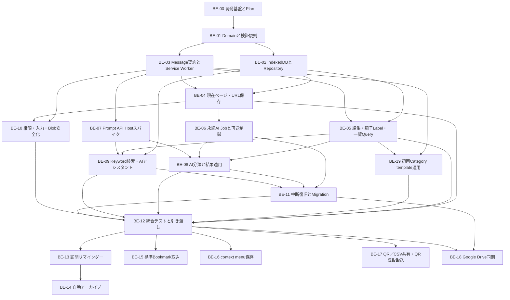
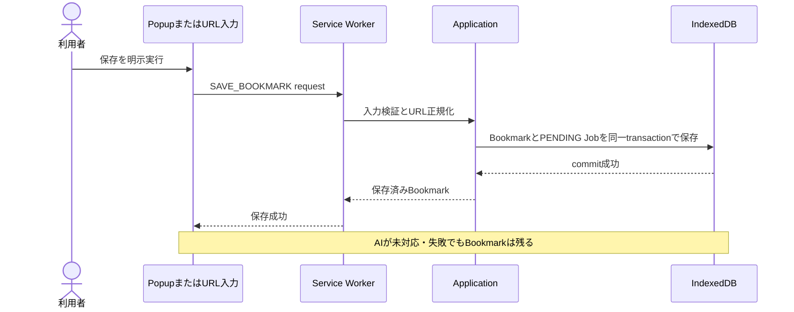

# Bookmation バックエンド実装タスク

- 状態: 実装前バックログ
- 更新日: 2026-08-17
- 対象: Chrome拡張機能内のDomain、Application、JSON document、IndexedDB、Manifest V3 Service Worker、AI Host、Chrome API、Google Driveアダプター
- 対象外: React画面の見た目、独自リモートサーバー、外部LLMへの自動fallback
- 正本: [バックエンド設計](docs/BACKEND.md) / [DBスキーマ](docs/DB-SCHEMA.md) / [セキュリティ](docs/SECURITY.md) / [要件](docs/REQUIREMENTS.md)

## この一覧の使い方

このファイルは、バックエンド担当者が「次に何を作るか」「何が終われば完了か」を短時間で把握するための実装順一覧である。現在は開発基盤と確認用popupまで存在し、保存・一覧・AI・共有は未実装である。BE-00以外は未着手である。

1. 担当するタスクの状態を `未着手` から `進行中` に変更し、担当者名を記入する。
2. 半日を超える作業、DB変更、Chrome権限変更、Prompt API検証では、先に [Execution Plan規約](docs/PLANS.md) に沿ってPlanを作る。
3. タスク内のチェック項目、成果物、完了条件、検証をすべて満たす。
4. 実行コマンドと結果を [WORKLOG.md](docs/WORKLOG.md) に残してから `完了` にする。

状態は `未着手 / 進行中 / ブロック / レビュー中 / 完了` のいずれかを使う。

## 最初に把握する境界

- 独自リモートバックエンドを置かず、データの正本はIndexedDB上の版付きJSON documentとする。Blobだけは別Storeへ分離する。
- Bookmark保存をAI処理より先に完了し、AI失敗で保存データを失わない。
- Prompt APIをService Workerで実行しない。対応確認済みのトップレベル拡張ページだけをAI Hostにする。
- カテゴリを親、タグを子とする固定2階層とし、activeな各タグはactiveな親カテゴリIDを持つ。Tagの親は管理モードの利用者操作で変更でき、BookmarkのCategory集合は常にTagの親から自動導出する。正規化名はCATEGORY内とTAG内でそれぞれglobal uniqueとし、タグは親をまたいでも同名別IDを許可しない。soft-delete中も名前を予約し、物理回収後だけ再利用できる。CATEGORYとTAGは別namespaceである。
- active Tagだけにactive親Categoryを必須とする。tombstone Tagはdeleted親を参照できる。親Categoryの物理回収は、そのIDを参照する全子Tag tombstoneが消滅するまでblockする。
- Label Normalizer v1はproject-vendored Unicode 15.1.0 assetだけを使い、runtime ICUへ依存しない。NFKC、`White_Space`、`Default_Ignorable_Code_Point`、`CaseFolding.txt` C＋F mappingと、実装時に生成・固定するasset hashを契約に含める。
- AIは既存カテゴリを選択できるが、新規カテゴリを作成できない。
- AI細分化度は整数 `0`〜`4` で、新規タグ上限 `0 / 1 / 2 / 4 / 6` へ対応する。Jobには両値をdiscriminated snapshotとして保存し、不一致を拒否する。`0` は新規AIタグ作成だけを禁止し、既存タグの自動付与は継続する。
- 同じ `(bookmarkId, labelId)`、同じ保存要求、同じAI提案の再送を重複登録しない。
- keyword検索は両一覧から開くフルページ検索へ最大8件の入力候補を返す。AI入力ポップアップはLabel／Bookmark検索とBookmationの機能説明を扱い、検索結果はLabelを先にし、順位・スコアを契約に含めない。
- 訪問判定は回数ではなく、選択した直近7／30／365暦日内の訪問日数を使う。日数の既定値は設けず、期間変更時も入力を消去して上限を7／30／365へ切り替える。`いいえ` はそのcanonical URLの集計基準を応答時刻へ進め、「次回以降表示しない」だけを `SUPPRESSED` とする。AI細分化だけをslider値にする。
- 自動archiveは既定OFFのtoggleと既定30日の正整数設定を持ち、history権限の許可後だけONにできる。履歴なしは項目別エラーとしてarchive不可にする。archive後はカテゴリ・タグ、ページ名、URLだけを保持し、設定の一覧から選択して復元する。
- ユーザー間共有はカテゴリ／タグ／個別Bookmarkを選んだQR／CSV exportとQR読取取込を使う。QR容量超過時は分割・切捨てせずCSVへ誘導する。Driveは同一Googleアカウントの端末間同期を `appDataFolder`、別アカウントへの権限共有を通常Drive file＋permissions/capabilities検証として分離し、設定で対象アカウントを選ぶ。標準Bookmarkは明示取込とし、各Bookmarkの直上Folderだけを1件のTagへ対応させる。右クリック保存は端末固有toggleがONの時だけpage／link menuを表示し、共通保存use caseを使う。
- 一覧のページサイズは内部設定とし、利用者が変更するプルダウンや永続設定を作らない。
- 初回カテゴリテンプレート機能はP0確定とする。具体的catalogと導線はISSUE-022で決め、利用者の明示適用前にCategoryをseedせず、適用時は通常のUSER Category作成へ合流させる。

## 実装依存フロー

並行しやすい組合せは `BE-02とBE-03`、`BE-06とBE-07`、`BE-09とBE-10` である。ただし、共有する型とMessage schemaは先にBE-01で固定する。

## 全体一覧

| ID | タスク | 状態 | 担当 | 主な依存 | 利用者に届く成果 |
| --- | --- | --- | --- | --- | --- |
| BE-00 | 開発基盤とバックエンドPlan | 完了 | T-taku | なし | チームが同じコマンドで実装を開始できる |
| BE-01 | Domain型と不変条件 | 完了 | GreenTea | BE-00 | 不正なBookmark・Label・AI結果を共通規則で拒否できる |
| BE-02 | IndexedDBとRepository | 完了 | 🐳 | BE-01 | 再読込後もデータが残り、一覧をカーソル取得できる |
| BE-03 | Message契約とService Worker | 完了 | GreenTea | BE-01 | popup、dashboard、workerが安全に連携できる |
| BE-04 | 現在ページ・URL保存 | 完了 | GreenTea / 🐳 | BE-02、BE-03 | AIなしでもBookmarkを保存できる |
| BE-05 | 編集・親子Label・一覧Query | 進行中 | GreenTea | BE-02、BE-03 | 編集、削除、親カテゴリ／子タグ管理、候補・一覧取得ができる |
| BE-19 | 初回Category template適用 | 未着手 | 未定 | ISSUE-022、BE-03、BE-05 | 利用者が明示適用したtemplate Categoryだけを通常規則で重複なく作成できる |
| BE-06 | 永続AI Job | 未着手 | 未定 | BE-03、BE-04 | workerやAI Hostが止まっても分類要求を失わない |
| BE-07 | Prompt API Hostスパイク | 進行中 | みやけ | BE-00、BE-03 | 対応環境とAI実行場所を実証できる |
| BE-08 | AI分類と結果適用 | 未着手 | 未定 | BE-05〜BE-07 | カテゴリ／タグ規則どおり分類し、失敗時も保存を守る |
| BE-09 | Keyword検索・AIアシスタント | 未着手 | 未定 | BE-02、BE-05、BE-07 | 最大8件の候補と検索／機能説明を返せる |
| BE-10 | 権限・入力・Blob安全化 | 未着手 | 未定 | BE-03、BE-04 | 最小権限で危険入力と外部画像追跡を防げる |
| BE-11 | 中断復旧とMigration | 未着手 | 未定 | BE-06、BE-08、BE-09 | 更新・再送・途中停止から安全に回復できる |
| BE-12 | 統合テストとフロント引き渡し | 未着手 | 未定 | BE-04、BE-05、BE-08〜BE-11 | P0の一連操作を再現し、UIから利用できる |
| BE-13 | 訪問日数閾値と保存リマインダー | 未着手 | 未定 | BE-03、BE-04、BE-10、BE-12 | 期間内の訪問日数とURL別resetに従い、確認したURLだけを保存できる |
| BE-14 | 権限gate付き自動アーカイブ | 未着手 | 未定 | BE-05、BE-13 | 既定30日、history許可時だけON、履歴なしエラー、最小archive、復元を扱える |
| BE-15 | Chrome標準Bookmarkインポート | 未着手 | 未定 | BE-02、BE-10、BE-12 | 元treeを変えず、直上Folderだけを1件のTagにしてJSON documentへ取込できる |
| BE-16 | context menu保存 | 未着手 | 未定 | BE-01、BE-03、BE-04、BE-10 | 設定toggleに従ってpage／link menuを重複なく登録／解除し、ON時だけ共通保存use caseへ渡せる |
| BE-17 | QR／CSV共有・QR読取取込 | 未着手 | 未定 | BE-02、BE-10、BE-12 | 同じ選択集合をQR／CSVでexportし、QR容量超過をCSVへ誘導できる |
| BE-18 | Google Drive同期・権限共有 | 未着手 | 未定 | BE-02、BE-10、BE-11、BE-12 | 同一アカウント同期と別アカウント共有を混ぜずに扱える |

## 最初の縦切り

最初からAIまで作らず、次の順で「保存して再読込後に見える」状態を先に完成させる。

この縦切りの完了にはBE-00〜BE-04の必要部分だけを使う。AI分類、画像取得、同期候補を理由に保存機能の完成を遅らせない。

## タスク詳細

### BE-00 開発基盤とバックエンドPlan

目的: 実装者ごとに環境やコマンドが分かれない状態を作る。

- [x] Plasmo、React、TypeScript、Tailwind、Node、package managerの対応版を固定する。
- [x] Domain、Application、Ports、Adapters、Entrypointsの配置を決める。
- [x] `dev`、`build`、`lint`、`typecheck`、`test` のscriptを定義する。
- [x] IndexedDBを使う単体テスト環境とChrome E2E方針を決める。
- [ ] [テスト仕様](docs/TESTING.md) に沿うUI WebプレビューとPlaywright拡張E2Eのscript／証拠契約を実装する。
- [x] 最初の縦切り用Execution Planを作る。

成果物: `package.json`、lockfile、初期ディレクトリ、品質コマンド、Execution Plan。

完了条件: 新しいcheckoutで依存導入、型検査、空のテスト、開発ビルドを同じ手順で実行できる。

完了メモ: 2026-08-16。unit は vitest（node）。IndexedDB の fake 実装は TASK-003 / BE-02、UI WebプレビューとChrome E2E harnessはTASK-013、統合受入は TASK-011 / BE-12。Plan は [docs/plans/2026-08-16-dev-scaffold.md](docs/plans/2026-08-16-dev-scaffold.md)。

### BE-01 Domain型と不変条件

目的: UI、DB、AIのどの入口でも同じ業務ルールを適用する。

- [x] Bookmark、Label、BookmarkLabel、ClassificationJob、LocalSettingsの型を定義する。
- [x] Blob以外の全永続型を `schemaVersion` 付きJSON documentにし、read/write schema検証を定義する。
- [x] URL、ID、revision、時刻、正規化名、カーソルを値オブジェクトまたは検証関数にする。
- [x] `LabelNormalizer v1` 用にUnicode 15.1.0のNFKC、`White_Space`、`Default_Ignorable_Code_Point`、`CaseFolding.txt` status C＋Fをprojectへvendoringする生成処理を作る。runtime ICU／端末Unicode版を参照せず、生成assetのhashを実装時に固定して `normalizerVersion` と検証する。
- [x] 有効カテゴリの `categoryUniqueName`、有効タグの `tagUniqueName` を各namespaceでglobal uniqueにし、カテゴリの `origin=USER` を保証する。
- [x] active TAGにはactive CATEGORYの親IDを必須とし、親子は2階層より深くならないよう検証する。tombstone TAGだけはdeleted親参照を許す。
- [x] TAGの親CATEGORY変更を管理モードの利用者向け更新commandとして定義し、AI／Import／同期競合の暗黙処理からは呼べないようにする。
- [x] 同一Bookmarkへ複数TAGを付与し、CATEGORY集合をその親から自動導出する。BookmarkからCATEGORYだけを直接更新する入力は拒否する。
- [x] `LocalSettings` へ初回ホーム完了状態、`frequentVisitReminderEnabled`、`frequentVisitWindow`、既定nullの `frequentVisitDayThreshold`、既定falseの `autoArchiveEnabled`、既定30のarchive日数、端末固有の `contextMenuBookmarkEnabled`、AI細分化度 `0`〜`4` を型付きで定義する。旧回数閾値は日数へ暗黙移行せず、設定を未完了・reminder無効へ戻す。旧settingsでarchive toggleが欠ける場合はfalse、archive日数が欠損／不正なら30へ移す。右クリック設定はfield欠損を `true` へ移行し、boolean以外を `false` へ縮退する。
- [x] エラーコードと、UIに見せる安全なメッセージへの変換規則を定義する。
- [x] AI由来のunknown入力をDomain型へ直接castしない検証境界を作る。

成果物: Domain型、validator、error型、単体テストfixture。

完了条件: Normalizer v1のUnicode境界、カテゴリ／タグ同名競合、tombstone予約、親カテゴリ欠落、Tag／選択親の古いrevision、AI／ImportからのTag親変更、AIのカテゴリ作成、設定不正値、危険URL、上限超過を単体テストで拒否できる。

完了メモ: 2026-08-22。`src/domain/` 配下に全型・値オブジェクト・Normalizer v1（Unicode 15.1.0 vendored）・各エンティティ不変条件・AI境界・エラーコードを実装。単体テスト89件含む全173テストパス確認済み。

### BE-02 IndexedDBとRepository

目的: ローカルデータを正本として安全に読み書きする。

- [ ] `bookmarks`、`labels`、`bookmarkLabels`、`classificationJobs`、`bookmarkRevisions`、`searchDocuments`、`tagMutationReceipts`、`blobs`、`schemaMeta`を作る。
- [ ] Blob以外をJSON互換に限定し、各documentのschemaVersion、size上限、unknown version隔離を実装する。
- [ ] [DBスキーマ](docs/DB-SCHEMA.md) のunique/non-unique indexを実装する。
- [ ] Bookmark保存とPENDING Job作成を1transactionにする。
- [ ] `(bookmarkId, labelId)`、`creationRequestId`、カテゴリ名、タグ名を冪等・一意に扱う。名前unique indexはtombstoneも対象にし、物理回収transaction後だけ予約を解放する。
- [ ] `labels` の親カテゴリ参照と、active／tombstoneを区別して親子関係をたどるindexを実装する。親Categoryの物理回収は参照する全子Tag tombstoneが物理回収され、参照が0件になるまで拒否する。
- [ ] Category、全子Tag、関連BookmarkLabel edgeのcascade soft-deleteと、影響BookmarkごとのPENDING ClassificationJob作成を1 transactionで確定できるRepository契約を作る。Bookmark本体は削除しない。
- [ ] Tag親変更ではTagと選択先Categoryの期待revisionを検証し、Tag、新旧Category、全参照Bookmark／edgeを固定して、Tag親、BookmarkのCategory closure・revision、検索派生文書を1 transactionで更新するRepository契約を作る。AI分類Jobは作らない。
- [ ] Tag更新requestIdとpayload fingerprintを `tagMutationReceipts` へ同じtransactionで保存し、同じrequest再送は保存済み結果へ収束、別対象／payloadでのrequestId再利用は拒否する。
- [ ] `savedAt + id` 等の安定カーソル、総件数、条件別一覧をRepository契約にする。
- [ ] 内部ページサイズを定数または内部設定に置き、`chrome.storage.local`やUI向け表示数設定にしない。
- [ ] schema versionと中断可能なmigration骨格を作る。

成果物: DB open処理、migration、Repository実装、Repository契約テスト。

完了条件: JSON round-trip／不正版、再読込、同時作成、削除後の同名作成拒否、物理回収後の再利用、hash衝突、edge再送、同時刻カーソル、migration中断のテストが通る。

### BE-03 Message契約とService Worker

目的: 拡張機能の各実行コンテキストを、型付きかつ再送可能な契約で接続する。

- [x] popup、dashboard、AI Host、Service Worker間のmessageをdiscriminated unionにする。
- [x] `schemaVersion`、`requestId`、送信元、action allowlist、payload上限を検証する。
- [x] 保存、編集、削除、一覧、Label、Job claim/result、検索のhandlerをApplicationへ委譲する。
- [x] `runtime.onInstalled` の `reason=INSTALL` のときだけ初回ホーム状態を冪等に初期化し、更新、Chrome更新、通常起動で上書きしない。
- [x] `save-current-page` と `open-bookmation-home` のcommand名をallowlist化する。
- [x] workerのglobal変数、timer、in-memory queueを正本にしない。
- [x] Service WorkerからLanguageModelを呼べない構造にする。

成果物: Message schema、router、handler、Chrome API adapter、契約テスト。

完了条件: 未知action、不正sender、巨大payload、重複request、worker再起動を安全に処理できる。

完了メモ: 2026-08-22。`src/extension/messages.ts` にversion付きdiscriminated unionと入力境界検証、`message-router.ts` に送信元検証とstateless router、`install-handler.ts` にINSTALL限定の初期化を実装。業務actionはApplication境界へ委譲し、BE-04以降でuse caseを注入する。契約テスト14件、型検査、変更範囲のlint、MV3 buildを確認済み。

### BE-04 現在ページ・URL保存

目的: 3つの入口から同じ安全な保存処理を使う。

- [ ] popup保存、保存shortcut、URL指定保存を `SaveBookmark` use caseへ合流させる。
- [ ] `http:` / `https:`、長さ、構文、正規化結果を検証する。
- [ ] 現在タブから取得するURL、title、siteName、favicon候補を最小限にする。
- [ ] 同じnormalized URLを検出し、黙って上書き・複製しない。
- [ ] metadata取得失敗時も検証済みURLと代替titleで保存する。
- [ ] BookmarkとPENDING Jobを保存後、AI完了を待たず成功を返す。

成果物: SaveCurrentTab、SaveBookmarkByUrl、重複確認、保存結果型。

完了条件: 3入口、危険scheme、重複URL、metadata失敗、DB失敗、request再送のテストが通る。

### BE-05 編集・親子Label・一覧Query

目的: UIがBookmarkとカテゴリ／タグを安全に管理・表示できる契約を揃える。

- [x] Bookmarkの名前、URL、複数Tagだけをrevision付きで更新し、Category edgeをTagの親から同じtransaction内で自動導出する。Bookmark更新payloadのCategory直接指定は拒否する。
- [x] Bookmark／Tagの削除は確認済みflagを要求せず、`deletedAt` とrevisionを更新するsoft-deleteとして原子的に実装する。
- [x] 削除Undo用のoperation、期限、error code、復元commandを作らない。同じ削除requestの再送は冪等に扱う。
- [ ] Bookmark削除では関連・Blobを表示対象から外し、tombstoneと同期安全性を保った物理回収境界を定義する。
- [ ] カテゴリ作成・改名時に正規化名競合を返し、既存カテゴリを選べる情報を返す。
- [x] タグ作成時はactiveな既存親カテゴリIDを必須とする。Category keyword入力には一致度の高いactive候補を最大8件返し、自由入力文字列だけでは作成しない。作成use caseは既存Tag IDの選択／関連付けを受理せず、親をまたぐ場合も正規化名競合を返して新規IDを作らない。
- [ ] カテゴリ／タグの名前競合時はtombstoneを含む既存IDと状態を返す。有効なら元画面で選択し、削除済みなら物理回収まで別名だけを許して別ID作成を拒否する。
- [ ] tombstone Tagからdeleted親への参照を物理回収まで保持し、子Tag tombstoneが残る親Categoryの先行回収を拒否する。
- [ ] タグ編集responseに現在の親Category ID／revisionを返し、名前と親Categoryを更新できるようにする。保存時はTagと選択先Categoryのexpected revision、およびsubmit開始時に1回発行して同一retryで再利用する `tag-update:<UUID>` requestIdを必須とし、Tag名のglobal uniqueを親変更前後で維持する。
- [x] タグ入力とTag作成／編集の親Category入力向けに、keyword一致度、親カテゴリ、由来、利用件数を持つactive候補を最大8件返す。
- [ ] Tag編集からのCategory新規作成を別の冪等requestとして扱い、元のTag編集draftを保存せず保持できるresponseを返す。作成したCategory ID／revisionを再検証して親候補として選べるようにする。
- [x] Tag親変更では参照する全active Bookmarkの残存active Tag親集合へCategory edgeを完全一致させ、Bookmark revisionとSearchDocumentを更新する。`tagMutationReceipts` へ `UpdateTagResult { tagId, resultTagRevision, affectedBookmarkCount }` を保存し、同request再送で同じ結果を返す。1件でも競合・失敗すれば全件rollbackし、AI再分類Jobを作らない。
- [x] `GetCategoryEditDetail` で、activeな使用中TagのID・実名一覧と件数、配下Tagを1件以上持つ関連Bookmarkのunique件数、Category／全物理子Tag／影響edge・Bookmarkのrevisionを含むcanonicalな `impactFingerprint` を返す。件数、一覧、fingerprintは同じsnapshotから生成する。
- [ ] 作成modalを閉じるまで複数作成できるよう、各requestを一意キーで独立かつ冪等に処理する。
- [ ] `DeleteCategoryCascade` はCategory編集detailを使った警告を利用者が確認した後だけ呼び、category ID、expected revision、`expectedImpactFingerprint`、`category-delete:<UUID>` requestId、`warningAcknowledged=true` を必須とする。Tag更新の `tag-update:` とnamespaceを分け、requestIdを1つのCategoryだけへ結び付ける。同一Categoryの完了済み再送はrevision／fingerprint検証前にno-op成功、別Categoryでの再利用は拒否する。新規requestでrevisionまたは影響集合が変わっていれば削除せず最新detailで再確認を求める。
- [ ] `DeleteCategoryCascade` はCategory、物理的に存在する全子Tag、関連edgeを1 transactionでcascade soft-deleteし、影響Bookmark本体を保持したまま各Bookmarkの再分類Jobを `PENDING` で冪等作成する。成功response消失後の同一command再送でもJob、Outbox、BookmarkRevisionを増やさない。分類失敗はBookmarkを削除せず `NEEDS_REVIEW` と手動分類へ送る。
- [x] 最近追加、labelId条件、Label／Bookmark候補、総件数、読込済み件数を取得する。
- [x] 無限スクロール用cursorで同じIDを二重返却しない。
- [ ] 手動アーカイブと復元を削除とは別の状態変更として実装する。

成果物: Bookmark/Label CRUD use case、soft-delete契約、一覧Query、cursor page、件数契約。

完了条件: edit競合、BookmarkのCategory直接更新拒否、カテゴリ／タグ名競合、tombstone予約、削除後の同名作成拒否、namespace分離、親子不整合、Tag親変更の0件／1件／多数Bookmark参照、親候補0／8／9件以上、Category side view／draft、全件rollback、同request再送／別payload再利用拒否、AI再分類なし、連続作成、Category編集のTag実名／件数、Bookmark／Tagの確認なしsoft-delete、Category警告確認後のcascade soft-delete、影響Bookmark再分類、削除Undo経路がないこと、Label条件、cursor終端のテストが通る。

### BE-19 初回Category template適用

目的: 初回利用者へCategory templateを提示し、明示適用されたものだけを既存のCategory不変条件で作成する。

- [ ] ISSUE-022をDecidedにし、catalogの候補名／件数、set、選択、初期選択、skip、再表示、locale、version、再適用、競合UXを固定する。決定前に本番catalogをhardcodeしない。
- [ ] template catalogをversion付き・実行コードなしのlocal assetとして定義し、外部取得やIndexedDB seedにしない。
- [ ] `GetCategoryTemplateCatalog` はcatalog versionと表示候補を返すだけとし、Labelを書き込まない。
- [ ] `ApplyCategoryTemplates` は利用者が明示した候補、catalog version、安定requestIdを受け、各候補をBE-05のCreateCategoryへ渡す。Categoryは `origin=USER` のままにし、TEMPLATE originやAI Category作成経路を追加しない。
- [ ] Normalizer、一意名、tombstone予約、creationRequestIdを再検証し、既存／削除済み同名と部分失敗を利用者が判断できる項目別結果にする。transaction単位はISSUE-022で決定する。
- [ ] 同request再送は同じ結果へ収束し、別payloadでの再利用、update／reload／onboarding再開による無断再適用を拒否する。
- [ ] catalog versionとonboarding stepの保持形式をISSUE-022の決定後にLocalSettings schemaへ追加し、旧settingsを非破壊移行する。

成果物: Category template catalog schema／asset、取得・適用use case、onboarding進捗、競合・再送fixture。

完了条件: catalog閲覧だけではCategory件数が変わらず、利用者の明示適用後だけ通常のUSER Categoryが作成され、同名、応答消失、worker再起動、update／reloadで重複・上書きが起きない。

### BE-06 永続AI Job

目的: Service WorkerやAI Hostが終了しても分類状態を失わない。

- [ ] `PENDING / RUNNING / SUCCEEDED / FAILED / NEEDS_REVIEW / CANCELED` を実装する。
- [ ] Job claimを条件付き更新し、executor、attempt、lease期限、bookmark revisionを記録する。
- [ ] 期限切れRUNNINGを上限付きでPENDINGへ戻す。
- [ ] input fingerprintで成功済み結果の再適用を防ぐ。
- [ ] Job作成時に `{ granularity, maxNewTags }` をdiscriminated snapshotとして固定し、`0→0 / 1→1 / 2→2 / 3→4 / 4→6` 以外の組合せを保存・実行しない。
- [ ] AI提案の `creationRequestId = jobId:proposalKey` を安定生成する。
- [ ] UIがJob状態を照会・再試行・取消できる契約を作る。

成果物: Job Repository、claim/apply/retry use case、時計Port、再送テスト。

完了条件: worker停止、Host終了、lease競合、結果二重送信、古いrevisionでデータが重複・上書きされない。

### BE-07 Prompt API Hostスパイク

目的: 実装前にPrompt APIの利用条件と正しい実行場所を証拠付きで確定する。

- [x] トップレベル拡張ページでavailability、model準備、session作成、promptを検証する。
- [x] availabilityとcreateへ同じ入出力言語optionを渡す。
- [x] 日本語入力・出力、構造化JSON、ユーザー操作、モデル取得を確認する。
- [x] Service Workerと未確認Offscreen Documentで実行しない。
- [x] 非対応、準備中、download失敗、session終了をApplication errorへ変換する。
- [ ] 結果を [ISSUE-001](docs/ISSUES.md) と設計文書へ反映する。

実装・実機確認済み: Dashboard top-level pageのPromptApiTesterで、Chrome 151 / Windows 11における`downloadable`、モデル取得後の日本語分類、`responseConstraint`によるJSON Schema指定を確認した。`ai-host`のCLAIM/APPLYメッセージ契約は既存の拡張ページprotocolを利用する。最低Chrome版、モデル取得時間・容量、非対応時のBE-04/BE-05 fallbackは未確定である。

成果物: 最小spike、検証ログ、対応Chrome/OS、AI Host決定、fallback契約。

完了条件: 実機証拠が残り、AI非対応でもBE-04とBE-05が動く。

### BE-08 AI分類と結果適用

目的: AI出力を信用せず、ユーザー規則どおりカテゴリ／タグへ反映する。

- [ ] USERカテゴリ、USERタグ、AIタグのID付き候補を作る。
- [ ] AIが選べる既存ID、新規タグproposal、親カテゴリID、件数、文字列の固定schemaを作る。
- [ ] USERタグを優先し、適切な既存候補がない場合だけ新規タグを許す。
- [ ] 細分化度を整数 `0`〜`4` として検証し、新規タグ上限 `0 / 1 / 2 / 4 / 6` へ対応付ける。`0` では新規AIタグproposalを拒否するが、既存タグの自動選択・付与は続ける。
- [ ] 新規AIタグproposalが `tagUniqueName` と競合したらoriginを問わず既存Tagを再評価する。USER由来を優先するが、親カテゴリまたは意味が不適合なら関連付けも新規作成もせず `NEEDS_REVIEW` にする。
- [ ] AIによるカテゴリ作成・改名・削除と、候補外IDを拒否する。
- [ ] AI分類結果から既存Tagの親Categoryを変更できないようにし、親変更を管理モードの利用者commandだけへ限定する。
- [ ] AIが選んだタグの親カテゴリも同じBookmarkへ整合して付与されるよう、適用transactionで検証する。
- [ ] Service Worker側でrevision、lease、候補ID、Domain規則を再検証して1transactionで適用する。
- [ ] 失敗時はBookmarkを残し、FAILEDまたはNEEDS_REVIEWへ更新する。

成果物: ClassificationProvider Port、Prompt adapter、結果validator、適用use case。

完了条件: 不正JSON、カテゴリ生成、discriminated snapshot不一致、USERタグ優先、AI由来名競合、親／意味不適合のNEEDS_REVIEW、上限、候補外ID、再送、手動編集競合のテストが通る。

### BE-09 Keyword検索・AIアシスタント

目的: 両一覧から同じフルページ検索を使い、AIポップアップではBookmark探索とBookmationの機能説明を受けられるようにする。

- [ ] 正データから再構築できるSearchDocumentと版付きtoken/ngram生成を実装する。
- [ ] 両一覧で同じ `SuggestAllByKeyword` / `SearchAllByKeyword` を使い、フルページ検索へLabelとBookmarkを返す。
- [ ] 入力中のautocompleteは一致度の高い候補を全体で最大8件に切り、選択用IDとentity種別を返す。
- [ ] keyword結果と自然言語検索結果はLabel／Bookmark両方を作り、Labelを上、Bookmarkを下にする。
- [ ] AIには提示済み候補から可能性が高いID集合だけを選ばせる。
- [ ] AI入力を検索意図と機能説明意図へ安全に振り分け、機能説明は版管理されたBookmation機能情報だけから応答する。
- [ ] 入力と応答を同じAIポップアップで表示できるresponse型を定義し、検索候補と説明文を判別可能にする。
- [ ] 候補外ID、別entity type、重複、古いrevision、過剰件数を拒否する。
- [ ] responseを `labels`、`bookmarks` の順へ固定する。AI配列順を捨て、各集合を中立で決定的な順序にし、rank/scoreを返さない。
- [ ] query、展開語、自由文理由を永続化・通常ログ出力しない。
- [ ] AI非対応時はLEXICAL_FALLBACKであることを結果へ含める。

成果物: SearchDocument builder、Suggest/SearchAllByKeyword、AskBookmationAssistant、検索・機能説明契約テスト。

完了条件: 両入口、0／8／9件以上autocomplete、固定グループ順、カテゴリ／タグ別namespaceの同名表示、AI検索、機能質問、fallback、index再構築、古いAI応答のテストが通る。

### BE-10 権限・入力・Blob安全化

目的: 保存・表示・AI境界で利用者データと権限を守る。

- [ ] 初期権限を `storage`、`activeTab`、commands中心にレビューする。
- [ ] title、URL、Label名、message、JSON document、AI出力を未信頼入力として長さ・型・scheme検証する。
- [ ] 保存時の `og:image` を第一候補として、MIME、byte数、寸法、content hashを検証してlocal Blob化する。取得・検証・保存に失敗した場合は外部URLを参照せず同梱ロゴへ縮退する。
- [ ] 一覧表示のたびに外部画像URLへ接続しない。
- [ ] URL、title、Label名、AI queryを通常ログへ出さない。
- [ ] CSP、remote code禁止、権限拒否時fallbackをテストする。

成果物: security validator、Blob adapter、permission表、ログredaction、テスト。

完了条件: [SECURITY.md](docs/SECURITY.md) のP0確認を自動テストと手動権限レビューで満たす。

### BE-11 中断復旧とMigration

目的: Chrome拡張特有の中断とスキーマ更新からデータを守る。

- [ ] Service Worker停止、AI Host終了、transaction失敗、容量不足の復旧経路を作る。
- [ ] migrationを冪等・小分けにし、進捗cursorと失敗状態を保存する。
- [ ] カテゴリ／タグ名競合、旧同名タグ、重複edge、旧enum、unknown JSON schemaVersionを安全に変換・隔離する。
- [ ] SearchDocumentを正本から再構築できる保守処理を作る。
- [ ] 未参照Blobだけを回収し、参照中Blobを削除しない。
- [ ] Label GCはtombstone参照をたどり、子Tag tombstoneが1件でも残る親Categoryを物理回収しない。
- [ ] バージョン付きexport、検証付きimport、dry-runの最小境界を設計する。

成果物: recovery処理、migration fixture、index rebuild、Blob GC、backup境界。

完了条件: 各処理を途中停止して再実行しても、Bookmark消失やLabel/edge二重作成が起きない。

### BE-12 統合テストとフロント引き渡し

目的: バックエンド単体の完成ではなく、UIから再現できるP0成果として渡す。

- [ ] 保存→再読込→一覧→名前／URL／Tagだけの編集→Bookmarkの確認なし削除をE2Eで通し、CategoryがTag親から自動導出され、削除項目が一覧から消え、削除Undoの操作やAPIが提供されないことを確認する。
- [ ] 初回インストール用ホームと、完了後の最近追加ホームを別fixture／E2Eで通す。
- [ ] Tag作成／編集でactive Categoryを最大8候補から選ぶ→Category新規作成side view→draftを保って戻り自動選択→保存を通す。
- [ ] 複数Bookmarkが参照するTagの親を変更し、Tag IDとglobal unique名を維持したまま、全参照BookmarkのCategory closure・revision・検索文書が原子的に更新され、AI再分類Jobが作られないことを通す。同じrequest再送は同じreceiptへ収束し、別payloadでのrequestId再利用を拒否する。
- [ ] Category編集で使用中Tag実名一覧・件数と関連Bookmark unique件数を表示し、削除警告を確認後にCategory／全子Tag／edgeをcascade soft-deleteして、Bookmarkを残した再分類PENDING、失敗時NEEDS_REVIEWを通す。
- [ ] 両一覧からフルページkeyword検索へ移り、入力候補が最大8件であることを通す。
- [ ] AI対応時の分類・自然言語検索・機能説明と、AI非対応時のfallbackを通す。
- [ ] AI細分化の全5値でdiscriminated snapshotを検証し、`0` で新規AIタグ0件かつ既存タグの自動付与ありを通す。
- [ ] Label Normalizer v1のUnicode 15.1.0 vendored asset、asset hash、NFKC、`White_Space`、`Default_Ignorable_Code_Point`、CaseFolding C＋F fixtureを、runtime ICU差へ依存せず通す。
- [ ] active Tag／active親、tombstone Tag／deleted親、子Tag tombstone残存中の親Category GC拒否をfixtureで通す。
- [ ] production componentをfake Adapterで動かす通常Webプレビューから、主要状態を人間が再現できるようにする。
- [ ] AIエージェントがビルド済み拡張機能をPlaywrightで操作し、HTML report、screenshot、trace、skipを出力する。
- [ ] AIエージェント確認後、人間が同じcommit／buildを実Chromeで確認して承認または差戻しを記録する。
- [ ] 1万件規模でcursor、件数、検索索引、Job回収、Blob容量を測る。
- [ ] frontend向けrequest/response型、error code、loading/empty/end状態を文書化する。
- [ ] lint、typecheck、unit、integration、E2E、buildを実行する。
- [ ] 実行結果、未実証事項、技術的負債をWORKLOGへ記録する。

成果物: 自動テスト、性能結果、API契約、fixture、引き渡しメモ。

完了条件: [REQUIREMENTS.md](docs/REQUIREMENTS.md) のP0に対応する結果を、実行コマンドと証拠付きで説明できる。

### BE-13 訪問日数閾値と保存リマインダー

目的: よく訪れる未保存サイトを、無断保存せず利用者へ知らせる。

- [ ] `frequentVisitReminderEnabled` を明示設定とし、有効化時に用途を説明して `history` / `notifications` を任意要求する。
- [ ] `chrome.history.search()` で候補を絞り、各URLの `getVisits()` が返す `visitTime` を検証する。canonical URLごとに端末ローカルの同一暦日を1日へまとめ、非HTTP(S)、保存済み、除外済みURLを候補から外す。
- [ ] `frequentVisitDayThreshold` は新規installでも既定値なしのnullとする。`frequentVisitWindow` を `LAST_7_DAYS`／`LAST_30_DAYS`／`LAST_365_DAYS` の3値へ限定し、選択変更時も日数をnullへ戻す。1〜7／1〜30／1〜365の正整数が明示入力されるまで `REMINDER_CONFIG_REQUIRED` で判定を停止する。
- [ ] 旧 `frequentVisitThreshold` を訪問日数へ暗黙変換せず、migration後は利用者へ期間と日数の再設定を求める。
- [ ] 同一正規化URLのPENDING Reminderを1件にし、alarm再実行やworker再起動で重複通知しない。
- [ ] `はい`、`いいえ`、`次回以降表示しない` を処理し、`はい` のときだけ通常のSaveBookmarkを呼ぶ。`いいえ` は `countingResetAt` を応答時刻へ更新し、次回はその後の訪問日だけを数える。最後の選択はresetより優先して対象canonical URLだけを `SUPPRESSED` にし、`frequentVisitReminderEnabled` を変更しない。

成果物: History/Notification Port、VisitReminder Repository、設定、alarm handler、権限拒否fallback。

完了条件: global toggle無効、期間未選択、期間変更時clear、各期間の境界値、同日複数訪問、閾値未満／到達、`いいえ` 前後、同日reset後再訪、canonical URL単位SUPPRESSED、別URLでは継続、通知再送、権限拒否、重複URL、worker再起動のテストが通り、確認前にBookmarkが作られない。

### BE-14 権限gate付き自動アーカイブ

目的: 長期間使っていないBookmarkを、削除せず復元可能な状態へ移す。

- [ ] `archiveAfterDays` は新規install／欠損migrationで30とし、数値入力を正整数として保存する。空、NaN、0以下、小数、範囲外を拒否してAI細分化sliderの値と混在させない。
- [ ] `autoArchiveEnabled` は既定falseとする。ONの利用者gestureでhistory権限の目的を説明し、`permissions.contains()` と必要な `permissions.request()` を行う。許可と設定保存の両方が成功した時だけtrueへcommitし、拒否／取消／例外ではfalseのまま `ARCHIVE_HISTORY_PERMISSION_REQUIRED` を返す。
- [ ] `permissions.onRemoved` と各alarm実行前でhistory実権限を再確認し、取消時はtoggleをfalseへ戻してarchive alarmを解除する。OFF中の遅延alarmはBookmarkを変更しない。
- [ ] archive経路ではnotifications権限を要求しない。
- [ ] historyの `lastVisitTime` を正規化URLへ対応付け、`lastVisitedAt` を更新する。
- [ ] 名前付きalarmから、設定期間を超えたACTIVE項目だけを評価する。
- [ ] archive時はカテゴリ・タグ、ページ名、URLだけを残す最小JSON documentへtransaction更新し、それ以外の活動・表示用項目を保持しない。
- [ ] history許可済みでも `lastVisitedAt=null` のBookmarkは `ARCHIVE_HISTORY_NOT_FOUND` をOPENにupsertし、`履歴がないためアーカイブできません` と設定画面へ返してarchive不可にする。権限なし、revision競合、既にARCHIVEDも変更せず理由別件数を返す。
- [ ] 設定画面向けにarchive済み項目をリスト取得し、選択ID集合の復元とDrive Outboxを同じDomain規則へ通す。

成果物: ArchiveInactiveBookmarks、設定、Repository query、BookmarkRevision、復元契約。

完了条件: 既定OFF／30日、境界日時、timezone、ON時の権限説明、許可／拒否／取消、後発権限削除、OFF中の遅延alarm、notifications未要求、sleep後alarm、履歴なしの項目別エラー／archive不可、最小項目への縮退、単数／複数復元、競合で物理削除や誤archiveが起きない。

### BE-15 Chrome標準Bookmarkインポート

目的: Chrome標準Bookmarkを変更せず、BookmationのJSON documentへコピーする。

- [ ] 取込開始画面から `bookmarks` 権限を要求し、拒否時に既存データを変更しない。
- [ ] 読取専用adapterでtreeを取得し、URL、title、直上folder名、件数、深さを検証する。各Bookmarkの `parentId` が指す直上FolderだけをTag候補とし、祖先、full path、同階層の別FolderをLabel候補へ入れない。
- [ ] previewを直上Folder単位にgroup化する。同名active TagはそのIDと親Categoryを再利用し、新規Tagはactiveな既存Categoryの選択または同一導線のCategory作成を必須にする。CategoryをFolder名から暗黙作成しない。
- [ ] previewと利用者の選択、Folder→Tag解決をImport Jobへ固定し、cursorで中断再開する。直上Folder名が空／不正、または同名Tagがtombstoneなら自動renameやplaceholderを作らずskip／cancelとする。
- [ ] normalized URLの重複を検出し、import／skip／failedの件数と理由を返す。
- [ ] commitでは各Bookmarkへ解決済みTagを1件だけ `assignedBy="IMPORT"` で付与し、その親Category edgeを通常のclosure規則で導出する。取込と同時にAI分類を起動せず、祖先Folder由来Tagや追加Tagを付けない。
- [ ] Chrome標準Bookmarkのcreate/update/removeを呼べない契約テストを作る。

成果物: ChromeBookmarksReadPort、Import Job、preview/result型、fixture。

完了条件: `A/B/ページ` からTag `B` だけが付くこと、同名直上FolderのTag再利用、新規Tagの親Category選択、空／不正Folder名、tombstone競合、危険URL、重複、中断、部分失敗、AI分類未起動の後も元treeが不変で、再送による重複登録がない。

### BE-16 context menu保存

目的: ページ／リンクを右クリックから通常保存と同じ安全性で保存する。

- [ ] `contextMenus` を宣言し、端末固有設定 `contextMenuBookmarkEnabled`（既定ON）を一般設定のswitchから変更できるuse caseを実装する。設定はDrive同期しない。
- [ ] page用 `bookmation-save-page` とlink用 `bookmation-save-link` をBookmation所有の固定IDとし、install／startup／`chrome.storage.onChanged` で設定と登録状態を照合する。ONでは各1件を冪等登録し、OFFでは所有IDだけを解除する。
- [ ] 設定変更の登録／解除失敗時は以前の実効値へ補償し、UIへ実効値と再試行可能なエラーを返す。同じ操作の再送やService Worker再起動で重複項目を作らない。
- [ ] `page` と `link` contextにそれぞれ日本語ラベルを表示する。
- [ ] click時にmenu ID、送信元、保存直前の現在設定を検証し、ONの場合だけ `pageUrl` / `linkUrl` を選び分ける。OFF直前に配送された遅延clickは保存しない。
- [ ] `http:` / `https:`、長さ、正規化、重複をSaveBookmarkで再検証する。
- [ ] 成功、既存、保存不可、失敗を通知し、ページ本文を取得しない。

完了条件: 初期移行、ON／OFF反復、Service Worker再起動、API失敗、OFF直前の遅延clickを自動テストし、menuが設定と一致して重複せず、OFF中にはBookmarkが増えない。

成果物: context menu adapter／handler、manifest設定、統合テスト。

完了条件: page、link、危険scheme、未知menu ID、二重click、worker再起動を安全に処理できる。

### BE-17 QR／CSV共有・QR読取取込

目的: 選択Bookmarkを、内容確認付きで別ユーザーへ渡す。

- [ ] 検索結果とcheckboxから、カテゴリ別、タグ別、個別Bookmarkの選択を同一のBookmark ID集合へ解決する。同じselection fingerprintをQR／CSVの両commandへ渡す。
- [ ] QR向けに選択Bookmarkと親カテゴリ／子タグを `schemaVersion` 付きJSON payloadへ変換する。
- [ ] QRの実encoded bytesをencoder設定別に事前検査し、容量超過時は `QR_CAPACITY_EXCEEDED` と同じ選択集合のCSV actionを返す。分割、切捨て、部分QRを作らない。
- [ ] CSV v1をUTF-8、固定header、1 Bookmark 1行で生成し、Category名配列／Tag＋親Category配列をJSON fieldとしてCSV escapeする。数式注入をneutralizeし、安全なfilenameを使い、download後にobject URLを回収する。CSV importは追加しない。
- [ ] 内部ID、削除履歴、OAuth token、Blob、検索履歴をQR／CSVへ含めない。
- [ ] 件数、byte数、checksumをQR生成前に検証する。
- [ ] checksumは破損／切詰め検出だけに使い、送信者の真正性・改ざん防止を保証する値として表示または判定しない。
- [ ] カメラ等で読み取ったQRを、版、深さ、配列数、URL、文字列、checksumまで検証してpreviewする。
- [ ] 利用者確認後だけ新しいローカルIDで取込み、重複URLとカテゴリ名競合を解決する。
- [ ] 同名Tagが異なるparentCategoryで競合した場合は既存Tag再利用や親変更を行わず、明示別名、skip、cancelのいずれかを選ばせてからpreviewを再生成する。

成果物: ShareEncoder/Decoder、CSV encoder、JSON／CSV schema、QR容量fixture、CSV download、preview/import契約。

完了条件: カテゴリ／タグ／個別選択の重複解決、0件、QR容量内／超過、超過時CSV誘導と選択保持、CSV quote／改行／formula文字／download失敗、破損、切詰め、不明版、巨大payload、checksum真正性誤認、異親同名Tagの別名／skip／cancelと再previewを安全に処理し、QR読取後も確認前に書き込まない。

### BE-18 Google Drive同期・権限共有

目的: 同一Googleアカウントの複数端末同期と、別アカウントへの権限共有を、保存領域と権限境界を混ぜずに提供する。

- [ ] 設定で利用者が接続／共有先Googleアカウントを明示選択し、現在の接続先を表示する。
- [ ] 同一アカウントの端末間同期は `appDataFolder` の版付きsnapshot／operationだけを使い、通常Drive fileを列挙しない。
- [ ] `appDataFolder` は別アカウントと共有できる前提にせず、別アカウントへの共有は通常Drive fileを別経路で作成する。
- [ ] 通常Drive file共有では所有者、permissions、capabilitiesを取得・検証し、利用者が選んだ権限範囲だけを適用する。
- [ ] 各経路の明示接続から必要な `identity` とDrive scopeだけを取得し、tokenをIndexedDB／JSON／ログへ保存しない。
- [ ] ローカル更新とsyncOutbox追加を同一transactionにし、再送を冪等化する。
- [ ] ETag／revisionを使い、同一field同時更新、update対delete、add対delete、カテゴリ／タグ名前競合を検出する。これらを自動LWWで解決せず `syncConflicts` へ隔離する。
- [ ] 競合検出時のlocal／remote／baseをimmutableな `syncSnapshots` として保存し、利用者が確認する版付きresolution planを作る。plan適用時は参照snapshot IDとrevisionを再照合する。
- [ ] openな競合が参照するsnapshotはGC対象外にし、解決済みsnapshotとplanも解決日時から30日保持してから物理回収可能にする。
- [ ] 名前競合を含む解決でLabel IDまたはBookmark-Label edgeを既存IDへ暗黙にremapしない。resolution planへkeep／rename／skip等の明示操作を列挙し、確認後だけ適用する。
- [ ] delete tombstone、長期offline端末、categoryUniqueName、tagUniqueName、edge集合を規則どおりmergeする。
- [ ] 未接続、offline、認証失効、quota、Drive障害でもローカル編集を継続し、状態を返す。

成果物: OAuth/Drive adapter、SyncPort、Outbox worker、merge engine、conflict契約、復旧テスト。

完了条件: アカウント未選択／切替、`appDataFolder` の共有拒否、通常Drive fileの所有権／権限不一致、2端末同時編集、削除対編集、offline復帰、token失効、immutable snapshot、明示resolution plan、open中GC拒否、解決後30日保持、暗黙Label／edge remap拒否、retryでデータを黙って失わず、QR／CSV共有とも経路が混ざらない。

## UIとの受け渡し早見表

| UI操作                     | バックエンドUse Case                                                                                                                 | 最低限返すもの                                                                                                                                       |
| -------------------------- | ------------------------------------------------------------------------------------------------------------------------------------ | ---------------------------------------------------------------------------------------------------------------------------------------------------- |
| 現在ページを保存           | `SaveCurrentTab`                                                                                                                     | Bookmark、重複状態、分類Job状態                                                                                                                      |
| URLを入力して保存          | `SaveBookmarkByUrl`                                                                                                                  | Bookmark、metadata代替状態、分類Job状態                                                                                                              |
| 初回／通常ホーム           | `GetHomeState` / `CompleteOnboarding`                                                                                                | 初回状態、最近追加一覧へ進む状態                                                                                                                     |
| 初回Category template      | `GetCategoryTemplateCatalog` / `ApplyCategoryTemplates`                                                                              | catalog version、未適用候補、項目別の作成／既存／競合結果、onboarding step                                                                           |
| 最近追加／Label別一覧      | `ListBookmarks`                                                                                                                      | items、totalCount、nextCursor、hasNext                                                                                                               |
| フルページkeyword入力      | `Suggest/SearchAllByKeyword`                                                                                                         | 最大8候補、labels、bookmarks。結果はlabelsが先                                                                                                       |
| 全画面カテゴリ・タグ一覧   | `ListLabels`                                                                                                                         | 親子items、利用件数、nextCursor、hasNext                                                                                                             |
| カテゴリ・タグ作成／編集   | `SuggestCategories` / `CreateCategory` / `CreateTag` / `UpdateCategory` / `UpdateTag` / `GetTagEditDetail` / `GetCategoryEditDetail` | 最大8件のactive Category候補、Tag／親expected revision、requestId／receipt、参照Bookmark更新、Tag実名一覧・件数、Bookmark unique件数、名前予約、競合 |
| Category削除               | `DeleteCategoryCascade`                                                                                                              | 警告確認、cascade結果、再分類Job状態、削除後revision                                                                                                 |
| Tag削除                    | `DeleteTag`                                                                                                                          | 対象ID、削除後revision                                                                                                                               |
| Bookmark編集               | `UpdateBookmark`                                                                                                                     | 更新後Bookmark、Tag関連、自動導出Category関連、revision                                                                                              |
| Bookmark削除               | `DeleteBookmark`                                                                                                                     | 対象ID、削除後revision                                                                                                                               |
| AI分類                     | `ClassifyBookmark`                                                                                                                   | Job状態、提案、適用結果または要確認                                                                                                                  |
| AI検索／機能質問           | `AskBookmationAssistant`                                                                                                             | 検索候補または機能説明、`AI`／`LEXICAL_FALLBACK`                                                                                                     |
| ショートカット表示         | `ListCommands`                                                                                                                       | command名、実キーまたは未割当                                                                                                                        |
| 訪問リマインダー設定／応答 | `UpdateReminderSettings` / `HandleVisitReminder`                                                                                     | 7／30／365日の期間、期間別訪問日数閾値、frequentVisitReminderEnabled、保存／URL別reset／SUPPRESSED                                                   |
| Archive設定／復元          | `SetAutoArchiveEnabled` / `ArchiveInactiveBookmarks` / `List/RestoreArchivedBookmarks`                                               | 権限gate、既定30日、履歴なしエラー、最小項目一覧、復元結果                                                                                           |
| 標準Bookmark取込           | `Preview/ImportChromeBookmarks`                                                                                                      | 直上Folder→Tag解決、親Category選択、preview、progress、imported/skipped/failed                                                                       |
| QR／CSV共有・QR読取取込    | `ResolveShareSelection` / `ExportQr` / `ExportCsv` / `Preview/ImportQr`                                                              | 選択件数、QR／CSV payload、容量超過fallback、preview、取込結果                                                                                       |
| Drive設定                  | `Connect/SyncAppDataFolder` / `Create/ManageSharedDriveFile`                                                                         | 選択account、経路、owner、permissions、capabilities、state、conflicts                                                                                |

一覧APIに利用者指定の `pageSize` は渡さない。UIはバックエンドが返す `nextCursor` と `hasNext` だけを使って無限スクロールする。

## 共通Definition of Done

各タスクは次をすべて満たして初めて完了とする。

- [ ] Domain規則とセキュリティ境界をコードとテストの両方で保証した。
- [ ] 正常系、入力不正、再送、競合、中断のうち該当ケースをテストした。
- [ ] エラー時に既存Bookmarkを失わず、UIが回復操作を判断できる結果を返す。
- [ ] URL、title、Label名、AI queryなどの利用者データを通常ログへ出していない。
- [ ] 追加した権限、Store、index、message、設定の理由を文書化した。
- [ ] 数値入力、AI slider `0`〜`4`、Tag／Categoryの最大8候補、Tag親変更のexpected revision／requestId／receipt、Category自動導出、全参照Bookmarkの原子的closure更新／AI再分類なし、Category使用状況、初回状態、Bookmark／Tagの確認なし削除、Category警告付きcascade削除と再分類、archive既定30日／権限gate／履歴なしエラー、最小archive、QR／CSV共有選択の境界fixtureを追加した。
- [ ] Label Normalizer v1のUnicode 15.1.0 vendored asset＋hash、tombstone名前予約と親子GC、Category cascade soft-delete、削除Undo経路なし、PENDING／NEEDS_REVIEW再分類、discriminated granularity snapshot、QR容量超過CSV fallback／checksum境界、Drive conflict snapshot／resolution／GC／remap拒否をfixtureで固定した。
- [ ] `lint`、`typecheck`、対象テスト、`build` の結果をWORKLOGへ記録した。
- [ ] Webプレビュー、AIエージェントのPlaywright確認、人間受入を順番どおり実施し、同じcommit／buildと証拠を記録した。
- [ ] 未実装・未実証を成功扱いせず、ISSUESまたはTECH-DEBTへ残した。

## 対象外

- 外部LLMへの自動fallback
- リモートバックエンドサーバー
- Chrome標準ブックマークへの書込み
- ブックマーク表示数を変更するUI設定
