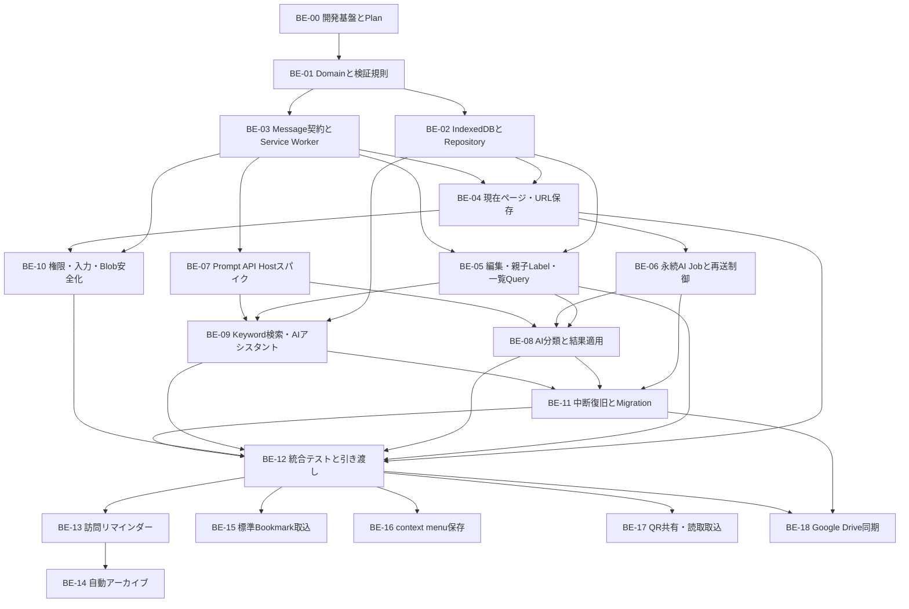
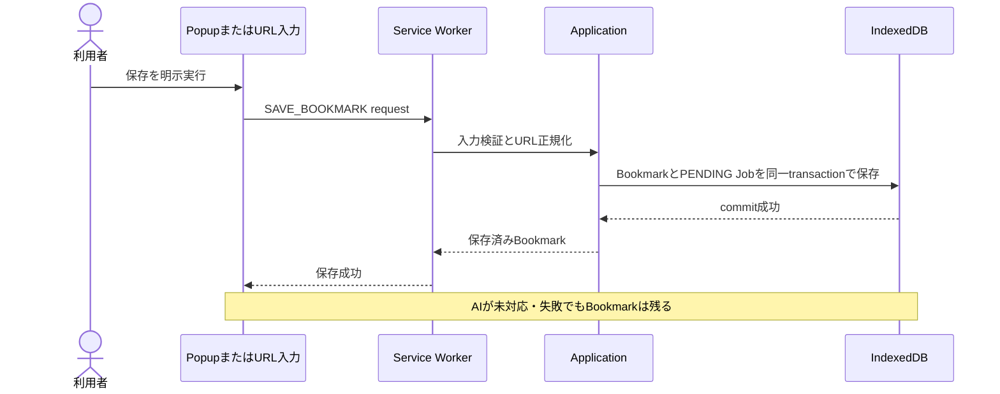

# Bookmation バックエンド実装タスク

- 状態: 実装前バックログ
- 更新日: 2026-08-17
- 対象: Chrome拡張機能内のDomain、Application、JSON document、IndexedDB、Manifest V3 Service Worker、AI Host、Chrome API、Google Driveアダプター
- 対象外: React画面の見た目、独自リモートサーバー、外部LLMへの自動fallback
- 正本: [バックエンド設計](docs/BACKEND.md) / [DBスキーマ](docs/DB-SCHEMA.md) / [セキュリティ](docs/SECURITY.md) / [要件](docs/REQUIREMENTS.md)

## この一覧の使い方

このファイルは、バックエンド担当者が「次に何を作るか」「何が終われば完了か」を短時間で把握するための実装順一覧である。現在は開発基盤と確認用popupまで存在し、保存・一覧・AI・共有は未実装である。BE-00以外は未着手である。

1. 担当するタスクの状態を `未着手` から `進行中` に変更し、担当者名を記入する。
2. 半日を超える作業、DB変更、Chrome権限変更、Prompt API検証では、先に [Execution Plan規約](docs/PLANS.md) に沿ってPlanを作る。
3. タスク内のチェック項目、成果物、完了条件、検証をすべて満たす。
4. 実行コマンドと結果を [WORKLOG.md](docs/WORKLOG.md) に残してから `完了` にする。

状態は `未着手 / 進行中 / ブロック / レビュー中 / 完了` のいずれかを使う。

## 最初に把握する境界

- 独自リモートバックエンドを置かず、データの正本はIndexedDB上の版付きJSON documentとする。Blobだけは別Storeへ分離する。
- Bookmark保存をAI処理より先に完了し、AI失敗で保存データを失わない。
- Prompt APIをService Workerで実行しない。対応確認済みのトップレベル拡張ページだけをAI Hostにする。
- カテゴリを親、タグを子とする固定2階層とし、activeな各タグはactiveな親カテゴリIDを持つ。正規化名はCATEGORY内とTAG内でそれぞれglobal uniqueとし、タグは親をまたいでも同名別IDを許可しない。soft-delete中も名前を予約し、物理回収後だけ再利用できる。CATEGORYとTAGは別namespaceである。
- active Tagだけにactive親Categoryを必須とする。tombstone Tagはdeleted親を参照できる。親Categoryの物理回収は、そのIDを参照する全子Tag tombstoneが消滅するまでblockする。
- Label Normalizer v1はproject-vendored Unicode 15.1.0 assetだけを使い、runtime ICUへ依存しない。NFKC、`White_Space`、`Default_Ignorable_Code_Point`、`CaseFolding.txt` C＋F mappingと、実装時に生成・固定するasset hashを契約に含める。
- AIは既存カテゴリを選択できるが、新規カテゴリを作成できない。
- AI細分化度は整数 `0`〜`4` で、新規タグ上限 `0 / 1 / 2 / 4 / 6` へ対応する。Jobには両値をdiscriminated snapshotとして保存し、不一致を拒否する。`0` は新規AIタグ作成だけを禁止し、既存タグの自動付与は継続する。
- 同じ `(bookmarkId, labelId)`、同じ保存要求、同じAI提案の再送を重複登録しない。
- keyword検索は両一覧から開くフルページ検索へ最大8件の入力候補を返す。AI入力ポップアップはLabel／Bookmark検索とBookmationの機能説明を扱い、検索結果はLabelを先にし、順位・スコアを契約に含めない。
- 訪問回数／archive日数は正整数設定とし、AI細分化だけをslider値にする。訪問保存は有効化時かつ閾値到達後、リマインダーで利用者が確認した場合だけ行う。「次回以降表示しない」は対象canonical URLだけを `SUPPRESSED` にし、globalな `frequentVisitReminderEnabled` と別URLのリマインダーは維持する。
- archive後はカテゴリ・タグ、ページ名、URLだけを保持し、設定の一覧から選択して復元する。
- ユーザー間共有はカテゴリ／タグ／個別Bookmarkを選んだQRと読取取込を使う。Driveは同一Googleアカウントの端末間同期を `appDataFolder`、別アカウントへの権限共有を通常Drive file＋permissions/capabilities検証として分離し、設定で対象アカウントを選ぶ。標準Bookmarkは明示取込、右クリック保存は共通保存use caseを使う。
- 一覧のページサイズは内部設定とし、利用者が変更するプルダウンや永続設定を作らない。

## 実装依存フロー

並行しやすい組合せは `BE-02とBE-03`、`BE-06とBE-07`、`BE-09とBE-10` である。ただし、共有する型とMessage schemaは先にBE-01で固定する。

## 全体一覧

| ID | タスク | 状態 | 担当 | 主な依存 | 利用者に届く成果 |
| --- | --- | --- | --- | --- | --- |
| BE-00 | 開発基盤とバックエンドPlan | 完了 | T-taku | なし | チームが同じコマンドで実装を開始できる |
| BE-01 | Domain型と不変条件 | 未着手 | 未定 | BE-00 | 不正なBookmark・Label・AI結果を共通規則で拒否できる |
| BE-02 | IndexedDBとRepository | 未着手 | 未定 | BE-01 | 再読込後もデータが残り、一覧をカーソル取得できる |
| BE-03 | Message契約とService Worker | 未着手 | 未定 | BE-01 | popup、dashboard、workerが安全に連携できる |
| BE-04 | 現在ページ・URL保存 | 未着手 | 未定 | BE-02、BE-03 | AIなしでもBookmarkを保存できる |
| BE-05 | 編集・親子Label・一覧Query | 未着手 | 未定 | BE-02、BE-03 | 編集、削除、親カテゴリ／子タグ管理、候補・一覧取得ができる |
| BE-06 | 永続AI Job | 未着手 | 未定 | BE-03、BE-04 | workerやAI Hostが止まっても分類要求を失わない |
| BE-07 | Prompt API Hostスパイク | 未着手 | 未定 | BE-00、BE-03 | 対応環境とAI実行場所を実証できる |
| BE-08 | AI分類と結果適用 | 未着手 | 未定 | BE-05〜BE-07 | カテゴリ／タグ規則どおり分類し、失敗時も保存を守る |
| BE-09 | Keyword検索・AIアシスタント | 未着手 | 未定 | BE-02、BE-05、BE-07 | 最大8件の候補と検索／機能説明を返せる |
| BE-10 | 権限・入力・Blob安全化 | 未着手 | 未定 | BE-03、BE-04 | 最小権限で危険入力と外部画像追跡を防げる |
| BE-11 | 中断復旧とMigration | 未着手 | 未定 | BE-06、BE-08、BE-09 | 更新・再送・途中停止から安全に回復できる |
| BE-12 | 統合テストとフロント引き渡し | 未着手 | 未定 | BE-04、BE-05、BE-08〜BE-11 | P0の一連操作を再現し、UIから利用できる |
| BE-13 | 訪問閾値と保存リマインダー | 未着手 | 未定 | BE-03、BE-04、BE-10、BE-12 | 有効化と数値閾値に従い、確認したURLだけを保存できる |
| BE-14 | 最終訪問日時による自動アーカイブ | 未着手 | 未定 | BE-05、BE-13 | 最小項目へarchiveし、設定一覧から復元できる |
| BE-15 | Chrome標準Bookmarkインポート | 未着手 | 未定 | BE-02、BE-10、BE-12 | 元treeを変えずJSON documentへ取込できる |
| BE-16 | context menu保存 | 未着手 | 未定 | BE-03、BE-04、BE-10 | page／linkを共通保存use caseへ渡せる |
| BE-17 | QR共有・読取取込 | 未着手 | 未定 | BE-02、BE-10、BE-12 | 選択したBookmarkを確認付きJSON payloadで交換できる |
| BE-18 | Google Drive同期・権限共有 | 未着手 | 未定 | BE-02、BE-10、BE-11、BE-12 | 同一アカウント同期と別アカウント共有を混ぜずに扱える |

## 最初の縦切り

最初からAIまで作らず、次の順で「保存して再読込後に見える」状態を先に完成させる。

この縦切りの完了にはBE-00〜BE-04の必要部分だけを使う。AI分類、画像取得、同期候補を理由に保存機能の完成を遅らせない。

## タスク詳細

### BE-00 開発基盤とバックエンドPlan

目的: 実装者ごとに環境やコマンドが分かれない状態を作る。

- [x] Plasmo、React、TypeScript、Tailwind、Node、package managerの対応版を固定する。
- [x] Domain、Application、Ports、Adapters、Entrypointsの配置を決める。
- [x] `dev`、`build`、`lint`、`typecheck`、`test` のscriptを定義する。
- [x] IndexedDBを使う単体テスト環境とChrome E2E方針を決める。
- [ ] [テスト仕様](docs/TESTING.md) に沿うUI WebプレビューとPlaywright拡張E2Eのscript／証拠契約を実装する。
- [x] 最初の縦切り用Execution Planを作る。

成果物: `package.json`、lockfile、初期ディレクトリ、品質コマンド、Execution Plan。

完了条件: 新しいcheckoutで依存導入、型検査、空のテスト、開発ビルドを同じ手順で実行できる。

完了メモ: 2026-08-16。unit は vitest（node）。IndexedDB の fake 実装は TASK-003 / BE-02、UI WebプレビューとChrome E2E harnessはTASK-013、統合受入は TASK-011 / BE-12。Plan は [docs/plans/2026-08-16-dev-scaffold.md](docs/plans/2026-08-16-dev-scaffold.md)。

### BE-01 Domain型と不変条件

目的: UI、DB、AIのどの入口でも同じ業務ルールを適用する。

- [ ] Bookmark、Label、BookmarkLabel、ClassificationJob、LocalSettingsの型を定義する。
- [ ] Blob以外の全永続型を `schemaVersion` 付きJSON documentにし、read/write schema検証を定義する。
- [ ] URL、ID、revision、時刻、正規化名、カーソルを値オブジェクトまたは検証関数にする。
- [ ] `LabelNormalizer v1` 用にUnicode 15.1.0のNFKC、`White_Space`、`Default_Ignorable_Code_Point`、`CaseFolding.txt` status C＋Fをprojectへvendoringする生成処理を作る。runtime ICU／端末Unicode版を参照せず、生成assetのhashを実装時に固定して `normalizerVersion` と検証する。
- [ ] 有効カテゴリの `categoryUniqueName`、有効タグの `tagUniqueName` を各namespaceでglobal uniqueにし、カテゴリの `origin=USER` を保証する。
- [ ] active TAGにはactive CATEGORYの親IDを必須とし、親子は2階層より深くならないよう検証する。tombstone TAGだけはdeleted親参照を許す。
- [ ] 同一Bookmarkへカテゴリ／タグを各複数付与できるようにする。
- [ ] `LocalSettings` へ初回ホーム完了状態、`frequentVisitReminderEnabled`、訪問回数／archive日数、AI細分化度 `0`〜`4` を型付きで定義する。`autoArchiveEnabled` は要求しない。
- [ ] エラーコードと、UIに見せる安全なメッセージへの変換規則を定義する。
- [ ] AI由来のunknown入力をDomain型へ直接castしない検証境界を作る。

成果物: Domain型、validator、error型、単体テストfixture。

完了条件: Normalizer v1のUnicode境界、カテゴリ／タグ同名競合、tombstone予約、親カテゴリ欠落、AIのカテゴリ作成、設定不正値、危険URL、上限超過、古いrevisionを単体テストで拒否できる。

### BE-02 IndexedDBとRepository

目的: ローカルデータを正本として安全に読み書きする。

- [ ] `bookmarks`、`labels`、`bookmarkLabels`、`classificationJobs`、`bookmarkRevisions`、`searchDocuments`、`blobs`、`schemaMeta`を作る。
- [ ] Blob以外をJSON互換に限定し、各documentのschemaVersion、size上限、unknown version隔離を実装する。
- [ ] [DBスキーマ](docs/DB-SCHEMA.md) のunique/non-unique indexを実装する。
- [ ] Bookmark保存とPENDING Job作成を1transactionにする。
- [ ] `(bookmarkId, labelId)`、`creationRequestId`、カテゴリ名、タグ名を冪等・一意に扱う。名前unique indexはtombstoneも対象にし、物理回収transaction後だけ予約を解放する。
- [ ] `labels` の親カテゴリ参照と、active／tombstoneを区別して親子関係をたどるindexを実装する。親Categoryの物理回収は参照する全子Tag tombstoneが物理回収され、参照が0件になるまで拒否する。
- [ ] `savedAt + id` 等の安定カーソル、総件数、条件別一覧をRepository契約にする。
- [ ] 内部ページサイズを定数または内部設定に置き、`chrome.storage.local`やUI向け表示数設定にしない。
- [ ] schema versionと中断可能なmigration骨格を作る。

成果物: DB open処理、migration、Repository実装、Repository契約テスト。

完了条件: JSON round-trip／不正版、再読込、同時作成、削除後の同名作成拒否、物理回収後の再利用、hash衝突、edge再送、同時刻カーソル、migration中断のテストが通る。

### BE-03 Message契約とService Worker

目的: 拡張機能の各実行コンテキストを、型付きかつ再送可能な契約で接続する。

- [ ] popup、dashboard、AI Host、Service Worker間のmessageをdiscriminated unionにする。
- [ ] `schemaVersion`、`requestId`、送信元、action allowlist、payload上限を検証する。
- [ ] 保存、編集、削除、一覧、Label、Job claim/result、検索のhandlerをApplicationへ委譲する。
- [ ] `runtime.onInstalled` の `reason=INSTALL` のときだけ初回ホーム状態を冪等に初期化し、更新、Chrome更新、通常起動で上書きしない。
- [ ] `save-current-page` と `open-bookmation-home` のcommand名をallowlist化する。
- [ ] workerのglobal変数、timer、in-memory queueを正本にしない。
- [ ] Service WorkerからLanguageModelを呼べない構造にする。

成果物: Message schema、router、handler、Chrome API adapter、契約テスト。

完了条件: 未知action、不正sender、巨大payload、重複request、worker再起動を安全に処理できる。

### BE-04 現在ページ・URL保存

目的: 3つの入口から同じ安全な保存処理を使う。

- [ ] popup保存、保存shortcut、URL指定保存を `SaveBookmark` use caseへ合流させる。
- [ ] `http:` / `https:`、長さ、構文、正規化結果を検証する。
- [ ] 現在タブから取得するURL、title、siteName、favicon候補を最小限にする。
- [ ] 同じnormalized URLを検出し、黙って上書き・複製しない。
- [ ] metadata取得失敗時も検証済みURLと代替titleで保存する。
- [ ] BookmarkとPENDING Jobを保存後、AI完了を待たず成功を返す。

成果物: SaveCurrentTab、SaveBookmarkByUrl、重複確認、保存結果型。

完了条件: 3入口、危険scheme、重複URL、metadata失敗、DB失敗、request再送のテストが通る。

### BE-05 編集・親子Label・一覧Query

目的: UIがBookmarkとカテゴリ／タグを安全に管理・表示できる契約を揃える。

- [ ] Bookmarkの名前、URL、複数カテゴリ、各カテゴリ配下のタグをrevision付きで別々に更新する。
- [ ] Bookmark／Category／Tagの削除は確認済みflagを要求せず、`deletedAt` とrevisionを更新するsoft-deleteとして原子的に実装する。
- [ ] 削除Undo用のoperation、期限、error code、復元commandを作らない。同じ削除requestの再送は冪等に扱う。
- [ ] Bookmark削除では関連・Blobを表示対象から外し、tombstoneと同期安全性を保った物理回収境界を定義する。
- [ ] カテゴリ作成・改名時に正規化名競合を返し、既存カテゴリを選べる情報を返す。
- [ ] タグ作成時は親カテゴリIDを必須とする。作成use caseは既存IDの選択／関連付けを受理せず、親をまたぐ場合も正規化名競合を返して新規IDを作らない。
- [ ] カテゴリ／タグの名前競合時はtombstoneを含む既存IDと状態を返す。有効なら元画面で選択し、削除済みなら物理回収まで別名だけを許して別ID作成を拒否する。
- [ ] tombstone Tagからdeleted親への参照を物理回収まで保持し、子Tag tombstoneが残る親Categoryの先行回収を拒否する。
- [ ] タグ編集responseでは親カテゴリを返すが、親変更commandは [ISSUE-019](docs/ISSUES.md) 決定後の別タスクとし、P0の更新allowlistへ含めない。
- [ ] カテゴリ／タグ入力向けに、keyword一致度、親カテゴリ、由来、利用件数を持つ候補を最大8件返す。
- [ ] 作成modalを閉じるまで複数作成できるよう、各requestを一意キーで独立かつ冪等に処理する。
- [ ] 管理モードのカテゴリ／タグ削除はUI確認済みflagを要求せずsoft-deleteする。子タグが残るカテゴリはBLOCKし、子タグ削除または中止だけを返す。cascade deleteや親変更案内を返さない。
- [ ] 最近追加、labelId条件、Label／Bookmark候補、総件数、読込済み件数を取得する。
- [ ] 無限スクロール用cursorで同じIDを二重返却しない。
- [ ] 手動アーカイブと復元を削除とは別の状態変更として実装する。

成果物: Bookmark/Label CRUD use case、soft-delete契約、一覧Query、cursor page、件数契約。

完了条件: edit競合、カテゴリ／タグ名競合、tombstone予約、削除後の同名作成拒否、namespace分離、親子不整合、候補0／8／9件以上、連続作成、3 entityの確認なしsoft-delete、削除Undo経路がないこと、子タグ残存時BLOCK、Label条件、cursor終端のテストが通る。

### BE-06 永続AI Job

目的: Service WorkerやAI Hostが終了しても分類状態を失わない。

- [ ] `PENDING / RUNNING / SUCCEEDED / FAILED / NEEDS_REVIEW / CANCELED` を実装する。
- [ ] Job claimを条件付き更新し、executor、attempt、lease期限、bookmark revisionを記録する。
- [ ] 期限切れRUNNINGを上限付きでPENDINGへ戻す。
- [ ] input fingerprintで成功済み結果の再適用を防ぐ。
- [ ] Job作成時に `{ granularity, maxNewTags }` をdiscriminated snapshotとして固定し、`0→0 / 1→1 / 2→2 / 3→4 / 4→6` 以外の組合せを保存・実行しない。
- [ ] AI提案の `creationRequestId = jobId:proposalKey` を安定生成する。
- [ ] UIがJob状態を照会・再試行・取消できる契約を作る。

成果物: Job Repository、claim/apply/retry use case、時計Port、再送テスト。

完了条件: worker停止、Host終了、lease競合、結果二重送信、古いrevisionでデータが重複・上書きされない。

### BE-07 Prompt API Hostスパイク

目的: 実装前にPrompt APIの利用条件と正しい実行場所を証拠付きで確定する。

- [ ] トップレベル拡張ページでavailability、model準備、session作成、promptを検証する。
- [ ] availabilityとcreateへ同じ入出力言語optionを渡す。
- [ ] 日本語入力・出力、構造化JSON、ユーザー操作、モデル取得を確認する。
- [ ] Service Workerと未確認Offscreen Documentで実行しない。
- [ ] 非対応、準備中、download失敗、session終了をApplication errorへ変換する。
- [ ] 結果を [ISSUE-001](docs/ISSUES.md) と設計文書へ反映する。

成果物: 最小spike、検証ログ、対応Chrome/OS、AI Host決定、fallback契約。

完了条件: 実機証拠が残り、AI非対応でもBE-04とBE-05が動く。

### BE-08 AI分類と結果適用

目的: AI出力を信用せず、ユーザー規則どおりカテゴリ／タグへ反映する。

- [ ] USERカテゴリ、USERタグ、AIタグのID付き候補を作る。
- [ ] AIが選べる既存ID、新規タグproposal、親カテゴリID、件数、文字列の固定schemaを作る。
- [ ] USERタグを優先し、適切な既存候補がない場合だけ新規タグを許す。
- [ ] 細分化度を整数 `0`〜`4` として検証し、新規タグ上限 `0 / 1 / 2 / 4 / 6` へ対応付ける。`0` では新規AIタグproposalを拒否するが、既存タグの自動選択・付与は続ける。
- [ ] 新規AIタグproposalが `tagUniqueName` と競合したらoriginを問わず既存Tagを再評価する。USER由来を優先するが、親カテゴリまたは意味が不適合なら関連付けも新規作成もせず `NEEDS_REVIEW` にする。
- [ ] AIによるカテゴリ作成・改名・削除と、候補外IDを拒否する。
- [ ] AIが選んだタグの親カテゴリも同じBookmarkへ整合して付与されるよう、適用transactionで検証する。
- [ ] Service Worker側でrevision、lease、候補ID、Domain規則を再検証して1transactionで適用する。
- [ ] 失敗時はBookmarkを残し、FAILEDまたはNEEDS_REVIEWへ更新する。

成果物: ClassificationProvider Port、Prompt adapter、結果validator、適用use case。

完了条件: 不正JSON、カテゴリ生成、discriminated snapshot不一致、USERタグ優先、AI由来名競合、親／意味不適合のNEEDS_REVIEW、上限、候補外ID、再送、手動編集競合のテストが通る。

### BE-09 Keyword検索・AIアシスタント

目的: 両一覧から同じフルページ検索を使い、AIポップアップではBookmark探索とBookmationの機能説明を受けられるようにする。

- [ ] 正データから再構築できるSearchDocumentと版付きtoken/ngram生成を実装する。
- [ ] 両一覧で同じ `SuggestAllByKeyword` / `SearchAllByKeyword` を使い、フルページ検索へLabelとBookmarkを返す。
- [ ] 入力中のautocompleteは一致度の高い候補を全体で最大8件に切り、選択用IDとentity種別を返す。
- [ ] keyword結果と自然言語検索結果はLabel／Bookmark両方を作り、Labelを上、Bookmarkを下にする。
- [ ] AIには提示済み候補から可能性が高いID集合だけを選ばせる。
- [ ] AI入力を検索意図と機能説明意図へ安全に振り分け、機能説明は版管理されたBookmation機能情報だけから応答する。
- [ ] 入力と応答を同じAIポップアップで表示できるresponse型を定義し、検索候補と説明文を判別可能にする。
- [ ] 候補外ID、別entity type、重複、古いrevision、過剰件数を拒否する。
- [ ] responseを `labels`、`bookmarks` の順へ固定する。AI配列順を捨て、各集合を中立で決定的な順序にし、rank/scoreを返さない。
- [ ] query、展開語、自由文理由を永続化・通常ログ出力しない。
- [ ] AI非対応時はLEXICAL_FALLBACKであることを結果へ含める。

成果物: SearchDocument builder、Suggest/SearchAllByKeyword、AskBookmationAssistant、検索・機能説明契約テスト。

完了条件: 両入口、0／8／9件以上autocomplete、固定グループ順、カテゴリ／タグ別namespaceの同名表示、AI検索、機能質問、fallback、index再構築、古いAI応答のテストが通る。

### BE-10 権限・入力・Blob安全化

目的: 保存・表示・AI境界で利用者データと権限を守る。

- [ ] 初期権限を `storage`、`activeTab`、commands中心にレビューする。
- [ ] title、URL、Label名、message、JSON document、AI出力を未信頼入力として長さ・型・scheme検証する。
- [ ] favicon/thumbnailのMIME、byte数、寸法、content hashを検証してlocal Blob化する。
- [ ] 一覧表示のたびに外部画像URLへ接続しない。
- [ ] URL、title、Label名、AI queryを通常ログへ出さない。
- [ ] CSP、remote code禁止、権限拒否時fallbackをテストする。

成果物: security validator、Blob adapter、permission表、ログredaction、テスト。

完了条件: [SECURITY.md](docs/SECURITY.md) のP0確認を自動テストと手動権限レビューで満たす。

### BE-11 中断復旧とMigration

目的: Chrome拡張特有の中断とスキーマ更新からデータを守る。

- [ ] Service Worker停止、AI Host終了、transaction失敗、容量不足の復旧経路を作る。
- [ ] migrationを冪等・小分けにし、進捗cursorと失敗状態を保存する。
- [ ] カテゴリ／タグ名競合、旧同名タグ、重複edge、旧enum、unknown JSON schemaVersionを安全に変換・隔離する。
- [ ] SearchDocumentを正本から再構築できる保守処理を作る。
- [ ] 未参照Blobだけを回収し、参照中Blobを削除しない。
- [ ] Label GCはtombstone参照をたどり、子Tag tombstoneが1件でも残る親Categoryを物理回収しない。
- [ ] バージョン付きexport、検証付きimport、dry-runの最小境界を設計する。

成果物: recovery処理、migration fixture、index rebuild、Blob GC、backup境界。

完了条件: 各処理を途中停止して再実行しても、Bookmark消失やLabel/edge二重作成が起きない。

### BE-12 統合テストとフロント引き渡し

目的: バックエンド単体の完成ではなく、UIから再現できるP0成果として渡す。

- [ ] 保存→再読込→一覧→編集→確認なし削除をE2Eで通し、削除項目が一覧から消え、削除Undoの操作やAPIが提供されないことを確認する。
- [ ] 初回インストール用ホームと、完了後の最近追加ホームを別fixture／E2Eで通す。
- [ ] 親カテゴリ／子タグ作成→別入力で付与→管理モード編集／確認なし削除→同名作成拒否→label条件一覧を通す。
- [ ] 両一覧からフルページkeyword検索へ移り、入力候補が最大8件であることを通す。
- [ ] AI対応時の分類・自然言語検索・機能説明と、AI非対応時のfallbackを通す。
- [ ] AI細分化の全5値でdiscriminated snapshotを検証し、`0` で新規AIタグ0件かつ既存タグの自動付与ありを通す。
- [ ] Label Normalizer v1のUnicode 15.1.0 vendored asset、asset hash、NFKC、`White_Space`、`Default_Ignorable_Code_Point`、CaseFolding C＋F fixtureを、runtime ICU差へ依存せず通す。
- [ ] active Tag／active親、tombstone Tag／deleted親、子Tag tombstone残存中の親Category GC拒否をfixtureで通す。
- [ ] production componentをfake Adapterで動かす通常Webプレビューから、主要状態を人間が再現できるようにする。
- [ ] AIエージェントがビルド済み拡張機能をPlaywrightで操作し、HTML report、screenshot、trace、skipを出力する。
- [ ] AIエージェント確認後、人間が同じcommit／buildを実Chromeで確認して承認または差戻しを記録する。
- [ ] 1万件規模でcursor、件数、検索索引、Job回収、Blob容量を測る。
- [ ] frontend向けrequest/response型、error code、loading/empty/end状態を文書化する。
- [ ] lint、typecheck、unit、integration、E2E、buildを実行する。
- [ ] 実行結果、未実証事項、技術的負債をWORKLOGへ記録する。

成果物: 自動テスト、性能結果、API契約、fixture、引き渡しメモ。

完了条件: [REQUIREMENTS.md](docs/REQUIREMENTS.md) のP0に対応する結果を、実行コマンドと証拠付きで説明できる。

### BE-13 訪問閾値と保存リマインダー

目的: よく訪れる未保存サイトを、無断保存せず利用者へ知らせる。

- [ ] `frequentVisitReminderEnabled` を明示設定とし、有効化時に用途を説明して `history` / `notifications` を任意要求する。
- [ ] `HistoryItem.visitCount` / `lastVisitTime` を検証し、非HTTP(S)、保存済み、除外済みURLを候補から外す。
- [ ] 数値入力された `frequentVisitThreshold` を安全な正の整数として保存・変更し、空、NaN、小数、範囲外を拒否する。
- [ ] 同一正規化URLのPENDING Reminderを1件にし、alarm再実行やworker再起動で重複通知しない。
- [ ] `保存`、`あとで`、`次回以降表示しない` を処理し、`保存` のときだけ通常のSaveBookmarkを呼ぶ。最後の選択は対象canonical URLだけを `SUPPRESSED` にし、`frequentVisitReminderEnabled` を変更しない。

成果物: History/Notification Port、VisitReminder Repository、設定、alarm handler、権限拒否fallback。

完了条件: global toggle無効、数値不正、閾値未満／到達、canonical URL単位SUPPRESSED、別URLでは継続、通知再送、権限拒否、重複URL、worker再起動のテストが通り、確認前にBookmarkが作られない。

### BE-14 最終訪問日時による自動アーカイブ

目的: 長期間使っていないBookmarkを、削除せず復元可能な状態へ移す。

- [ ] 数値入力された `archiveAfterDays` を正整数として保存し、空、NaN、0以下、小数、範囲外を拒否してAI細分化sliderの値と混在させない。最新UIにない `autoArchiveEnabled` を要求しない。
- [ ] archive初回開始時（閾値確定時等）にhistory権限の目的を説明して要求する。拒否時は `archiveAfterDays` を保持し、判定状態を `PERMISSION_REQUIRED`（UI表示は「権限待ち」）で停止する。
- [ ] archive経路ではnotifications権限を要求しない。
- [ ] historyの `lastVisitTime` を正規化URLへ対応付け、`lastVisitedAt` を更新する。
- [ ] 名前付きalarmから、設定期間を超えたACTIVE項目だけを評価する。
- [ ] archive時はカテゴリ・タグ、ページ名、URLだけを残す最小JSON documentへtransaction更新し、それ以外の活動・表示用項目を保持しない。
- [ ] `lastVisitedAt=null`、権限なし、revision競合、既にARCHIVEDをskipし、理由別件数を返す。
- [ ] 設定画面向けにarchive済み項目をリスト取得し、選択ID集合の復元とDrive Outboxを同じDomain規則へ通す。

成果物: ArchiveInactiveBookmarks、設定、Repository query、BookmarkRevision、復元契約。

完了条件: 境界日時、timezone、初回権限説明、history拒否時の日数保持／権限待ち、notifications未要求、sleep後alarm、履歴なし、最小項目への縮退、単数／複数復元、競合で物理削除や誤archiveが起きない。

### BE-15 Chrome標準Bookmarkインポート

目的: Chrome標準Bookmarkを変更せず、BookmationのJSON documentへコピーする。

- [ ] 取込開始画面から `bookmarks` 権限を要求し、拒否時に既存データを変更しない。
- [ ] 読取専用adapterでtreeを取得し、URL、title、folder名、件数、深さを検証する。
- [ ] previewと利用者の選択をImport Jobへ固定し、cursorで中断再開する。
- [ ] normalized URLの重複を検出し、import／skip／failedの件数と理由を返す。
- [ ] folderからカテゴリ／タグへの対応はISSUE-016の決定を適用し、暗黙に同名カテゴリを作らない。
- [ ] Chrome標準Bookmarkのcreate/update/removeを呼べない契約テストを作る。

成果物: ChromeBookmarksReadPort、Import Job、preview/result型、fixture。

完了条件: 深いfolder、危険URL、重複、中断、部分失敗の後も元treeが不変で、再送による重複登録がない。

### BE-16 context menu保存

目的: ページ／リンクを右クリックから通常保存と同じ安全性で保存する。

- [ ] `contextMenus` を宣言し、install/startupで固定menu IDを冪等登録する。
- [ ] `page` と `link` contextにそれぞれ日本語ラベルを表示する。
- [ ] click時にmenu IDと送信元を検証し、`pageUrl` / `linkUrl` を選び分ける。
- [ ] `http:` / `https:`、長さ、正規化、重複をSaveBookmarkで再検証する。
- [ ] 成功、既存、保存不可、失敗を通知し、ページ本文を取得しない。

成果物: context menu adapter／handler、manifest設定、統合テスト。

完了条件: page、link、危険scheme、未知menu ID、二重click、worker再起動を安全に処理できる。

### BE-17 QR共有・読取取込

目的: 選択Bookmarkを、内容確認付きで別ユーザーへ渡す。

- [ ] 検索結果とcheckboxから、カテゴリ別、タグ別、個別Bookmarkの選択を同一のBookmark ID集合へ解決する。
- [ ] 選択Bookmarkと親カテゴリ／子タグを `schemaVersion` 付きJSON payloadへ変換する。
- [ ] 内部ID、削除履歴、OAuth token、Blob、検索履歴をpayloadへ含めない。
- [ ] 件数、byte数、checksumを生成前に検証し、容量超過を黙って切り捨てない。
- [ ] checksumは破損／切詰め検出だけに使い、送信者の真正性・改ざん防止を保証する値として表示または判定しない。
- [ ] カメラ等で読み取ったQRを、版、深さ、配列数、URL、文字列、checksumまで検証してpreviewする。
- [ ] 利用者確認後だけ新しいローカルIDで取込み、重複URLとカテゴリ名競合を解決する。
- [ ] 同名Tagが異なるparentCategoryで競合した場合は既存Tag再利用や親変更を行わず、明示別名、skip、cancelのいずれかを選ばせてからpreviewを再生成する。

成果物: ShareEncoder/Decoder、JSON schema、QR容量fixture、preview/import契約。

完了条件: カテゴリ／タグ／個別選択の重複解決、0件、破損、切詰め、不明版、巨大payload、checksum真正性誤認、異親同名Tagの別名／skip／cancelと再previewを安全に処理し、QR読取後も確認前に書き込まない。

### BE-18 Google Drive同期・権限共有

目的: 同一Googleアカウントの複数端末同期と、別アカウントへの権限共有を、保存領域と権限境界を混ぜずに提供する。

- [ ] 設定で利用者が接続／共有先Googleアカウントを明示選択し、現在の接続先を表示する。
- [ ] 同一アカウントの端末間同期は `appDataFolder` の版付きsnapshot／operationだけを使い、通常Drive fileを列挙しない。
- [ ] `appDataFolder` は別アカウントと共有できる前提にせず、別アカウントへの共有は通常Drive fileを別経路で作成する。
- [ ] 通常Drive file共有では所有者、permissions、capabilitiesを取得・検証し、利用者が選んだ権限範囲だけを適用する。
- [ ] 各経路の明示接続から必要な `identity` とDrive scopeだけを取得し、tokenをIndexedDB／JSON／ログへ保存しない。
- [ ] ローカル更新とsyncOutbox追加を同一transactionにし、再送を冪等化する。
- [ ] ETag／revisionを使い、同一field同時更新、update対delete、add対delete、カテゴリ／タグ名前競合を検出する。これらを自動LWWで解決せず `syncConflicts` へ隔離する。
- [ ] 競合検出時のlocal／remote／baseをimmutableな `syncSnapshots` として保存し、利用者が確認する版付きresolution planを作る。plan適用時は参照snapshot IDとrevisionを再照合する。
- [ ] openな競合が参照するsnapshotはGC対象外にし、解決済みsnapshotとplanも解決日時から30日保持してから物理回収可能にする。
- [ ] 名前競合を含む解決でLabel IDまたはBookmark-Label edgeを既存IDへ暗黙にremapしない。resolution planへkeep／rename／skip等の明示操作を列挙し、確認後だけ適用する。
- [ ] delete tombstone、長期offline端末、categoryUniqueName、tagUniqueName、edge集合を規則どおりmergeする。
- [ ] 未接続、offline、認証失効、quota、Drive障害でもローカル編集を継続し、状態を返す。

成果物: OAuth/Drive adapter、SyncPort、Outbox worker、merge engine、conflict契約、復旧テスト。

完了条件: アカウント未選択／切替、`appDataFolder` の共有拒否、通常Drive fileの所有権／権限不一致、2端末同時編集、削除対編集、offline復帰、token失効、immutable snapshot、明示resolution plan、open中GC拒否、解決後30日保持、暗黙Label／edge remap拒否、retryでデータを黙って失わず、QR共有とも経路が混ざらない。

## UIとの受け渡し早見表

| UI操作 | バックエンドUse Case | 最低限返すもの |
| --- | --- | --- |
| 現在ページを保存 | `SaveCurrentTab` | Bookmark、重複状態、分類Job状態 |
| URLを入力して保存 | `SaveBookmarkByUrl` | Bookmark、metadata代替状態、分類Job状態 |
| 初回／通常ホーム | `GetHomeState` / `CompleteOnboarding` | 初回状態、最近追加一覧へ進む状態 |
| 最近追加／Label別一覧 | `ListBookmarks` | items、totalCount、nextCursor、hasNext |
| フルページkeyword入力 | `Suggest/SearchAllByKeyword` | 最大8候補、labels、bookmarks。結果はlabelsが先 |
| 全画面カテゴリ・タグ一覧 | `ListLabels` | 親子items、利用件数、nextCursor、hasNext |
| カテゴリ・タグ作成／編集／削除 | `Create/Update/DeleteLabel` | 親子関係、名前予約、競合、削除後revision |
| Bookmark編集 | `UpdateBookmark` | 更新後Bookmark、カテゴリ関連、タグ関連、revision |
| Bookmark削除 | `DeleteBookmark` | 対象ID、削除後revision |
| AI分類 | `ClassifyBookmark` | Job状態、提案、適用結果または要確認 |
| AI検索／機能質問 | `AskBookmationAssistant` | 検索候補または機能説明、`AI`／`LEXICAL_FALLBACK` |
| ショートカット表示 | `ListCommands` | command名、実キーまたは未割当 |
| 訪問リマインダー設定／応答 | `UpdateReminderSettings` / `HandleVisitReminder` | 数値閾値、frequentVisitReminderEnabled、保存／snooze／canonical URL SUPPRESSED |
| Archive設定／復元 | `ArchiveInactiveBookmarks` / `List/RestoreArchivedBookmarks` | 数値日数、最小項目一覧、skip理由、復元結果 |
| 標準Bookmark取込 | `Preview/ImportChromeBookmarks` | preview、progress、imported/skipped/failed |
| QR共有／読取取込 | `ResolveShareSelection` / `ExportQr` / `Preview/ImportQr` | 選択件数、payload情報、preview、取込結果 |
| Drive設定 | `Connect/SyncAppDataFolder` / `Create/ManageSharedDriveFile` | 選択account、経路、owner、permissions、capabilities、state、conflicts |

一覧APIに利用者指定の `pageSize` は渡さない。UIはバックエンドが返す `nextCursor` と `hasNext` だけを使って無限スクロールする。

## 共通Definition of Done

各タスクは次をすべて満たして初めて完了とする。

- [ ] Domain規則とセキュリティ境界をコードとテストの両方で保証した。
- [ ] 正常系、入力不正、再送、競合、中断のうち該当ケースをテストした。
- [ ] エラー時に既存Bookmarkを失わず、UIが回復操作を判断できる結果を返す。
- [ ] URL、title、Label名、AI queryなどの利用者データを通常ログへ出していない。
- [ ] 追加した権限、Store、index、message、設定の理由を文書化した。
- [ ] 数値入力、AI slider `0`〜`4`、最大8候補、親子整合、初回状態、確認なしLabel削除、最小archive、共有選択の境界fixtureを追加した。
- [ ] Label Normalizer v1のUnicode 15.1.0 vendored asset＋hash、tombstone名前予約と親子GC、確認なしsoft-deleteと削除Undo経路なし、discriminated granularity snapshot、QR checksum境界、Drive conflict snapshot／resolution／GC／remap拒否をfixtureで固定した。
- [ ] `lint`、`typecheck`、対象テスト、`build` の結果をWORKLOGへ記録した。
- [ ] Webプレビュー、AIエージェントのPlaywright確認、人間受入を順番どおり実施し、同じcommit／buildと証拠を記録した。
- [ ] 未実装・未実証を成功扱いせず、ISSUESまたはTECH-DEBTへ残した。

## 対象外

- 外部LLMへの自動fallback
- リモートバックエンドサーバー
- Chrome標準ブックマークへの書込み
- ブックマーク表示数を変更するUI設定
