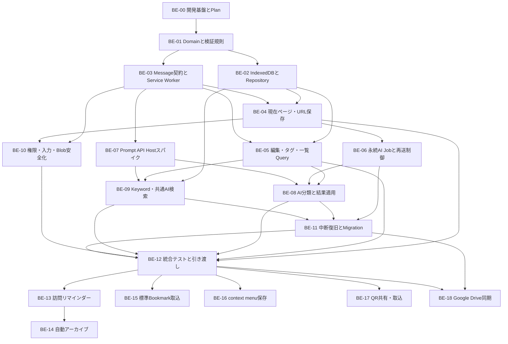
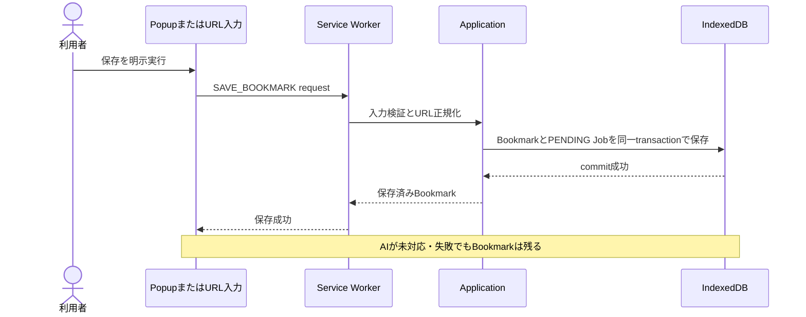

# Bookmation バックエンド実装タスク

- 状態: 実装前バックログ
- 更新日: 2026-08-16
- 対象: Chrome拡張機能内のDomain、Application、JSON document、IndexedDB、Manifest V3 Service Worker、AI Host、Chrome API、Google Driveアダプター
- 対象外: React画面の見た目、独自リモートサーバー、外部LLMへの自動fallback
- 正本: [バックエンド設計](docs/BACKEND.md) / [DBスキーマ](docs/DB-SCHEMA.md) / [セキュリティ](docs/SECURITY.md) / [要件](docs/REQUIREMENTS.md)

## この一覧の使い方

このファイルは、バックエンド担当者が「次に何を作るか」「何が終われば完了か」を短時間で把握するための実装順一覧である。現在は実行可能なアプリがないため、全タスク未着手である。

1. 担当するタスクの状態を `未着手` から `進行中` に変更し、担当者名を記入する。
2. 半日を超える作業、DB変更、Chrome権限変更、Prompt API検証では、先に [Execution Plan規約](docs/PLANS.md) に沿ってPlanを作る。
3. タスク内のチェック項目、成果物、完了条件、検証をすべて満たす。
4. 実行コマンドと結果を [WORKLOG.md](docs/WORKLOG.md) に残してから `完了` にする。

状態は `未着手 / 進行中 / ブロック / レビュー中 / 完了` のいずれかを使う。

## 最初に把握する境界

- 独自リモートバックエンドを置かず、データの正本はIndexedDB上の版付きJSON documentとする。Blobだけは別Storeへ分離する。
- Bookmark保存をAI処理より先に完了し、AI失敗で保存データを失わない。
- Prompt APIをService Workerで実行しない。対応確認済みのトップレベル拡張ページだけをAI Hostにする。
- カテゴリはユーザー作成かつ正規化名で一意、タグは同名の別IDを許可する。
- AIは既存カテゴリを選択できるが、新規カテゴリを作成できない。
- 同じ `(bookmarkId, labelId)`、同じ保存要求、同じAI提案の再送を重複登録しない。
- keyword／AI検索は両一覧からLabelとBookmarkを同時に返し、Labelを先にする。AI候補は順位・スコアを契約に含めない。
- 訪問保存は閾値到達後のリマインダーで利用者が確認した場合だけ行う。自動archiveは最終訪問日時と設定日数で文字列stateを変更し、削除しない。
- ユーザー間共有はQR、同一ユーザー同期はGoogle Drive、標準Bookmarkは明示取込、右クリック保存は共通保存use caseを使う。
- 一覧のページサイズは内部設定とし、利用者が変更するプルダウンや永続設定を作らない。

## 実装依存フロー

並行しやすい組合せは `BE-02とBE-03`、`BE-06とBE-07`、`BE-09とBE-10` である。ただし、共有する型とMessage schemaは先にBE-01で固定する。

## 全体一覧

| ID | タスク | 状態 | 担当 | 主な依存 | 利用者に届く成果 |
| --- | --- | --- | --- | --- | --- |
| BE-00 | 開発基盤とバックエンドPlan | 完了 | T-taku | なし | チームが同じコマンドで実装を開始できる |
| BE-01 | Domain型と不変条件 | 未着手 | 未定 | BE-00 | 不正なBookmark・Label・AI結果を共通規則で拒否できる |
| BE-02 | IndexedDBとRepository | 未着手 | 未定 | BE-01 | 再読込後もデータが残り、一覧をカーソル取得できる |
| BE-03 | Message契約とService Worker | 未着手 | 未定 | BE-01 | popup、dashboard、workerが安全に連携できる |
| BE-04 | 現在ページ・URL保存 | 未着手 | 未定 | BE-02、BE-03 | AIなしでもBookmarkを保存できる |
| BE-05 | 編集・Label・一覧Query | 未着手 | 未定 | BE-02、BE-03 | 編集、削除、カテゴリ／タグ管理、件数・一覧取得ができる |
| BE-06 | 永続AI Job | 未着手 | 未定 | BE-03、BE-04 | workerやAI Hostが止まっても分類要求を失わない |
| BE-07 | Prompt API Hostスパイク | 未着手 | 未定 | BE-00、BE-03 | 対応環境とAI実行場所を実証できる |
| BE-08 | AI分類と結果適用 | 未着手 | 未定 | BE-05〜BE-07 | カテゴリ／タグ規則どおり分類し、失敗時も保存を守る |
| BE-09 | 統合Keyword・AI検索 | 未着手 | 未定 | BE-02、BE-05、BE-07 | 両一覧からLabel／Bookmarkを探せる |
| BE-10 | 権限・入力・Blob安全化 | 未着手 | 未定 | BE-03、BE-04 | 最小権限で危険入力と外部画像追跡を防げる |
| BE-11 | 中断復旧とMigration | 未着手 | 未定 | BE-06、BE-08、BE-09 | 更新・再送・途中停止から安全に回復できる |
| BE-12 | 統合テストとフロント引き渡し | 未着手 | 未定 | BE-04、BE-05、BE-08〜BE-11 | P0の一連操作を再現し、UIから利用できる |
| BE-13 | 訪問閾値と保存リマインダー | 未着手 | 未定 | BE-03、BE-04、BE-10、BE-12 | 閾値到達後、確認した未保存URLだけを保存できる |
| BE-14 | 最終訪問日時による自動アーカイブ | 未着手 | 未定 | BE-05、BE-13 | 設定日数で文字列archiveStateを更新・復元できる |
| BE-15 | Chrome標準Bookmarkインポート | 未着手 | 未定 | BE-02、BE-10、BE-12 | 元treeを変えずJSON documentへ取込できる |
| BE-16 | context menu保存 | 未着手 | 未定 | BE-03、BE-04、BE-10 | page／linkを共通保存use caseへ渡せる |
| BE-17 | QR共有・取込 | 未着手 | 未定 | BE-02、BE-10、BE-12 | ユーザー間で確認付きJSON payloadを交換できる |
| BE-18 | Google Drive同期 | 未着手 | 未定 | BE-02、BE-10、BE-11、BE-12 | 同一ユーザー端末間で競合を失わず同期できる |

## 最初の縦切り

最初からAIまで作らず、次の順で「保存して再読込後に見える」状態を先に完成させる。

この縦切りの完了にはBE-00〜BE-04の必要部分だけを使う。AI分類、画像取得、同期候補を理由に保存機能の完成を遅らせない。

## タスク詳細

### BE-00 開発基盤とバックエンドPlan

目的: 実装者ごとに環境やコマンドが分かれない状態を作る。

- [x] Plasmo、React、TypeScript、Tailwind、Node、package managerの対応版を固定する。
- [x] Domain、Application、Ports、Adapters、Entrypointsの配置を決める。
- [x] `dev`、`build`、`lint`、`typecheck`、`test` のscriptを定義する。
- [x] IndexedDBを使う単体テスト環境とChrome E2E方針を決める。
- [x] 最初の縦切り用Execution Planを作る。

成果物: `package.json`、lockfile、初期ディレクトリ、品質コマンド、Execution Plan。

完了条件: 新しいcheckoutで依存導入、型検査、空のテスト、開発ビルドを同じ手順で実行できる。

完了メモ: 2026-08-16。unit は vitest（node）。IndexedDB の fake 実装は TASK-003 / BE-02、Chrome E2E は TASK-011 / BE-12。Plan は [docs/plans/2026-08-16-dev-scaffold.md](docs/plans/2026-08-16-dev-scaffold.md)。

### BE-01 Domain型と不変条件

目的: UI、DB、AIのどの入口でも同じ業務ルールを適用する。

- [ ] Bookmark、Label、BookmarkLabel、ClassificationJob、LocalSettingsの型を定義する。
- [ ] Blob以外の全永続型を `schemaVersion` 付きJSON documentにし、read/write schema検証を定義する。
- [ ] URL、ID、revision、時刻、正規化名、カーソルを値オブジェクトまたは検証関数にする。
- [ ] 有効カテゴリの `categoryUniqueName` 一意、カテゴリの `origin=USER`、タグ同名可を保証する。
- [ ] 同一Bookmarkへカテゴリ／タグを各複数付与できるようにする。
- [ ] エラーコードと、UIに見せる安全なメッセージへの変換規則を定義する。
- [ ] AI由来のunknown入力をDomain型へ直接castしない検証境界を作る。

成果物: Domain型、validator、error型、単体テストfixture。

完了条件: カテゴリ同名競合、AIのカテゴリ作成、危険URL、上限超過、古いrevisionを単体テストで拒否できる。

### BE-02 IndexedDBとRepository

目的: ローカルデータを正本として安全に読み書きする。

- [ ] `bookmarks`、`labels`、`bookmarkLabels`、`classificationJobs`、`bookmarkRevisions`、`searchDocuments`、`blobs`、`schemaMeta`を作る。
- [ ] Blob以外をJSON互換に限定し、各documentのschemaVersion、size上限、unknown version隔離を実装する。
- [ ] [DBスキーマ](docs/DB-SCHEMA.md) のunique/non-unique indexを実装する。
- [ ] Bookmark保存とPENDING Job作成を1transactionにする。
- [ ] `(bookmarkId, labelId)`、`creationRequestId`、有効カテゴリ名を冪等・一意に扱う。
- [ ] `savedAt + id` 等の安定カーソル、総件数、条件別一覧をRepository契約にする。
- [ ] 内部ページサイズを定数または内部設定に置き、`chrome.storage.local`やUI向け表示数設定にしない。
- [ ] schema versionと中断可能なmigration骨格を作る。

成果物: DB open処理、migration、Repository実装、Repository契約テスト。

完了条件: JSON round-trip／不正版、再読込、同時作成、hash衝突、edge再送、同時刻カーソル、migration中断のテストが通る。

### BE-03 Message契約とService Worker

目的: 拡張機能の各実行コンテキストを、型付きかつ再送可能な契約で接続する。

- [ ] popup、dashboard、AI Host、Service Worker間のmessageをdiscriminated unionにする。
- [ ] `schemaVersion`、`requestId`、送信元、action allowlist、payload上限を検証する。
- [ ] 保存、編集、削除、一覧、Label、Job claim/result、検索のhandlerをApplicationへ委譲する。
- [ ] `save-current-page` と `open-bookmation-home` のcommand名をallowlist化する。
- [ ] workerのglobal変数、timer、in-memory queueを正本にしない。
- [ ] Service WorkerからLanguageModelを呼べない構造にする。

成果物: Message schema、router、handler、Chrome API adapter、契約テスト。

完了条件: 未知action、不正sender、巨大payload、重複request、worker再起動を安全に処理できる。

### BE-04 現在ページ・URL保存

目的: 3つの入口から同じ安全な保存処理を使う。

- [ ] popup保存、保存shortcut、URL指定保存を `SaveBookmark` use caseへ合流させる。
- [ ] `http:` / `https:`、長さ、構文、正規化結果を検証する。
- [ ] 現在タブから取得するURL、title、siteName、favicon候補を最小限にする。
- [ ] 同じnormalized URLを検出し、黙って上書き・複製しない。
- [ ] metadata取得失敗時も検証済みURLと代替titleで保存する。
- [ ] BookmarkとPENDING Jobを保存後、AI完了を待たず成功を返す。

成果物: SaveCurrentTab、SaveBookmarkByUrl、重複確認、保存結果型。

完了条件: 3入口、危険scheme、重複URL、metadata失敗、DB失敗、request再送のテストが通る。

### BE-05 編集・Label・一覧Query

目的: UIがBookmarkとカテゴリ／タグを安全に管理・表示できる契約を揃える。

- [ ] Bookmarkの名前、URL、複数カテゴリ／タグをrevision付きで更新する。
- [ ] Bookmark削除を確認済みcommandとして実装し、関連・Blobの回収境界を定義する。
- [ ] カテゴリ作成・改名時に正規化名競合を返し、既存カテゴリを選べる情報を返す。
- [ ] タグの既存候補を優先表示しつつ、同名別IDの明示作成を許可する。
- [ ] 最近追加、labelId条件、統合keywordのLabel／Bookmark候補、総件数、読込済み件数を取得する。
- [ ] 無限スクロール用cursorで同じIDを二重返却しない。
- [ ] 手動アーカイブと復元を削除とは別の状態変更として実装する。

成果物: Bookmark/Label CRUD use case、一覧Query、cursor page、件数契約。

完了条件: edit競合、カテゴリ重複、タグ同名、Label条件、統合keyword、削除、cursor終端のテストが通る。

### BE-06 永続AI Job

目的: Service WorkerやAI Hostが終了しても分類状態を失わない。

- [ ] `PENDING / RUNNING / SUCCEEDED / FAILED / NEEDS_REVIEW / CANCELED` を実装する。
- [ ] Job claimを条件付き更新し、executor、attempt、lease期限、bookmark revisionを記録する。
- [ ] 期限切れRUNNINGを上限付きでPENDINGへ戻す。
- [ ] input fingerprintで成功済み結果の再適用を防ぐ。
- [ ] AI提案の `creationRequestId = jobId:proposalKey` を安定生成する。
- [ ] UIがJob状態を照会・再試行・取消できる契約を作る。

成果物: Job Repository、claim/apply/retry use case、時計Port、再送テスト。

完了条件: worker停止、Host終了、lease競合、結果二重送信、古いrevisionでデータが重複・上書きされない。

### BE-07 Prompt API Hostスパイク

目的: 実装前にPrompt APIの利用条件と正しい実行場所を証拠付きで確定する。

- [ ] トップレベル拡張ページでavailability、model準備、session作成、promptを検証する。
- [ ] availabilityとcreateへ同じ入出力言語optionを渡す。
- [ ] 日本語入力・出力、構造化JSON、ユーザー操作、モデル取得を確認する。
- [ ] Service Workerと未確認Offscreen Documentで実行しない。
- [ ] 非対応、準備中、download失敗、session終了をApplication errorへ変換する。
- [ ] 結果を [ISSUE-001](docs/ISSUES.md) と設計文書へ反映する。

成果物: 最小spike、検証ログ、対応Chrome/OS、AI Host決定、fallback契約。

完了条件: 実機証拠が残り、AI非対応でもBE-04とBE-05が動く。

### BE-08 AI分類と結果適用

目的: AI出力を信用せず、ユーザー規則どおりカテゴリ／タグへ反映する。

- [ ] USERカテゴリ、USERタグ、AIタグのID付き候補を作る。
- [ ] AIが選べる既存ID、新規タグproposal、件数、文字列の固定schemaを作る。
- [ ] USERタグを優先し、適切な既存候補がない場合だけ新規タグを許す。
- [ ] 細分化度を新規タグ上限 `0 / 1 / 2 / 4 / 6` へ対応付ける。
- [ ] AIによるカテゴリ作成・改名・削除と、候補外IDを拒否する。
- [ ] Service Worker側でrevision、lease、候補ID、Domain規則を再検証して1transactionで適用する。
- [ ] 失敗時はBookmarkを残し、FAILEDまたはNEEDS_REVIEWへ更新する。

成果物: ClassificationProvider Port、Prompt adapter、結果validator、適用use case。

完了条件: 不正JSON、カテゴリ生成、USERタグ優先、上限、候補外ID、再送、手動編集競合のテストが通る。

### BE-09 統合Keyword・AI検索

目的: 入口画面やAIの有無にかかわらず、LabelとBookmarkを同時に探せるようにする。

- [ ] 正データから再構築できるSearchDocumentと版付きtoken/ngram生成を実装する。
- [ ] 両一覧で同じ `SearchAllByKeyword` を使い、LabelとBookmarkを別cursorで取得する。
- [ ] keyword／自然言語のどちらもLabel／Bookmark両方の候補集合を上限付きで作る。
- [ ] AIには提示済み候補から可能性が高いID集合だけを選ばせる。
- [ ] 候補外ID、別entity type、重複、古いrevision、過剰件数を拒否する。
- [ ] responseを `labels`、`bookmarks` の順へ固定する。AI配列順を捨て、各集合を中立で決定的な順序にし、rank/scoreを返さない。
- [ ] query、展開語、自由文理由を永続化・通常ログ出力しない。
- [ ] AI非対応時はLEXICAL_FALLBACKであることを結果へ含める。

成果物: SearchDocument builder、SearchAllByKeyword、SearchAllNaturalLanguage、検索契約テスト。

完了条件: 両入口、固定グループ順、同名タグ、0件、複数候補、fallback、index再構築、古いAI応答のテストが通る。

### BE-10 権限・入力・Blob安全化

目的: 保存・表示・AI境界で利用者データと権限を守る。

- [ ] 初期権限を `storage`、`activeTab`、commands中心にレビューする。
- [ ] title、URL、Label名、message、JSON document、AI出力を未信頼入力として長さ・型・scheme検証する。
- [ ] favicon/thumbnailのMIME、byte数、寸法、content hashを検証してlocal Blob化する。
- [ ] 一覧表示のたびに外部画像URLへ接続しない。
- [ ] URL、title、Label名、AI queryを通常ログへ出さない。
- [ ] CSP、remote code禁止、権限拒否時fallbackをテストする。

成果物: security validator、Blob adapter、permission表、ログredaction、テスト。

完了条件: [SECURITY.md](docs/SECURITY.md) のP0確認を自動テストと手動権限レビューで満たす。

### BE-11 中断復旧とMigration

目的: Chrome拡張特有の中断とスキーマ更新からデータを守る。

- [ ] Service Worker停止、AI Host終了、transaction失敗、容量不足の復旧経路を作る。
- [ ] migrationを冪等・小分けにし、進捗cursorと失敗状態を保存する。
- [ ] カテゴリ名競合、同名タグ、重複edge、旧enum、unknown JSON schemaVersionを安全に変換・隔離する。
- [ ] SearchDocumentを正本から再構築できる保守処理を作る。
- [ ] 未参照Blobだけを回収し、参照中Blobを削除しない。
- [ ] バージョン付きexport、検証付きimport、dry-runの最小境界を設計する。

成果物: recovery処理、migration fixture、index rebuild、Blob GC、backup境界。

完了条件: 各処理を途中停止して再実行しても、Bookmark消失やLabel/edge二重作成が起きない。

### BE-12 統合テストとフロント引き渡し

目的: バックエンド単体の完成ではなく、UIから再現できるP0成果として渡す。

- [ ] 保存→再読込→一覧→編集→削除をE2Eで通す。
- [ ] カテゴリ／タグ作成→付与→label条件一覧→統合keyword検索を通す。
- [ ] AI対応時の分類・共通検索と、AI非対応時のfallbackを通す。
- [ ] 1万件規模でcursor、件数、検索索引、Job回収、Blob容量を測る。
- [ ] frontend向けrequest/response型、error code、loading/empty/end状態を文書化する。
- [ ] lint、typecheck、unit、integration、E2E、buildを実行する。
- [ ] 実行結果、未実証事項、技術的負債をWORKLOGへ記録する。

成果物: 自動テスト、性能結果、API契約、fixture、引き渡しメモ。

完了条件: [REQUIREMENTS.md](docs/REQUIREMENTS.md) のP0に対応する結果を、実行コマンドと証拠付きで説明できる。

### BE-13 訪問閾値と保存リマインダー

目的: よく訪れる未保存サイトを、無断保存せず利用者へ知らせる。

- [ ] 設定有効化時に用途を説明し、`history` / `notifications` を任意要求する。
- [ ] `HistoryItem.visitCount` / `lastVisitTime` を検証し、非HTTP(S)、保存済み、除外済みURLを候補から外す。
- [ ] `frequentVisitThreshold` を安全な正の整数として保存・変更する。
- [ ] 同一正規化URLのPENDING Reminderを1件にし、alarm再実行やworker再起動で重複通知しない。
- [ ] `保存`、`あとで`、`表示しない` を処理し、`保存` のときだけ通常のSaveBookmarkを呼ぶ。

成果物: History/Notification Port、VisitReminder Repository、設定、alarm handler、権限拒否fallback。

完了条件: 閾値未満、閾値到達、通知再送、権限拒否、重複URL、worker再起動のテストが通り、確認前にBookmarkが作られない。

### BE-14 最終訪問日時による自動アーカイブ

目的: 長期間使っていないBookmarkを、削除せず復元可能な状態へ移す。

- [ ] `autoArchiveEnabled` と `archiveAfterDays` を範囲検証付きで保存する。
- [ ] historyの `lastVisitTime` を正規化URLへ対応付け、`lastVisitedAt` を更新する。
- [ ] 名前付きalarmから、設定期間を超えたACTIVE項目だけを評価する。
- [ ] `archiveState="ARCHIVED"`、`archiveReason="INACTIVE"`、`archivedAt` をJSON文字列／数値としてtransaction更新する。
- [ ] `lastVisitedAt=null`、権限なし、revision競合、既にARCHIVEDをskipし、理由別件数を返す。
- [ ] 手動復元とDrive Outboxを同じDomain規則へ通す。

成果物: ArchiveInactiveBookmarks、設定、Repository query、BookmarkRevision、復元契約。

完了条件: 境界日時、timezone、sleep後alarm、履歴なし、競合、復元で物理削除や誤archiveが起きない。

### BE-15 Chrome標準Bookmarkインポート

目的: Chrome標準Bookmarkを変更せず、BookmationのJSON documentへコピーする。

- [ ] 取込開始画面から `bookmarks` 権限を要求し、拒否時に既存データを変更しない。
- [ ] 読取専用adapterでtreeを取得し、URL、title、folder名、件数、深さを検証する。
- [ ] previewと利用者の選択をImport Jobへ固定し、cursorで中断再開する。
- [ ] normalized URLの重複を検出し、import／skip／failedの件数と理由を返す。
- [ ] folderからカテゴリ／タグへの対応はISSUE-016の決定を適用し、暗黙に同名カテゴリを作らない。
- [ ] Chrome標準Bookmarkのcreate/update/removeを呼べない契約テストを作る。

成果物: ChromeBookmarksReadPort、Import Job、preview/result型、fixture。

完了条件: 深いfolder、危険URL、重複、中断、部分失敗の後も元treeが不変で、再送による重複登録がない。

### BE-16 context menu保存

目的: ページ／リンクを右クリックから通常保存と同じ安全性で保存する。

- [ ] `contextMenus` を宣言し、install/startupで固定menu IDを冪等登録する。
- [ ] `page` と `link` contextにそれぞれ日本語ラベルを表示する。
- [ ] click時にmenu IDと送信元を検証し、`pageUrl` / `linkUrl` を選び分ける。
- [ ] `http:` / `https:`、長さ、正規化、重複をSaveBookmarkで再検証する。
- [ ] 成功、既存、保存不可、失敗を通知し、ページ本文を取得しない。

成果物: context menu adapter／handler、manifest設定、統合テスト。

完了条件: page、link、危険scheme、未知menu ID、二重click、worker再起動を安全に処理できる。

### BE-17 QR共有・取込

目的: 選択Bookmarkを、内容確認付きで別ユーザーへ渡す。

- [ ] Bookmarkとカテゴリ／タグを `schemaVersion` 付きJSON payloadへ変換する。
- [ ] 内部ID、削除履歴、OAuth token、Blob、検索履歴をpayloadへ含めない。
- [ ] 件数、byte数、checksumを生成前に検証し、容量超過を黙って切り捨てない。
- [ ] 受信時に版、深さ、配列数、URL、文字列、checksumを検証してpreviewする。
- [ ] 利用者確認後だけ新しいローカルIDで取込み、重複URLとカテゴリ名競合を解決する。

成果物: ShareEncoder/Decoder、JSON schema、QR容量fixture、preview/import契約。

完了条件: 改ざん、切詰め、不明版、巨大payload、重複、同名タグを安全に処理し、確認前に書き込まない。

### BE-18 Google Drive同期

目的: 同一ユーザーの複数端末で、ローカル利用を止めずにJSON documentを同期する。

- [ ] 明示接続から `identity` と `drive.appdata` scopeだけを取得し、tokenをIndexedDB／JSON／ログへ保存しない。
- [ ] `appDataFolder` に版付きsnapshot／operationを保存し、通常Driveファイルを列挙しない。
- [ ] ローカル更新とsyncOutbox追加を同一transactionにし、再送を冪等化する。
- [ ] ETag／revisionを使い、競合時は再取得、三者merge、syncConflictsへの隔離を行う。
- [ ] delete tombstone、長期offline端末、categoryUniqueName、同名タグ、edge集合を規則どおりmergeする。
- [ ] 未接続、offline、認証失効、quota、Drive障害でもローカル編集を継続し、状態を返す。

成果物: OAuth/Drive adapter、SyncPort、Outbox worker、merge engine、conflict契約、復旧テスト。

完了条件: 2端末同時編集、削除対編集、offline復帰、token失効、retryでデータを黙って失わず、QR共有と経路が混ざらない。

## UIとの受け渡し早見表

| UI操作 | バックエンドUse Case | 最低限返すもの |
| --- | --- | --- |
| 現在ページを保存 | `SaveCurrentTab` | Bookmark、重複状態、分類Job状態 |
| URLを入力して保存 | `SaveBookmarkByUrl` | Bookmark、metadata代替状態、分類Job状態 |
| 最近追加／Label別一覧 | `ListBookmarks` | items、totalCount、nextCursor、hasNext |
| 両一覧のkeyword | `SearchAllByKeyword` | labels、bookmarks。必ずlabelsが先 |
| 全画面カテゴリ一覧 | `ListLabels` | items、利用件数、nextCursor、hasNext |
| Bookmark編集 | `UpdateBookmark` | 更新後Bookmark、Label関連、revision |
| Bookmark削除 | `DeleteBookmark` | 対象ID、削除状態、影響範囲 |
| AI分類 | `ClassifyBookmark` | Job状態、提案、適用結果または要確認 |
| 共通AI検索 | `SearchAllNaturalLanguage` | labels、bookmarks、`AI`または`LEXICAL_FALLBACK` |
| ショートカット表示 | `ListCommands` | command名、実キーまたは未割当 |
| 訪問リマインダー | `HandleVisitReminder` | 保存／snooze／dismiss結果 |
| Archive設定／復元 | `ArchiveInactiveBookmarks` / `ChangeArchiveState` | 件数、skip理由、更新Bookmark |
| 標準Bookmark取込 | `Preview/ImportChromeBookmarks` | preview、progress、imported/skipped/failed |
| QR共有／取込 | `ExportQr` / `ImportQr` | payload情報、preview、取込結果 |
| Drive設定 | `Connect/SyncGoogleDrive` | account、state、pendingCount、conflicts |

一覧APIに利用者指定の `pageSize` は渡さない。UIはバックエンドが返す `nextCursor` と `hasNext` だけを使って無限スクロールする。

## 共通Definition of Done

各タスクは次をすべて満たして初めて完了とする。

- [ ] Domain規則とセキュリティ境界をコードとテストの両方で保証した。
- [ ] 正常系、入力不正、再送、競合、中断のうち該当ケースをテストした。
- [ ] エラー時に既存Bookmarkを失わず、UIが回復操作を判断できる結果を返す。
- [ ] URL、title、Label名、AI queryなどの利用者データを通常ログへ出していない。
- [ ] 追加した権限、Store、index、message、設定の理由を文書化した。
- [ ] `lint`、`typecheck`、対象テスト、`build` の結果をWORKLOGへ記録した。
- [ ] 未実装・未実証を成功扱いせず、ISSUESまたはTECH-DEBTへ残した。

## 対象外

- 外部LLMへの自動fallback
- リモートバックエンドサーバー
- Chrome標準ブックマークへの書込み
- ブックマーク表示数を変更するUI設定
