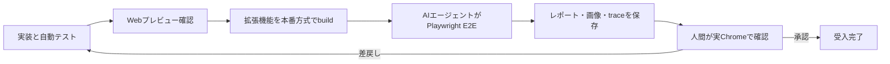

# テスト仕様

- 状態: **確定要件・テストハーネス未実装**
- 更新日: 2026-08-17
- 関連: [要件](REQUIREMENTS.md) / [制約](CONSTRAINTS.md) / [設計](DESIGN.md) / [フロントエンド](FRONTEND.md) / [セキュリティ](SECURITY.md) / [実装タスク](TASKS.md)

## 目的

BookmationのUIを人間が短時間で確認できるようにすると同時に、Chrome拡張機能固有の不具合を通常のWeb画面確認だけで見逃さないため、テスト入口を分離する。

1. 拡張機能UIをテスト／モック専用の通常Webページとして表示する。
2. AIエージェントがビルド済み拡張機能をPlaywrightで確認する。
3. AIエージェントの証拠を引き継ぎ、最後に人間が実Chromeで受入確認する。

この順序は確定仕様である。Webプレビューは拡張機能E2Eの代替ではなく、AIエージェントの確認も人間の最終判断を代替しない。

## 受入フロー

途中の必須段階が未実施、失敗、または環境都合でskipされた場合は、その事実を明記し、受入完了にしない。

## テスト面の分離

| テスト面 | 実行環境 | 主な目的 | 検証できないこと |
| --- | --- | --- | --- |
| Webプレビュー | 通常のローカルWebページ | UI状態、レスポンシブ、操作、アクセシビリティ、デザインレビュー | Chrome権限、Service Worker、拡張機能origin、commands等 |
| 自動単体／統合 | Vitest等のテスト環境 | Domain不変条件、JSON、Repository、Message、エラー処理 | 実Chrome固有のライフサイクルと権限UI |
| 拡張機能E2E | Playwrightが読み込むビルド済みManifest V3拡張 | popup、dashboard、永続化、メッセージ、再読込、ユーザー導線 | 対応端末限定AI、OS固有shortcut、実アカウント判断の全て |
| 人間受入 | 対象版Chromeと隔離テストprofile | 見た目、理解しやすさ、実権限、実ショートカット、実機限定機能 | 自動回帰の再現性 |

## Webプレビューの確定仕様

### 同じUIを使う

- popup、初回／通常ホーム、ブックマーク一覧、カテゴリ・タグ一覧、フルページ検索、編集／作成／設定／AI入力／共有等の画面は、本番と同じReact component、Tailwind token、文言を描画する。
- Webプレビュー専用に画面を複製しない。画面からChrome API、IndexedDB、Prompt API、Driveを直接呼ばず、Port／Adapterを注入する。
- 拡張機能では実Adapter、Webプレビューでは決定的なfake／mock Adapterを使う。
- Webプレビューでしか動かない分岐をプロダクトcomponentへ増やさず、依存注入とfixture選択を境界にする。

### 通常Webページとして開く

- `http://localhost:<port>/...` の通常Webページとしてブラウザから開けることを必須にする。
- Storybookまたは同等の専用preview appを利用できる。具体的なrunnerは [ISSUES.md](ISSUES.md) で決めるが、通常Webページで確認できるという受入条件は変更しない。
- 対象画面とfixtureをURL、toolbar、または両方で明示的に切り替えられるようにし、同じURLで同じ初期状態を再現する。
- popup相当は本番幅のframe内、dashboard相当はデスクトップ／狭幅／200%相当を確認できるviewportで表示する。
- 画面上に `TEST PREVIEW` とfixture名を表示し、本番画面や実データと誤認させない。

### 必須fixture

少なくとも次の状態を人間が一覧または直接URLで開けるようにする。

- 空、通常件数、大量件数、長い日本語、画像なし。
- LIST / GRID、カテゴリ常時表示、タグ閉／開。
- `runtime.onInstalled` のINSTALLで開く初回ホームと、UPDATE／導入完了後の最近追加ホーム。
- 初回Category templateのcatalog表示だけではCategoryが増えない状態、明示適用中／成功／既存active同名／tombstone同名／部分失敗／応答消失後再送／onboarding再開。具体的catalog内容と選択controlのfixtureはISSUE-022の決定後に固定する。
- 親カテゴリ／子タグ、親カテゴリ欠落、Label Normalizer v1のproject-vendored Unicode 15.1.0 asset（NFKC、`White_Space`、`Default_Ignorable_Code_Point`、`CaseFolding.txt` C＋F）、asset hash、runtime ICU非依存golden vector、カテゴリ／タグ各namespace内の名前競合、カテゴリ名とタグ名の相互一致。
- ブックマーク編集の名前／URL／Tag入力、Tag候補0／1／8／9件以上、Category直接入力がない状態、選択Tagの親からCategoryが自動導出される状態、同じmodal内のTag作成side view、draft保持。
- Tag作成／編集の親Category入力候補0／1／8／9件以上、active候補だけからの必須選択、同じmodal内のCategory新規作成side view、Tag draft保持、戻った時の新規Category自動選択。
- Bookmark／Tagの確認画面なしsoft-delete、Category削除の警告取消／確認／revision競合エラーと、全削除でUndo toast／token／期限／復元操作が現れない状態。
- カテゴリ・タグ作成の種類プルダウン、閉じるまでの連続作成、tombstone名前予約、削除済み同名項目がある場合の別名案内、削除後の同名作成拒否、active Tag／active親、tombstone Tag／deleted親、子Tag tombstone残存中の親Category GC拒否、物理回収後の名前再利用。
- Tag編集modalに名前、親Category、作成元、利用件数があり、名前と親を変更できる状態。親変更の参照Bookmark 0件／1件／多数、同じ旧親を残す別Tagあり／なし、Tag／選択親revision競合、transaction途中失敗、`tag-update:` requestIdをsubmit開始時に1回だけ発行すること、応答消失後の同request再送、別payloadでのrequestId再利用を含める。初回と再送の `UpdateTagResult` が同じであることも確認する。
- Tag親変更後にTag IDとglobal unique名規則が維持され、全参照BookmarkのCategory closure・revision・検索文書が更新される状態。AI再分類Jobが作られず、競合・失敗時は全件rollbackされる状態。
- Category編集の使用中Tag実名一覧・件数と関連Bookmark unique件数。通常／管理モード、hover／focus鉛筆、Category削除警告内の同じ件数。
- Category、全子Tag、関連edgeの原子的なcascade soft-delete、影響Bookmark本体の保持、再分類JobのPENDING、AI成功、AI失敗後のNEEDS_REVIEW／手動分類。途中失敗時は削除前状態へrollbackする。
- フルページ検索の両入口、入力候補0／1／8／9件以上、選択、結果0件／複数件。カテゴリ・タグが上、Bookmarkが下。
- AI入力ポップアップのBookmark検索／機能説明、AI利用可／利用不可／準備中／失敗／古い応答。
- 読込中、追加読込、終端、再試行、遅延。
- 訪問期間の未選択／7／30／365日、訪問日数の新規既定null、期間変更時のclear、各期間の入力0／1／上限／上限超過／小数／空、archive日数の新規／欠損migration既定30と正整数入力境界、AI Jobのdiscriminated `{ granularity, maxNewTags }` snapshot全5組／不一致。`0` で新規AIタグなし／既存タグ自動付与あり。
- 同一URLの同日0／1／複数訪問、期間境界の直前／一致／直後、canonical化前の複数URL、`いいえ` の直前／直後／同日再訪／翌日再訪、応答消失後retryをfixture化する。応答前の訪問日を再利用せず、別URLの集計をresetしない。
- `frequentVisitReminderEnabled`、canonical URL単位SUPPRESSED、resetよりSUPPRESSED優先、別URL継続、通知前未保存、history／notifications権限未要求／拒否、旧回数閾値からの日数暗黙移行なし。
- `contextMenuBookmarkEnabled` のfield欠損→ON移行、破損値→OFF縮退、ON／OFF表示、登録失敗時rollback、Service Worker再起動、page／link固定IDの重複なし、OFF直前の遅延click拒否。
- `autoArchiveEnabled` の既定OFF、ON gestureでhistory既許可／request許可／拒否／取消／例外、設定保存失敗、後発 `permissions.onRemoved`、実行直前取消、OFF中の遅延alarm、notifications未要求。historyなしでtrueが永続化されずBookmarkも変化しない。
- カテゴリ・タグ／ページ名／URLだけのarchive、設定のarchive一覧、単数／複数選択復元。権限許可済みでも履歴なしのBookmarkは `ARCHIVE_HISTORY_NOT_FOUND` と日本語エラーを表示し、`lastVisitedAt=null`／ACTIVEのままarchiveされない。
- カテゴリ別／タグ別／個別BookmarkのQR／CSV共通選択、QR容量内生成、境界＋1 byteの `QR_CAPACITY_EXCEEDED`、部分／分割QRなし、選択を保持したCSV action、CSVのcomma／quote／改行／formula先頭文字／UTF-8／download失敗、秘密情報除外。QR読取preview、破損／切詰め、checksum真正性非保証、異親同名Tagの別名／skip／cancel後再preview。
- Driveアカウント未選択／選択、同一accountの `appDataFolder` 同期、別accountの通常Drive file owner／permissions／capabilities、同一field／update-delete／add-delete／名前競合のsyncConflicts、immutable syncSnapshots、版付き明示resolution plan、open中GC拒否、解決後29日／30日境界の保持、暗黙Label ID／edge remap拒否、標準Bookmark Import。
- キーボードフォーカス、200%拡大、reduced motion。

fixtureは版管理されたJSONまたはTypeScriptデータとし、実際の閲覧履歴、実ブックマーク、OAuth token、個人情報を使わない。

### Webプレビューの合格条件

- 主要状態へ3操作以内または直接URLで到達できる。
- フルページ画面、popup、modal、side viewの開閉前後で、論理的な見出し、focus移動、元画面へのfocus復帰を確認できる。
- 本番componentとtokenを共有し、プレビュー専用のUIコピーがない。
- fake Adapterをresetでき、操作を再実行してもfixtureが意図せず汚染されない。
- console error、未処理Promise rejection、React key警告がない。
- キーボードだけで主要操作を確認でき、自動アクセシビリティ検査結果も表示または出力できる。
- Webプレビューのコード、fixture、debug操作を本番拡張成果物へ含めない。

## AIエージェントによるPlaywright確認

### 実行順序

AIエージェントは、人間へ確認を依頼する前に次を実行する。

1. 対象commitと作業ツリーを記録する。
2. lint、typecheck、unit／integration testを実行する。
3. 本番方式で拡張機能をbuildする。
4. 一時的で隔離されたChromium profileへビルド成果物を読み込む。
5. Playwrightで `chrome-extension://<extension-id>/...` の実ページとpopupを操作する。
6. 失敗時のscreenshot、HTML report、trace、console errorを保存する。
7. 成否、skip、未実証事項をまとめてから人間へ引き渡す。

AIエージェントがPlaywrightを起動できない環境では、Webプレビュー結果だけで合格にせず、`未実施` または `blocked` として人間へ伝える。

### 最小E2Eシナリオ

- 拡張機能を読み込み、manifest errorなしでpopupとdashboardを開く。
- popupを開いただけでは保存せず、保存とホームが別操作として動く。
- 新規profileのINSTALLで初回ホームを表示し、UPDATEと完了後の再訪では初期化し直さず最近追加ホームへ進む。
- 現在ページまたはURLを保存し、拡張機能の再読込後も一覧へ残る。
- 一覧からフルページ検索へ切り替え、入力候補が最大8件で選択でき、カテゴリ・タグの検索結果が上、Bookmarkが下に表示される。
- AI入力ポップアップ内でBookmark検索の入力・結果と、Bookmationの機能質問・説明を確認する。
- LIST / GRID切替、カテゴリ／タグ展開、名前／URL／TagだけのBookmark編集を行い、CategoryがTagの親から自動導出され、Category直接入力がないことを確認する。
- Bookmark編集からTag作成side viewへ進み、Category候補を最大8件から選ぶ。必要なCategoryを同じmodalのside viewで作り、Tag draftを失わず戻って新規Categoryが自動選択されることを確認する。
- Bookmark／Tagを確認なしでsoft-deleteし、削除後にUndo toast／復元操作がなく、Undo用message、token、期限、error codeが生成されないことを確認する。
- カテゴリ・タグ一覧で新規作成を閉じるまで繰り返し、tombstoneを含む同名作成を拒否する。削除済み同名項目には別名を案内し、削除後も名前予約が維持されることを確認する。
- active Tag作成ではactive親Categoryを要求し、tombstone Tagだけがdeleted親を参照できること、子Tag tombstoneが残る親Categoryを物理GCできないことを確認する。
- Tag編集で親Categoryをactive候補最大8件から選ぶ。Category作成side viewへ移ってもTag draftを失わず、作成後に戻って新規Categoryが自動選択されることを確認する。
- Tagと選択親のexpected revisionおよびsubmit開始時に1回発行した `tag-update:` requestIdを送って保存し、Tag IDとglobal unique名規則を維持したまま全参照BookmarkのCategory表示・revision・検索文書が一括更新され、AI再分類が開始されないことを確認する。競合・途中失敗時は全件rollbackし、dialogとdraftを保持する。同request再送は同じmutation receiptの同じ `UpdateTagResult` へ収束し、別payloadでのrequestId再利用は拒否する。
- 管理モードの鉛筆からCategory編集を開き、使用中Tagの実名一覧・件数と関連Bookmark unique件数を確認する。
- Category削除で全子Tagと関連edgeの連鎖削除、影響件数、Bookmark再分類を同じsnapshotから警告する。取消では変更しない。警告後に子Tagの作成／削除、BookmarkへのTag追加／解除、対象revision更新をそれぞれ行い、`expectedImpactFingerprint` 不一致で削除せず最新影響を再警告することを確認する。一致時だけcascade soft-deleteしてBookmark本体を残し、PENDING再分類を開始する。
- Category cascadeは子Tag 0件／Bookmark 0件、1件のBookmarkが同じCategory配下の複数Tagを持つ場合、大量件数をfixture化する。成功responseだけを失って同じCategory・`category-delete:` requestIdのcommandを再送しても、revision／fingerprintのstale errorではなくno-op成功となり、Job、Outbox、BookmarkRevisionが増えないことを確認する。同じrequestIdを別Categoryへ使うと拒否され、`tag-update:` requestIdを受理しないことも確認する。
- Category cascade削除の途中失敗が全体rollbackされること、AI分類失敗がBookmark消失ではなくNEEDS_REVIEW／手動分類になること、削除Undoは表示されないことを確認する。
- AI Jobのdiscriminated snapshot全5組と不一致拒否を確認し、`0` では新規AIタグを作らず既存タグは自動付与されることを確認する。
- AIのTag名競合ではoriginを問わず既存Tagを再評価し、USER優先、親／意味不適合のNEEDS_REVIEWを確認する。
- AI利用不可でも保存、手動分類、keyword検索が継続する。
- Message再送やService Worker再起動で重複作成または部分保存が起きない。
- Webプレビューで確認した主要画面と実拡張機能のスクリーンショットに意図しない構造差がない。

P1機能を実装した後は、訪問日数既定null、訪問期間3種、期間別境界、期間変更時clear、同日重複排除、`いいえ` のURL別reset、旧回数設定migration、`frequentVisitReminderEnabled` とcanonical URL単位SUPPRESSED、archive既定OFF／30日、history許可時だけON、拒否／後発取消、履歴なし項目別エラー／archive不可、最小archive復元、QR／CSV共通選択、QR容量境界＋CSV誘導、CSV escaping／formula neutralization／秘密情報除外、QR checksum境界と異親同名Tag再preview、同一accountの `appDataFolder` 同期、別accountの通常Drive file権限共有、Drive競合4種のimmutable syncSnapshots／明示resolution plan／open中GC拒否／解決後30日保持／暗黙Label・edge remap拒否、標準Bookmark非破壊取込を追加する。context menuは設定欠損時の既定ON、ON／OFF反復、page／link各1件、worker再起動、登録失敗rollback、危険URL拒否、OFF直前の遅延clickでBookmarkが増えないことを実拡張E2Eで確認する。

### Playwrightで守る境界

- テストごとに一時user data directoryを作り、開発者の日常Chrome profileを使わない。
- 実在する個人データ、閲覧履歴、通常利用中のGoogleアカウントを暗黙に使わない。
- locatorは利用者に見えるrole、name、labelを優先し、内部実装だけに依存しない。
- retryで偶然成功したflaky testを無条件に合格扱いせず、初回失敗とtraceを残す。
- screenshot基準を更新する場合は差分を人間が確認する。AIエージェントだけで一括承認しない。

## 人間による最終確認

人間はAIエージェントが確認したものと同じcommit／buildを対象にする。再buildした場合はbuild SHAまたは成果物hashを更新し、別成果物を確認したことを明示する。

### 人間が確認するもの

- Webプレビューで主要fixtureとresponsive状態を目視する。
- PlaywrightのHTML report、失敗／skip、screenshot差分、traceを確認する。
- 対象Chromeへ拡張機能を読み込み、初回ホーム、Category templateの明示適用、popup、dashboard、フルページ検索、AI入力ポップアップ、保存、Tag-only Bookmark編集、Tag／Category side view作成、Tag親変更fan-out、Category使用状況、Category削除警告と再分類、設定の主要導線を操作する。templateを表示しただけではCategoryが増えず、適用後のCategoryが通常の管理画面で編集・削除できることを確認する。P1実装後は一般設定から右クリック保存をON／OFFし、実際のpage／link menuの出現／消失と再起動後の維持を人間も確認する。
- Prompt APIの検索／機能説明、実ショートカット競合、OS通知、訪問期間変更時の入力clear、同日重複排除、`いいえ` 後のURL別reset、canonical URL単位の「次回以降表示しない」、archive toggleのhistory権限prompt／拒否／取消と履歴なしエラー、QR容量超過時のCSV誘導、CSV download、QR checksum説明／カメラ読取、Driveアカウント選択／OAuth／明示resolution planと暗黙remapがないconflict解決等、自動環境で実証できない項目を確認する。
- デザインシートとの視覚差、Tag編集のCategory候補／新規作成／draft復帰と親変更結果を理解できるか、Category cascade削除警告で対象・影響件数・Bookmark保持／再分類を理解できるか、文言、フォーカス、スクリーンリーダー等の人間判断を記録する。

### 最終承認の条件

- AIエージェントの必須Playwrightシナリオが成功している。
- skip／未実証項目を人間が確認したか、対象外として理由付きで承認している。
- blockerまたはデータ損失につながる既知失敗がない。
- `WORKLOG.md` またはPRへ、確認者、日付、commit、環境、結果、残課題が記録されている。

人間の確認前にAIエージェントが成功と報告しても、最終受入は完了しない。逆に、人間の目視だけで自動テストとPlaywrightを省略しない。

## テスト証拠

各引き渡しで次を残す。

| 項目 | 必須内容 |
| --- | --- |
| 対象 | commit SHA、dirty差分の有無、build成果物hashまたは識別子 |
| 環境 | OS、Node、pnpm、Plasmo、Playwright、Chromium／Chrome版 |
| コマンド | 実際に実行したlint、typecheck、test、build、E2E |
| 結果 | pass、fail、flaky、skip、未実施を区別した件数 |
| 画面証拠 | WebプレビューURL／fixture、screenshot差分、HTML report、trace |
| 人間確認 | 確認者、日時、操作範囲、承認／差戻し、残課題 |

URL、タイトル、検索文、履歴、token等の利用者データは証拠へ含めない。テストartifactの保存期間と公開範囲はCI実装時に決める。

## コマンド契約

現在実装済みなのは `pnpm test` のVitestだけである。次のscriptはテストハーネス実装時に追加する目標契約であり、存在確認前に成功したと記録しない。

| command | 目的 | 現在 |
| --- | --- | --- |
| `pnpm test` | unit／integration | 実装済み |
| `pnpm ui:preview` | 通常WebページのUIプレビューを起動 | 未実装 |
| `pnpm ui:build` | レビュー可能な静的UIプレビューを生成 | 未実装 |
| `pnpm test:e2e` | ビルド済み拡張機能のPlaywright E2E | 未実装 |
| `pnpm test:e2e:ui` | AIエージェント／人間が画面付きでデバッグ | 未実装 |

script名を変更する場合は、同じ変更で本書、`package.json`、[QUICKSTART.md](QUICKSTART.md)、CI、[WORKLOG.md](WORKLOG.md)を更新する。

## 完了の判定

テスト基盤の実装は、次の全てを満たした場合だけ完了とする。

- Webプレビューが通常Webページとして開き、必須fixtureを同じproduction componentで表示する。
- AIエージェントがPlaywrightで実拡張機能を確認し、再現可能な証拠を出力する。
- 人間が同じ成果物を確認して承認または差戻しを記録できる。
- Webプレビュー、拡張機能E2E、人間受入の責務と未検証範囲が混同されない。
- CIまたはローカル実行失敗を隠す自動skip、無制限retry、基準画像の無審査更新がない。
