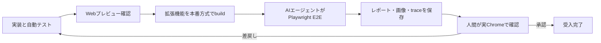

# テスト仕様

- 状態: **確定要件・テストハーネス未実装**
- 更新日: 2026-08-17
- 関連: [要件](REQUIREMENTS.md) / [制約](CONSTRAINTS.md) / [設計](DESIGN.md) / [フロントエンド](FRONTEND.md) / [セキュリティ](SECURITY.md) / [実装タスク](TASKS.md)

## 目的

BookmationのUIを人間が短時間で確認できるようにすると同時に、Chrome拡張機能固有の不具合を通常のWeb画面確認だけで見逃さないため、テスト入口を分離する。

1. 拡張機能UIをテスト／モック専用の通常Webページとして表示する。
2. AIエージェントがビルド済み拡張機能をPlaywrightで確認する。
3. AIエージェントの証拠を引き継ぎ、最後に人間が実Chromeで受入確認する。

この順序は確定仕様である。Webプレビューは拡張機能E2Eの代替ではなく、AIエージェントの確認も人間の最終判断を代替しない。

## 受入フロー

途中の必須段階が未実施、失敗、または環境都合でskipされた場合は、その事実を明記し、受入完了にしない。

## テスト面の分離

| テスト面 | 実行環境 | 主な目的 | 検証できないこと |
| --- | --- | --- | --- |
| Webプレビュー | 通常のローカルWebページ | UI状態、レスポンシブ、操作、アクセシビリティ、デザインレビュー | Chrome権限、Service Worker、拡張機能origin、commands等 |
| 自動単体／統合 | Vitest等のテスト環境 | Domain不変条件、JSON、Repository、Message、エラー処理 | 実Chrome固有のライフサイクルと権限UI |
| 拡張機能E2E | Playwrightが読み込むビルド済みManifest V3拡張 | popup、dashboard、永続化、メッセージ、再読込、ユーザー導線 | 対応端末限定AI、OS固有shortcut、実アカウント判断の全て |
| 人間受入 | 対象版Chromeと隔離テストprofile | 見た目、理解しやすさ、実権限、実ショートカット、実機限定機能 | 自動回帰の再現性 |

## Webプレビューの確定仕様

### 同じUIを使う

- popup、初回／通常ホーム、ブックマーク一覧、カテゴリ・タグ一覧、フルページ検索、編集／作成／設定／AI入力／共有等の画面は、本番と同じReact component、Tailwind token、文言を描画する。
- Webプレビュー専用に画面を複製しない。画面からChrome API、IndexedDB、Prompt API、Driveを直接呼ばず、Port／Adapterを注入する。
- 拡張機能では実Adapter、Webプレビューでは決定的なfake／mock Adapterを使う。
- Webプレビューでしか動かない分岐をプロダクトcomponentへ増やさず、依存注入とfixture選択を境界にする。

### 通常Webページとして開く

- `http://localhost:<port>/...` の通常Webページとしてブラウザから開けることを必須にする。
- Storybookまたは同等の専用preview appを利用できる。具体的なrunnerは [ISSUES.md](ISSUES.md) で決めるが、通常Webページで確認できるという受入条件は変更しない。
- 対象画面とfixtureをURL、toolbar、または両方で明示的に切り替えられるようにし、同じURLで同じ初期状態を再現する。
- popup相当は本番幅のframe内、dashboard相当はデスクトップ／狭幅／200%相当を確認できるviewportで表示する。
- 画面上に `TEST PREVIEW` とfixture名を表示し、本番画面や実データと誤認させない。

### 必須fixture

少なくとも次の状態を人間が一覧または直接URLで開けるようにする。

- 空、通常件数、大量件数、長い日本語、画像なし。
- LIST / GRID、カテゴリ常時表示、タグ閉／開。
- `runtime.onInstalled` のINSTALLで開く初回ホームと、UPDATE／導入完了後の最近追加ホーム。
- 親カテゴリ／子タグ、親カテゴリ欠落、Label Normalizer v1のproject-vendored Unicode 15.1.0 asset（NFKC、`White_Space`、`Default_Ignorable_Code_Point`、`CaseFolding.txt` C＋F）、asset hash、runtime ICU非依存golden vector、カテゴリ／タグ各namespace内の名前競合、カテゴリ名とタグ名の相互一致。
- ブックマーク編集のカテゴリ／タグ別入力、既存候補0／1／8／9件以上、同じmodal内の新規作成side view、draft保持。
- Bookmark／Category／Tagの確認画面なしsoft-deleteと、削除後にUndo toast／token／期限／復元操作が現れない状態。
- カテゴリ・タグ作成の種類プルダウン、閉じるまでの連続作成、tombstone名前予約、削除済み同名項目がある場合の別名案内、削除後の同名作成拒否、active Tag／active親、tombstone Tag／deleted親、子Tag tombstone残存中の親Category GC拒否、物理回収後の名前再利用。
- タグ編集modalの親カテゴリ読取専用表示。親カテゴリ変更はISSUE-019決定前のfixture／commandへ含めない。
- 通常／管理モード、hover／focus鉛筆、子タグ残存カテゴリの削除BLOCK、子タグ削除／中止だけの案内、移動／cascadeなし。
- フルページ検索の両入口、入力候補0／1／8／9件以上、選択、結果0件／複数件。カテゴリ・タグが上、Bookmarkが下。
- AI入力ポップアップのBookmark検索／機能説明、AI利用可／利用不可／準備中／失敗／古い応答。
- 読込中、追加読込、終端、再試行、遅延。
- 訪問回数／archive日数の正整数入力（空、0、小数、境界外）とAI Jobのdiscriminated `{ granularity, maxNewTags }` snapshot全5組／不一致。`0` で新規AIタグなし／既存タグ自動付与あり。
- `frequentVisitReminderEnabled`、canonical URL単位SUPPRESSED、別URL継続、通知前未保存、history／notifications権限未要求／拒否。
- archive初回開始時のhistory権限説明、拒否後も日数保持＋`権限待ち`、notifications未要求、`autoArchiveEnabled` UIなし。
- カテゴリ・タグ／ページ名／URLだけのarchive、設定のarchive一覧、単数／複数選択復元。
- カテゴリ別／タグ別／個別BookmarkのQR選択・生成、QR読取preview、破損／切詰め、checksum真正性非保証、異親同名Tagの別名／skip／cancel後再preview。
- Driveアカウント未選択／選択、同一accountの `appDataFolder` 同期、別accountの通常Drive file owner／permissions／capabilities、同一field／update-delete／add-delete／名前競合のsyncConflicts、immutable syncSnapshots、版付き明示resolution plan、open中GC拒否、解決後29日／30日境界の保持、暗黙Label ID／edge remap拒否、標準Bookmark Import。
- キーボードフォーカス、200%拡大、reduced motion。

fixtureは版管理されたJSONまたはTypeScriptデータとし、実際の閲覧履歴、実ブックマーク、OAuth token、個人情報を使わない。

### Webプレビューの合格条件

- 主要状態へ3操作以内または直接URLで到達できる。
- フルページ画面、popup、modal、side viewの開閉前後で、論理的な見出し、focus移動、元画面へのfocus復帰を確認できる。
- 本番componentとtokenを共有し、プレビュー専用のUIコピーがない。
- fake Adapterをresetでき、操作を再実行してもfixtureが意図せず汚染されない。
- console error、未処理Promise rejection、React key警告がない。
- キーボードだけで主要操作を確認でき、自動アクセシビリティ検査結果も表示または出力できる。
- Webプレビューのコード、fixture、debug操作を本番拡張成果物へ含めない。

## AIエージェントによるPlaywright確認

### 実行順序

AIエージェントは、人間へ確認を依頼する前に次を実行する。

1. 対象commitと作業ツリーを記録する。
2. lint、typecheck、unit／integration testを実行する。
3. 本番方式で拡張機能をbuildする。
4. 一時的で隔離されたChromium profileへビルド成果物を読み込む。
5. Playwrightで `chrome-extension://<extension-id>/...` の実ページとpopupを操作する。
6. 失敗時のscreenshot、HTML report、trace、console errorを保存する。
7. 成否、skip、未実証事項をまとめてから人間へ引き渡す。

AIエージェントがPlaywrightを起動できない環境では、Webプレビュー結果だけで合格にせず、`未実施` または `blocked` として人間へ伝える。

### 最小E2Eシナリオ

- 拡張機能を読み込み、manifest errorなしでpopupとdashboardを開く。
- popupを開いただけでは保存せず、保存とホームが別操作として動く。
- 新規profileのINSTALLで初回ホームを表示し、UPDATEと完了後の再訪では初期化し直さず最近追加ホームへ進む。
- 現在ページまたはURLを保存し、拡張機能の再読込後も一覧へ残る。
- 一覧からフルページ検索へ切り替え、入力候補が最大8件で選択でき、カテゴリ・タグの検索結果が上、Bookmarkが下に表示される。
- AI入力ポップアップ内でBookmark検索の入力・結果と、Bookmationの機能質問・説明を確認する。
- LIST / GRID切替、カテゴリ／タグ展開、カテゴリ／タグ別入力によるBookmark編集、side view作成、3 entityの確認なしsoft-deleteを行う。
- 削除後にUndo toast／復元操作がなく、Undo用message、token、期限、error codeが生成されないことを確認する。
- カテゴリ・タグ一覧で新規作成を閉じるまで繰り返し、tombstoneを含む同名作成を拒否する。削除済み同名項目には別名を案内し、削除後も名前予約が維持されることを確認する。
- active Tag作成ではactive親Categoryを要求し、tombstone Tagだけがdeleted親を参照できること、子Tag tombstoneが残る親Categoryを物理GCできないことを確認する。
- タグ編集では親カテゴリを読取専用で表示し、ISSUE-019決定前に親変更commandを送らない。
- 管理モードの鉛筆から編集し、確認画面なしのsoft-deleteを行う。削除Undoは表示せず、子タグが残るカテゴリはBLOCKされ、cascade deleteされない。
- AI Jobのdiscriminated snapshot全5組と不一致拒否を確認し、`0` では新規AIタグを作らず既存タグは自動付与されることを確認する。
- AIのTag名競合ではoriginを問わず既存Tagを再評価し、USER優先、親／意味不適合のNEEDS_REVIEWを確認する。
- AI利用不可でも保存、手動分類、keyword検索が継続する。
- Message再送やService Worker再起動で重複作成または部分保存が起きない。
- Webプレビューで確認した主要画面と実拡張機能のスクリーンショットに意図しない構造差がない。

P1機能を実装した後は、訪問／archive正整数入力、`frequentVisitReminderEnabled` とcanonical URL単位SUPPRESSED、archiveのhistory権限待ち、最小archive復元、QR checksum境界と異親同名Tag再preview、同一accountの `appDataFolder` 同期、別accountの通常Drive file権限共有、Drive競合4種のimmutable syncSnapshots／明示resolution plan／open中GC拒否／解決後30日保持／暗黙Label・edge remap拒否、標準Bookmark非破壊取込、context menuの危険URL拒否を追加する。

### Playwrightで守る境界

- テストごとに一時user data directoryを作り、開発者の日常Chrome profileを使わない。
- 実在する個人データ、閲覧履歴、通常利用中のGoogleアカウントを暗黙に使わない。
- locatorは利用者に見えるrole、name、labelを優先し、内部実装だけに依存しない。
- retryで偶然成功したflaky testを無条件に合格扱いせず、初回失敗とtraceを残す。
- screenshot基準を更新する場合は差分を人間が確認する。AIエージェントだけで一括承認しない。

## 人間による最終確認

人間はAIエージェントが確認したものと同じcommit／buildを対象にする。再buildした場合はbuild SHAまたは成果物hashを更新し、別成果物を確認したことを明示する。

### 人間が確認するもの

- Webプレビューで主要fixtureとresponsive状態を目視する。
- PlaywrightのHTML report、失敗／skip、screenshot差分、traceを確認する。
- 対象Chromeへ拡張機能を読み込み、初回ホーム、popup、dashboard、フルページ検索、AI入力ポップアップ、保存、編集、カテゴリ・タグ作成／管理、設定の主要導線を操作する。
- Prompt APIの検索／機能説明、実ショートカット競合、OS通知、canonical URL単位の「次回以降表示しない」、archiveのhistory権限待ち、QR checksum説明／カメラ読取、Driveアカウント選択／OAuth／明示resolution planと暗黙remapがないconflict解決等、自動環境で実証できない項目を確認する。
- デザインシートとの視覚差、文言の理解しやすさ、フォーカス、スクリーンリーダー等の人間判断を記録する。

### 最終承認の条件

- AIエージェントの必須Playwrightシナリオが成功している。
- skip／未実証項目を人間が確認したか、対象外として理由付きで承認している。
- blockerまたはデータ損失につながる既知失敗がない。
- `WORKLOG.md` またはPRへ、確認者、日付、commit、環境、結果、残課題が記録されている。

人間の確認前にAIエージェントが成功と報告しても、最終受入は完了しない。逆に、人間の目視だけで自動テストとPlaywrightを省略しない。

## テスト証拠

各引き渡しで次を残す。

| 項目 | 必須内容 |
| --- | --- |
| 対象 | commit SHA、dirty差分の有無、build成果物hashまたは識別子 |
| 環境 | OS、Node、pnpm、Plasmo、Playwright、Chromium／Chrome版 |
| コマンド | 実際に実行したlint、typecheck、test、build、E2E |
| 結果 | pass、fail、flaky、skip、未実施を区別した件数 |
| 画面証拠 | WebプレビューURL／fixture、screenshot差分、HTML report、trace |
| 人間確認 | 確認者、日時、操作範囲、承認／差戻し、残課題 |

URL、タイトル、検索文、履歴、token等の利用者データは証拠へ含めない。テストartifactの保存期間と公開範囲はCI実装時に決める。

## コマンド契約

現在実装済みなのは `pnpm test` のVitestだけである。次のscriptはテストハーネス実装時に追加する目標契約であり、存在確認前に成功したと記録しない。

| command | 目的 | 現在 |
| --- | --- | --- |
| `pnpm test` | unit／integration | 実装済み |
| `pnpm ui:preview` | 通常WebページのUIプレビューを起動 | 未実装 |
| `pnpm ui:build` | レビュー可能な静的UIプレビューを生成 | 未実装 |
| `pnpm test:e2e` | ビルド済み拡張機能のPlaywright E2E | 未実装 |
| `pnpm test:e2e:ui` | AIエージェント／人間が画面付きでデバッグ | 未実装 |

script名を変更する場合は、同じ変更で本書、`package.json`、[QUICKSTART.md](QUICKSTART.md)、CI、[WORKLOG.md](WORKLOG.md)を更新する。

## 完了の判定

テスト基盤の実装は、次の全てを満たした場合だけ完了とする。

- Webプレビューが通常Webページとして開き、必須fixtureを同じproduction componentで表示する。
- AIエージェントがPlaywrightで実拡張機能を確認し、再現可能な証拠を出力する。
- 人間が同じ成果物を確認して承認または差戻しを記録できる。
- Webプレビュー、拡張機能E2E、人間受入の責務と未検証範囲が混同されない。
- CIまたはローカル実行失敗を隠す自動skip、無制限retry、基準画像の無審査更新がない。
