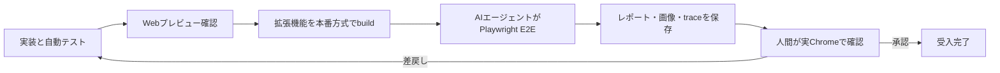

# テスト仕様

- 状態: **確定要件・UI-01 component sheet／UI-02 App Shell／UI-03 popup／UI-04 Bookmark一覧fixture実装済み・拡張E2E基盤／人間受入未実装**
- 更新日: 2026-08-23
- 関連: [要件](REQUIREMENTS.md) / [制約](CONSTRAINTS.md) / [設計](DESIGN.md) / [フロントエンド](FRONTEND.md) / [セキュリティ](SECURITY.md) / [実装タスク](TASKS.md)

## 目的

BookmationのUIを人間が短時間で確認できるようにすると同時に、Chrome拡張機能固有の不具合を通常のWeb画面確認だけで見逃さないため、テスト入口を分離する。

1. 拡張機能UIをテスト／モック専用の通常Webページとして表示する。
2. AIエージェントがビルド済み拡張機能をPlaywrightで確認する。
3. AIエージェントの証拠を引き継ぎ、最後に人間が実Chromeで受入確認する。

この順序は確定仕様である。Webプレビューは拡張機能E2Eの代替ではなく、AIエージェントの確認も人間の最終判断を代替しない。

視覚確認でも [REQUIREMENTS.md](REQUIREMENTS.md) と [UI.md](UI.md) をFigmaより優先する。Figmaとの差分だけを理由に、仕様書どおりの配置、部品、状態、操作を失敗扱いしない。

## 受入フロー

途中の必須段階が未実施、失敗、または環境都合でskipされた場合は、その事実を明記し、受入完了にしない。

## テスト面の分離

| テスト面       | 実行環境                                      | 主な目的                                                       | 検証できないこと                                       |
| -------------- | --------------------------------------------- | -------------------------------------------------------------- | ------------------------------------------------------ |
| Webプレビュー  | 通常のローカルWebページ                       | UI状態、レスポンシブ、操作、アクセシビリティ、デザインレビュー | Chrome権限、Service Worker、拡張機能origin、commands等 |
| 自動単体／統合 | Vitest等のテスト環境                          | Domain不変条件、JSON、Repository、Message、エラー処理          | 実Chrome固有のライフサイクルと権限UI                   |
| 拡張機能E2E    | Playwrightが読み込むビルド済みManifest V3拡張 | popup、dashboard、永続化、メッセージ、再読込、ユーザー導線     | 対応端末限定AI、OS固有shortcut、実アカウント判断の全て |
| 人間受入       | 対象版Chromeと隔離テストprofile               | 見た目、理解しやすさ、実権限、実ショートカット、実機限定機能   | 自動回帰の再現性                                       |

## Webプレビューの確定仕様

UI-01ではVite 7.3.6をrunnerとして採用し、semantic tokenとButton／Dialog／Switch／Slider／Selectをproduction codeから直接読み込むcomponent sheetを実装した。UI-02ではproductionのApp Shell、共通Header、型付きhash routeと同じcomponentを使う全画面shell fixtureを追加した。UI-03ではproductionの`PopupView`を共有し、`?view=popup&fixture=assigned`から割当済み／未割当、保存中／成功／重複／失敗、shortcut取得失敗を表示できる。UI-04ではproductionの`BookmarkListPage`とfake `BookmarkListPort`を共有し、`?view=bookmarks&fixture=grid#/home`からGRID／LIST／空／1件／多数／読込中／初回失敗／追加失敗を表示できる。Category／Tag管理、検索、設定等の残りのfeature data／fake Adapterとfixture catalogは未実装であり、Web fixtureの存在はPlaywright拡張E2E基盤、実Bookmark保存、画像Blob解決の完了を意味しない。

### 同じUIを使う

- popup、初回／通常ホーム、ブックマーク一覧、カテゴリ・タグ一覧、フルページ検索、編集／作成／設定／AI入力／共有等の画面は、本番と同じReact component、Tailwind token、文言を描画する。
- Webプレビュー専用に画面を複製しない。画面からChrome API、IndexedDB、Prompt API、Driveを直接呼ばず、Port／Adapterを注入する。
- 拡張機能では実Adapter、Webプレビューでは決定的なfake／mock Adapterを使う。
- Webプレビューでしか動かない分岐をプロダクトcomponentへ増やさず、依存注入とfixture選択を境界にする。

### 通常Webページとして開く

- `http://localhost:<port>/...` の通常Webページとしてブラウザから開けることを必須にする。
- Viteの独立preview appを利用し、preview entryとfixture codeをPlasmo production entryから参照しない。通常Webページで確認できるという受入条件は変更しない。
- UI-02の全画面shellは `?view=app-shell#/home` で開く。これはrouting、共通header、responsive shellを確認する入口であり、Bookmark等のfeature fixtureではない。
- UI-04のBookmark一覧は `?view=bookmarks&fixture=grid#/home` で開く。`fixture`は`grid`／`list`／`empty`／`single`／`many`／`loading`／`initial-error`／`page-error`から選ぶ。
- 対象画面とfixtureをURL、toolbar、または両方で明示的に切り替えられるようにし、同じURLで同じ初期状態を再現する。
- popup相当は本番幅のframe内、dashboard相当はデスクトップ／狭幅／200%相当を確認できるviewportで表示する。
- 画面上に `TEST PREVIEW` とfixture名を表示し、本番画面や実データと誤認させない。

### 必須fixture

少なくとも次の状態を人間が一覧または直接URLで開けるようにする。

- 空、通常件数、大量件数、長い日本語、画像なし、`og:image` 取得成功、MIME／寸法／容量／content hash検証失敗、取得失敗時の同梱Bookmationロゴfallback。
- LIST / GRID、カテゴリ常時表示、タグ閉／開。
- `runtime.onInstalled` のINSTALLで開く初回ホームと、UPDATE／導入完了後の最近追加ホーム。
- 初回Category templateのcatalog表示だけではCategoryが増えない状態、明示適用中／成功／既存active同名／tombstone同名／部分失敗／応答消失後再送／onboarding再開。具体的catalog内容と選択controlのfixtureはISSUE-022の決定後に固定する。
- 親カテゴリ／子タグ、親カテゴリ欠落、Label Normalizer v1のproject-vendored Unicode 15.1.0 asset（NFKC、`White_Space`、`Default_Ignorable_Code_Point`、`CaseFolding.txt` C＋F）、asset hash、runtime ICU非依存golden vector、カテゴリ／タグ各namespace内の名前競合、カテゴリ名とタグ名の相互一致。
- ブックマーク追加／編集の名前／URL／空のTag入力、リアルタイムTag候補0／1／8／9件以上、`タグ n件` 左／`追加` 右、現在Tagの初期展開、Tag chip形状、カテゴリ・タグシェブロン相当のhover／focus減光と中央解除button、pointer／keyboardによる個別解除、連続追加後の入力clear／focus復帰、重複Tag、IME変換中Enter、Category直接入力がない状態、選択Tagの親からCategoryが自動導出される状態、同じmodal内のTag作成side view、作成Tagを解決済み選択へ戻して `追加`／Enterで確定する状態、draft保持。
- Bookmark追加／編集で、存在しないTag文字列を `追加`／Enterした時にfield errorを表示し、Tag ID／edgeを作らない状態。
- Tag作成の空の親Category入力と、Tag編集の現在Category選択済み入力。候補0／1／8／9件以上、activeな正規化完全一致または候補選択時点の単一選択、Category用 `追加` buttonなし、未知Categoryのfield error、同じmodal内のCategory新規作成side view、Tag draft保持、戻った時の新規Category自動選択。
- Bookmark／Tagの確認画面なしsoft-delete、Category削除の警告取消／確認／revision競合エラーと、全削除でUndo toast／token／期限／復元操作が現れない状態。
- カテゴリ・タグ作成の種類プルダウン、閉じるまでの連続作成、tombstone名前予約、削除済み同名項目がある場合の別名案内、削除後の同名作成拒否、active Tag／active親、tombstone Tag／deleted親、子Tag tombstone残存中の親Category GC拒否、物理回収後の名前再利用。
- Tag編集modalに名前、親Category、作成元、利用件数があり、名前と親を変更できる状態。親変更の参照Bookmark 0件／1件／多数、同じ旧親を残す別Tagあり／なし、Tag／選択親revision競合、transaction途中失敗、`tag-update:` requestIdをsubmit開始時に1回だけ発行すること、応答消失後の同request再送、別payloadでのrequestId再利用を含める。初回と再送の `UpdateTagResult` が同じであることも確認する。
- Tag親変更後にTag IDとglobal unique名規則が維持され、全参照BookmarkのCategory closure・revision・検索文書が更新される状態。AI再分類Jobが作られず、競合・失敗時は全件rollbackされる状態。
- Category編集の使用中Tag実名一覧・件数と関連Bookmark unique件数。通常／管理モード、hover／focus鉛筆、Category削除警告内の同じ件数。
- Category、全子Tag、関連edgeの原子的なcascade soft-deleteと影響Bookmark本体の保持。AI設定がCONFIGUREDかつenabledなら再分類JobのPENDING、AI成功、3 dispatchすべてquality-zero後のNEEDS_REVIEW、恒久非対応／実行上限／technical failure込みのdispatch枯渇後のFAILEDを確認する。disabled／再設定待ちはJobなしで残存active Tag有無に応じたCLASSIFIED／UNCLASSIFIED、手動分類を確認する。途中失敗時は削除前状態へrollbackする。
- フルページ検索の両入口、入力候補0／1／8／9件以上、選択、結果0件／複数件。カテゴリ・タグが上、Bookmarkが下。
- AI入力ポップアップのBookmark検索／機能説明、AI利用可／利用不可／準備中／失敗／古い応答。
- 読込中、追加読込、終端、再試行、遅延。
- 訪問期間の未選択／7／30／365日、訪問日数の新規既定null、期間変更時のclear、各期間の入力0／1／上限／上限超過／小数／空、archive日数の新規／欠損migration既定30と正整数入力境界、AI Jobのpolicy version 2全5組とgranularity／reusePolicy／allowedCreateImportance不一致。新規installのclassificationSettingsがCONFIGURED／enabled／granularity 2／BALANCED／revision 1であることも固定fixtureで確認する。0／1はCORE、2はMAJORまで、3はSUPPORTINGまで、4はDETAILまでCREATEでき、0と1では既存Tagを再利用できる意味範囲が異なるfixtureを使う。
- 決定的validator試験では、モデル出力のCategory 0件／1件／複数／snapshot候補外、全候補が選択Category配下、既存手動Tag由来の別Category保持を確認する。候補外Category IDは試行全体のquality-zero、候補外REUSE Tag IDはそのcandidateだけの棄却とする。保存済みCategory／Tagのdeleted／revision不一致は後述のstale fixtureで区別する。同じID／normalizedNameは全値でcanonical化し、選択Category外の同じnormalizedNameはCREATE／REUSE／親変更を拒否する。異なるnormalizedNameの同義語、略称、翻訳、表記揺れはproduction validatorの決定的合否へ使わず、固定oracleの実モデル評価で全値REUSE品質を測る。許可外importanceのCREATEだけを棄却し、旧件数上限を超える正常候補も全件採用して先頭N件やconfidence上位N件へ切り捨てない。
- AI候補の正常2件＋不正3件では正常2件を1 transactionで適用しSUCCEEDED、retryなしとする。既付与REUSEも冪等成功として終了する。重複は「重複以外を先に検証」「選択Category内の同じnormalizedNameのactive TAGへ解決できるCREATEは重複棄却前にREUSEへ変換」「同じREUSE IDの先頭正常要素」「同じnormalizedNameではREUSE優先」「USER／AI／IMPORT／SHAREとID順」「同じnormalizedNameのCREATEの先頭正常要素」で決定的に収束し、不正な先行候補が正常な後続候補を抑止しない。選択Category外の同じnormalizedNameやtombstone予約ではCREATE／REUSE／親変更をしない。正常候補0件だけ次を試し、1回目0件／2回目成功では2回目だけを採用し、試行間で結合・多数決しない。3 dispatchすべてquality-zeroならNEEDS_REVIEW、正常集合のtransaction失敗は全件rollbackとする。部分棄却があってもPARTIAL_SUCCESSを作らずaccepted／rejected診断を確認する。
- attempt outcomeはJSON／envelope／Category全体不正をGLOBAL_INVALID、正常envelopeのNEEDS_REVIEW、空配列、全candidate棄却をZERO_VALID、timeout等をTECHNICAL_FAILURE、適用完了をAPPLIED、設定による取消をCANCELED_SETTINGSとして固定し、phaseと混同しないことを確認する。GLOBAL_INVALID／ZERO_VALID／TECHNICAL_FAILURE／CANCELED_SETTINGSをCLOSEDにするtransactionでactiveAttemptIdがnullになり、次のPREPAREDだけが新IDを設定し、CLOSED／VALIDATED attemptへの重複応答を拒否する。設定取消ではAI_DISABLED／SETTINGS_RECONFIGURATION_REQUIREDの診断も確認する。
- 再分類成功では置換をTAG edgeだけに限定し、旧 `assignedBy=AI` TAG edgeのうち今回にないものだけを論理削除し、残るAI TAG edgeのJob／confidenceを更新する。USER／IMPORT／SHAREとUSERへ昇格済みTAG edgeは、今回候補にない場合も保持し、AI REUSEでもprovenance／既存confidenceを上書きしない。新規AI TAG edgeだけが現在Job由来になることを確認する。既存AI TagをBookmark手動編集で明示選択した時点でUSER、confidence／classificationJobId=nullへ昇格し、次回再分類で消えないことを確認する。同じCategoryにUSER＋AI、IMPORT＋AI、SHARE＋AIの子Tagがあるfixtureで、派生CATEGORY edgeがUSER、IMPORT、SHARE、AIの順に決まり、confidence／classificationJobIdは常にnullで、AI sweep対象にならないことを確認する。
- 新規version 2 Jobは全triggerでmodelAttempt／executionAttempt=0、modelAttempts空、activeAttemptId／pendingApply／executor／lease fields=nullから始まり、旧Jobのcounterを引き継がない。`modelAttempt` はPREPAREDでは増えず、DISPATCH_RESERVEDのcommitでだけ増える。PREPAREDのlease喪失ではexecutionAttemptが3未満なら旧attemptをABANDONED_PRE_DISPATCH／CLOSEDにし、同じ次ordinalの新attemptIdを新leaseで作ってmodelAttemptを消費しない。同attemptIdを1回しかdispatchせず、reservation直後停止を消費済みとして扱う。timeout／応答切断／truncated／UTF-8で262144 bytesを超える応答／結果喪失はTECHNICAL_FAILUREでquality-zeroに数えず、technical failureを含む3枠枯渇はFAILED、3枠すべてquality-zeroだけはNEEDS_REVIEWになる。262144 bytes以下／境界＋1とProvider先行truncatedを分け、応答byte超過のretryContextは `MODEL_RESPONSE_SIZE_EXCEEDED`、結果喪失は `MODEL_RESULT_LOST` だけを持つ。all-active-labels-v1の全inputが固定byte予算／Provider quotaを超えた場合はdispatch前にINPUT_CONTEXT_TOO_LARGE／FAILEDとしてmodelAttemptを増やさない。所有者なし／期限切れJobの所有権取得claimはexecutorInstanceIdが同じでもexecutionAttemptを1増やし、整数0〜3以外を拒否する。transaction開始時に1回固定したnowに対して `leaseExpiresAt > now` だけを有効、`<= now` を失効とし、期限直前／一致／直後のrenew・結果受付・claimを境界fixture化する。結果受付とfinalizerの競合はreadwrite transactionのcommit順で一方だけが勝ち、後続側がpendingApply回復／terminal no-op／実行上限FAILEDまたはlate response拒否へ収束することを確認する。3回目leaseが有効な間のrenew／結果／pendingApplyを許し、4回目claimが必要な時だけ新ownerなしのfinalizerを実行する。PREPARED、DISPATCH_RESERVED、VALIDATED＋pendingApplyあり／なし、attemptなし／CLOSEDを各fixture化し、modelAttempt維持、MODEL_RESULT_LOST、invariant error、EXECUTION_ATTEMPT_LIMIT_EXCEEDED、attempt／token／activeInputKey clearを確認する。設定取消、stale差替え、pendingApply回復がfinalizerより先行し、late lease／別attempt／別fingerprint結果を拒否する。
- `executionAttempt=3` で、modelAttempt<3の結果受付がquality-zeroまたはtechnical failureをCLOSEDで先にcommitし、JobがRUNNING・`activeAttemptId=null`・`pendingApply=null` のままlease失効したraceを専用fixtureにする。後続finalizerがno-opにせず、新owner／新attemptなしで `EXECUTION_ATTEMPT_LIMIT_EXCEEDED` のFAILED、Bookmark FAILED、attempt／token／`activeInputKey` clearへ同一transactionで収束することを確認する。第3 DISPATCH_RESERVEDの結果喪失でmodelAttempt=3とexecutionAttempt=3が同時に枯渇する別fixtureは、attemptをMODEL_RESULT_LOST／TECHNICAL_FAILUREで閉じ、`AI_TECHNICAL_FAILURE` および評価用 `DISPATCH_BUDGET_EXHAUSTED_WITH_TECHNICAL_FAILURE` を `EXECUTION_ATTEMPT_LIMIT_EXCEEDED` より優先してFAILEDへ収束させる。finalizerが先にcommitする逆順では後続結果をlate responseとして拒否する。
- dispatch前／結果適用前にBookmark、設定、既存Category／Tagの状態・revision・親を変更するfixtureに加え、active Category／Tagの追加、tombstoneからの復元、候補消滅を含める。transactionは設定stateを先に読み、disabled／再設定待ちはpolicy必須のfingerprint関数を一度も呼ばず、`CANCELED_SETTINGS`／CLOSED、差替えJobなし、bookmarkStateBeforeJob復帰へ進む。CONFIGUREDかつenabledの場合だけ同じ決定的候補queryからcurrent base fingerprintを再計算し、旧Jobが `STALE_CLASSIFICATION_INPUT` でCANCELEDになることを確認する。新snapshotのversion 2 JobはmodelAttempt／executionAttempt=0で1件だけ作る。executionAttempt=3でも設定取消、stale、pendingApplyをclaim上限より先に評価する。PREPARED／DISPATCH_RESERVED／VALIDATEDの各staleではcurrent attemptが `CANCELED_STALE`／CLOSEDとなり、旧JobのactiveAttemptId／pendingApply／executor／lease fieldsがclearされ、activeInputKey propertyが消えることを確認する。pendingApply保存後から適用write transaction開始までにsnapshotを変えるraceでも、transaction冒頭のfingerprint再検証によりedgeを1件も適用せず規定分岐へ進む。同じ旧Jobの再送だけでなく、同一Bookmarkの複数の旧active Jobから並行に差替えてもactiveInputKeyにより1件へ収束する。旧取消、attempt終端、token clear、新Jobまたは状態復帰の一部だけがcommitされないことも確認する。
- Job作成時の `bookmarkStateBeforeJob`、stale差替えでの引継ぎ、差替えなし取消での同状態復帰を確認する。INITIAL_SAVEは手動Tag適用後、CATEGORY_CASCADE_DELETEは削除後の残存active Tag有無からCLASSIFIED／UNCLASSIFIEDを決め、USER_RECLASSIFYは開始前stateを保持する。active Job中の手動Tag追加／解除は同transactionで旧Jobの復帰先を編集後のactive Tag有無から更新し、stale差替えがその値を継承する。Tag差分なしのtitle／URL／設定staleは元の復帰先を維持する。BookmarkへCANCELED状態を保存しない。version 1移行はraw chrome.storage.localのschemaVersion、settingsSchemaVersion、aiEnabled、aiGranularityを型付きsnapshot・hash付きdurable gateへ固定し、既存migrateLocalSettingsを通さない。own schemaVersion=1、settingsSchemaVersion／aiEnabled欠損、own整数granularity 0〜4の全5値だけを暗黙enabledのCONFIGUREDとして同じslider位置のv2 policyへ移し、旧件数上限は持ち込まない。aiEnabledが存在する、version欠損／未知、settingsSchemaVersionが存在する、granularity欠損／型不正／範囲外はRECONFIGURATION_REQUIREDとして旧Job取消、AI無効、Bookmark状態復帰を同transactionで行う。gateのCAPTURED／IDB_COMMITTED両状態で全設定read／write、Bookmark保存、Category cascade、USER_RECLASSIFY、Job作成／差替え／claim／dispatch／結果／pendingApply／回収が無変更でSETTINGS_MIGRATION_IN_PROGRESSまたはbackground待機となり、検索／一覧等の非依存readだけが続くことをcommand表で確認する。通常mirror repairとstorage.onChangedはgate中に動かさず、migration ownerだけがIDB_COMMITTED後の4項目mirror修復・照合・gate削除を行う。各crashから同じsnapshotで再開し、revision／Jobを増やさない。snapshot hash改変はFAILED、外部storage編集は移行入力にも正本にもならないことを確認する。
- AI設定commandは実効変更時だけsettingsRevisionをちょうど1増やし、同じrequestId／fingerprint再送では増やさず、別payload再利用と古いexpected revisionを拒否する。Job.settingsVersionが作成transactionで読んだIDB revisionと一致し、chrome.storage.local mirror失敗／改変後もJob入力へ使われず正本から修復されることを確認する。AI無効／再設定待ちのINITIAL_SAVE、CATEGORY_CASCADE_DELETE、USER_RECLASSIFY、staleでは新規／差替えJobを作らず、保存と手動Tag編集を継続する。
- 再試行の `retryContext` はallowlist済み理由コードだけを重複除外して持ち、生の前回出力、title、URL、Tag名を持たず、Jobのbase input fingerprintを変えないことを確認する。
- all-active-labels-v1は全active USER CategoryをID順、その親の全active TagをUSER／AI／IMPORT／SHAREとorigin内ID順で漏れなく返し、件数・意味shortlistをしないことを確認する。candidateQueryVersion、maxPromptInputBytes、maxModelResponseBytesはBaseFingerprintPayloadへ入り、retryContextは入らない一方、実PromptInputとinput byte計測にはretryContextが入る。canonical JSON v1の非JSON値拒否、UTF-16 key順、array順保持、UTF-8 SHA-256をfixture化し、input／outputとも262144 bytes以下と262145 bytesを境界試験する。DISPATCH_RESERVED transactionでcurrent fingerprintを再計算し、PREPARED後に候補が変わった場合はmodelAttemptを消費せずstale差替えへ移る。
- 同一URLの同日0／1／複数訪問、期間境界の直前／一致／直後、canonical化前の複数URL、`いいえ` の直前／直後／同日再訪／翌日再訪、応答消失後retryをfixture化する。応答前の訪問日を再利用せず、別URLの集計をresetしない。
- `frequentVisitReminderEnabled`、canonical URL単位SUPPRESSED、resetよりSUPPRESSED優先、別URL継続、通知前未保存、history／notifications権限未要求／拒否、旧回数閾値からの日数暗黙移行なし。
- `contextMenuBookmarkEnabled` のfield欠損→ON移行、破損値→OFF縮退、ON／OFF表示、登録失敗時rollback、Service Worker再起動、page／link固定IDの重複なし、OFF直前の遅延click拒否。
- `autoArchiveEnabled` の既定OFF、ON gestureでhistory既許可／request許可／拒否／取消／例外、設定保存失敗、後発 `permissions.onRemoved`、実行直前取消、OFF中の遅延alarm、notifications未要求。historyなしでtrueが永続化されずBookmarkも変化しない。
- カテゴリ・タグ／ページ名／URLだけのarchive、設定のarchive一覧、単数／複数選択復元。権限許可済みでも履歴なしのBookmarkは `ARCHIVE_HISTORY_NOT_FOUND` と日本語エラーを表示し、`lastVisitedAt=null`／ACTIVEのままarchiveされない。
- カテゴリ別／タグ別／個別BookmarkのQR／CSV共通選択、QR容量内生成、境界＋1 byteの `QR_CAPACITY_EXCEEDED`、部分／分割QRなし、選択を保持したCSV action、CSVのcomma／quote／改行／formula先頭文字／UTF-8／download失敗、秘密情報除外。QR読取preview、破損／切詰め、checksum真正性非保証、異親同名Tagの別名／skip／cancel後再preview。
- Driveアカウント未選択／選択、同一accountの `appDataFolder` 同期、別accountの通常Drive file owner／permissions／capabilities、同一field／update-delete／add-delete／名前競合のsyncConflicts、immutable syncSnapshots、版付き明示resolution plan、open中GC拒否、解決後29日／30日境界の保持、暗黙Label ID／edge remap拒否。標準Bookmark Importは `A/B/ページ` からTag `B` だけ、祖先／full pathなし、既存Tag再利用、新規Tagの親Category選択／side view作成、同名leaf Folderの同一Tag収束、空／不正Folder名、tombstone同名、AI Jobなし、元tree不変を確認する。
- キーボードフォーカス、200%拡大、reduced motion。

fixtureは版管理されたJSONまたはTypeScriptデータとし、実際の閲覧履歴、実ブックマーク、OAuth token、個人情報を使わない。

### Webプレビューの合格条件

- 主要状態へ3操作以内または直接URLで到達できる。
- フルページ画面、popup、modal、side viewの開閉前後で、論理的な見出し、focus移動、元画面へのfocus復帰を確認できる。
- 本番componentとtokenを共有し、プレビュー専用のUIコピーがない。
- fake Adapterをresetでき、操作を再実行してもfixtureが意図せず汚染されない。
- console error、未処理Promise rejection、React key警告がない。
- キーボードだけで主要操作を確認でき、自動アクセシビリティ検査結果も表示または出力できる。
- Webプレビューのコード、fixture、debug操作を本番拡張成果物へ含めない。

## AIエージェントによるPlaywright確認

### 実行順序

AIエージェントは、人間へ確認を依頼する前に次を実行する。

1. 対象commitと作業ツリーを記録する。
2. lint、typecheck、unit／integration testを実行する。
3. 本番方式で拡張機能をbuildする。
4. 一時的で隔離されたChromium profileへビルド成果物を読み込む。
5. Playwrightで `chrome-extension://<extension-id>/...` の実ページとpopupを操作する。
6. 失敗時のscreenshot、HTML report、trace、console errorを保存する。
7. 成否、skip、未実証事項をまとめてから人間へ引き渡す。

AIエージェントがPlaywrightを起動できない環境では、Webプレビュー結果だけで合格にせず、`未実施` または `blocked` として人間へ伝える。

### UI-02で実施した一回限りの確認

AIエージェントはUI-02の最終tab bundle（SHA-256 `d69840b75916e63bb5f45dadbb1b84713608bc7b6984546c1986f8149dc8aa51`、manifest SHA-256 `4c5d2fdc5af03816bab23496ebd8bade90457702edd112869b289e625a7a2801`）をunpacked extensionとして読み込み、Playwrightで見出しfocus、ブラウザBackとscroll復元、URL直接指定時のfallback、320 px／768 pxのreflow、console errorがないことを確認した。この実行はUI-02 App Shellに限定した一回限りの確認であり、リポジトリ管理された `test:e2e`／`test:e2e:ui`、CI、HTML report、trace保存を実装したものではない。popup、Service Worker、権限、永続化、feature dataは対象外であり、人間による実Chrome受入も未実施である。

### 最小E2Eシナリオ

- 拡張機能を読み込み、manifest errorなしでpopupとdashboardを開く。
- popupを開いただけでは保存せず、保存とホームが別操作として動く。
- 新規profileのINSTALLで初回ホームを表示し、UPDATEと完了後の再訪では初期化し直さず最近追加ホームへ進む。
- 現在ページまたはURLを保存し、拡張機能の再読込後も一覧へ残る。
- 一覧からフルページ検索へ切り替え、入力候補が最大8件で選択でき、カテゴリ・タグの検索結果が上、Bookmarkが下に表示される。
- AI入力ポップアップ内でBookmark検索の入力・結果と、Bookmationの機能質問・説明を確認する。
- LIST / GRID切替、カテゴリ／タグ展開、名前／URL／TagだけのBookmark編集を行い、CategoryがTagの親から自動導出され、Category直接入力がないことを確認する。
- Bookmark編集からTag作成side viewへ進み、Category候補を最大8件から選ぶ。必要なCategoryを同じmodalのside viewで作り、Tag draftを失わず戻って新規Categoryが自動選択されることを確認する。
- Bookmark／Tagを確認なしでsoft-deleteし、削除後にUndo toast／復元操作がなく、Undo用message、token、期限、error codeが生成されないことを確認する。
- カテゴリ・タグ一覧で新規作成を閉じるまで繰り返し、tombstoneを含む同名作成を拒否する。削除済み同名項目には別名を案内し、削除後も名前予約が維持されることを確認する。
- active Tag作成ではactive親Categoryを要求し、tombstone Tagだけがdeleted親を参照できること、子Tag tombstoneが残る親Categoryを物理GCできないことを確認する。
- Tag編集で親Categoryをactive候補最大8件から選ぶ。Category作成side viewへ移ってもTag draftを失わず、作成後に戻って新規Categoryが自動選択されることを確認する。
- Tagと選択親のexpected revisionおよびsubmit開始時に1回発行した `tag-update:` requestIdを送って保存し、Tag IDとglobal unique名規則を維持したまま全参照BookmarkのCategory表示・revision・検索文書が一括更新され、AI再分類が開始されないことを確認する。競合・途中失敗時は全件rollbackし、dialogとdraftを保持する。同request再送は同じmutation receiptの同じ `UpdateTagResult` へ収束し、別payloadでのrequestId再利用は拒否する。
- 管理モードの鉛筆からCategory編集を開き、使用中Tagの実名一覧・件数と関連Bookmark unique件数を確認する。
- Category削除で全子Tagと関連edgeの連鎖削除、影響件数、AI有効時のBookmark再分類を同じsnapshotから警告する。取消では変更しない。警告後に子Tagの作成／削除、BookmarkへのTag追加／解除、対象revision更新をそれぞれ行い、`expectedImpactFingerprint` 不一致で削除せず最新影響を再警告することを確認する。一致時だけcascade soft-deleteしてBookmark本体を残し、AI設定がCONFIGUREDかつenabledならPENDING再分類、disabled／再設定待ちはJobなしでCLASSIFIED／UNCLASSIFIEDへ進む。
- Category cascadeは子Tag 0件／Bookmark 0件、1件のBookmarkが同じCategory配下の複数Tagを持つ場合、大量件数をfixture化する。成功responseだけを失って同じCategory・`category-delete:` requestIdのcommandを再送しても、revision／fingerprintのstale errorではなくno-op成功となり、Job、Outbox、BookmarkRevisionが増えないことを確認する。同じrequestIdを別Categoryへ使うと拒否され、`tag-update:` requestIdを受理しないことも確認する。
- Category cascade削除の途中失敗が全体rollbackされることを確認する。CONFIGUREDかつenabledの場合はモデル未取得等でPENDING、3 dispatchすべてquality-zeroでNEEDS_REVIEW、恒久非対応／実行上限／technical failure込みの枯渇でFAILEDとなる。disabled／再設定待ちはJobなしでCLASSIFIED／UNCLASSIFIEDとなり、いずれもBookmark消失ではなく手動分類でき、削除Undoは表示されないことを確認する。
- AI Jobのpolicy version 2全5組と不一致拒否を確認する。Categoryは厳密に1件、0でも既存Tagで中心主題を表せない時は必要最小限のCOREをCREATEでき、正常候補は件数で切り捨てず全件採用されることを確認する。
- AIのTag名競合ではoriginを問わず既存Tagを再評価し、選択Category内の同じnormalizedNameでUSERを優先する。親不一致またはtombstone競合はその候補だけを棄却し、他に正常候補があれば全件を原子的に適用してSUCCEEDED、正常候補0件だけを最大3 dispatchし、3回すべてquality-zeroでNEEDS_REVIEWとなることを確認する。異名同義の意味判定をfake validator testへ混ぜない。
- 実Gemini Nano評価は [AI_GUIDE.md](./AI_GUIDE.md#必須の実モデル評価) を正本とし、fixtureSchemaVersion 3、resultSchemaVersion 1、scorerVersion `classification-eval-scorer-v2`、fixtureVersion、事前固定fixture set hashとresult artifact hashを持つartifactで各fixture×各値を `N=10` Job実行する。result artifactにrunSequence、sampleIndex、環境、policy、全DISPATCH_RESERVED attempt、Category、candidate-schema不正index、MODEL_DECISION／APPLICABLE候補、COMMITTED元attempt／候補／post-state、terminal stateを保存し、固定順・hashを再検証して同じ記録から再採点できることを確認する。補充できるのはmodelAttempt 0かつDISPATCH_RESERVED／応答なしのBEFORE_CLAIM／PREPAREDでallowlist済み環境理由に限り、最初のdispatch予約後のHost消失／technical failureやモデル由来失敗は分母へ残す。runSequence順の最初の非除外10件だけをsampleIndex 1〜10とし、10件到達後の追加を拒否する。fixture artifact preflightで、非曖昧cellの期待集合非空、曖昧fixtureの全OMIT、oracle対応のfixture内排他、MULTI_CONCEPTのC_min／C_all／M／S／D、4境界metadata、6 equivalence form×Category内外metadataを検証する。MODEL_DECISION、APPLICABLE、COMMITTEDを別に記録し、初回通常・multi-concept・境界はattempt 1のAPPLICABLE、最大3 attempt後はCOMMITTED、Category外同等Tagの禁止判断は全attemptのMODEL_DECISIONとCOMMITTED post-stateで採点して、親不一致棄却で禁止REUSEを隠さない。REUSE IDまたは許容CREATE normalizedNameから厳密に1つのconceptへ対応付け、未一致／複数一致、action／importance不一致、同conceptへの複数候補をfalse positive／miss／semantic duplicateとして採点する。`evaluationCase.kind=NORMAL` だけを通常cellとし、正しいCategory、concept precision=recall=1、action／importance一致を意味的成功とする。attempt 1のAPPLICABLEで各cell 80%以上・全通常cell 90%以上、COMMITTEDで最大3 attempt後95%以上とし、commitなしは不成功、runtime SUCCEEDEDだけでも成功に数えない。MULTI_CONCEPT、BOUNDARY、EQUIVALENCE、AMBIGUOUSは通常cell集計へ混ぜず専用基準で採点する。JSON／envelope不正率は完了受信した非technical responseを分母として5%以下、曖昧cellは10/10 Jobが3 quality-zero後にNEEDS_REVIEWとする。multi-concept fixtureは `E0=C_min`、`E1=C_all`、`E2=C_all∪M`、`E3=C_all∪M∪S`、`E4=C_all∪M∪S∪D` を固定し、各期待概念初回採用80%以上、全体recall 90%以上、集合完全一致80%以上、Ev外CREATE 0件とする。`meanCreateCount(v)=Σ createConceptCount(v,i)/10` が0から4へ厳密増加することを確認し、件数上限には使わない。4境界はfixture単独で高低差20 points以上、Category内同等Tagは全値・全反復で初回APPLICABLEとCOMMITTEDが指定TagのREUSE、Category外だけの同等Tagは全candidate itemのschema適合、期待anchor全件のCOMMITTED、全MODEL_DECISION／COMMITTEDで対象REUSE／同概念CREATE 0件、親／revision不変を必須にし、commitなしを合格にしない。fixture内aliasは評価専用でproduction catalogにしない。不合格ならpromptVersionを上げ、固定Nの全batchを再実行する。実行制御はfake／記録済みProviderで別に決定的テストする。
- 実モデル評価の各runはfixture v3の `initialState` から作る専用隔離DBで始め、baseInputのactive Label、固定Tag tombstone、Bookmark revision、active Tag／派生Category edgeを毎回完全復元する。先行runのCREATE、edge、revision、Job、tombstoneを後続runへ持ち越さず、復元後のall-active-labels-v1入力がbaseInputと完全一致しなければbatchを不成立とする。fixture hash前のpreflightは、期待Category／REUSE親／CREATE importanceの到達可能性、Normalizer v1のcanonicalなCREATE許容名と既存Tag／tombstoneとの非衝突、all-active-labels-v1参照／順序、JSON不変条件、初回／最大retryContextの262144 bytes／Provider quota適合も検証する。
- fixture setはNORMAL、MULTI_CONCEPT、AMBIGUOUSを各1件以上、4種のBOUNDARYを各1件以上、6 form×2 placementのEQUIVALENCEを各1件以上必須とする。0件のkind／subtypeやJSON／envelope不正率の分母0を空真／0%で合格させず、fixtureまたはbatchを不成立とする。
- result artifactは `responseDisposition`、attempt `outcome`、APPLICABLE／COMMITTED、`finalJobState`、`terminalReasonCode` のcross-field invariantを検証する。APPLIEDは最後attempt・非空APPLICABLE・SUCCEEDED・COMMITTED source、3 quality-zeroだけをNEEDS_REVIEW、technical failure混在の3枠枯渇だけを該当FAILED、executionAttempt=3かつmodelAttempt<3の回収上限だけを別FAILEDとする。GLOBAL_INVALIDをtechnical dispositionと組み合わせず、runtime不可能なartifactはhashが正しくても採点しない。
- AI利用不可でも保存、手動分類、keyword検索が継続する。
- Message再送やService Worker再起動で重複作成または部分保存が起きない。
- Webプレビューで確認した主要画面と実拡張機能のスクリーンショットに意図しない構造差がない。

P1機能を実装した後は、訪問日数既定null、訪問期間3種、期間別境界、期間変更時clear、同日重複排除、`いいえ` のURL別reset、旧回数設定migration、`frequentVisitReminderEnabled` とcanonical URL単位SUPPRESSED、archive既定OFF／30日、history許可時だけON、拒否／後発取消、履歴なし項目別エラー／archive不可、最小archive復元、QR／CSV共通選択、QR容量境界＋CSV誘導、CSV escaping／formula neutralization／秘密情報除外、QR checksum境界と異親同名Tag再preview、同一accountの `appDataFolder` 同期、別accountの通常Drive file権限共有、Drive競合4種のimmutable syncSnapshots／明示resolution plan／open中GC拒否／解決後30日保持／暗黙Label・edge remap拒否、標準Bookmarkの直上FolderだけをTag化する非破壊取込を追加する。context menuは設定欠損時の既定ON、ON／OFF反復、page／link各1件、worker再起動、登録失敗rollback、危険URL拒否、OFF直前の遅延clickでBookmarkが増えないことを実拡張E2Eで確認する。

### Playwrightで守る境界

- テストごとに一時user data directoryを作り、開発者の日常Chrome profileを使わない。
- 実在する個人データ、閲覧履歴、通常利用中のGoogleアカウントを暗黙に使わない。
- locatorは利用者に見えるrole、name、labelを優先し、内部実装だけに依存しない。
- retryで偶然成功したflaky testを無条件に合格扱いせず、初回失敗とtraceを残す。
- screenshot基準を更新する場合は差分を人間が確認する。AIエージェントだけで一括承認しない。

## 人間による最終確認

人間はAIエージェントが確認したものと同じcommit／buildを対象にする。再buildした場合はbuild SHAまたは成果物hashを更新し、別成果物を確認したことを明示する。

### 人間が確認するもの

- Webプレビューで主要fixtureとresponsive状態を目視し、仕様書をFigmaより優先して判定する。
- PlaywrightのHTML report、失敗／skip、screenshot差分、traceを確認する。
- 対象Chromeへ拡張機能を読み込み、初回ホーム、Category templateの明示適用、popup、dashboard、フルページ検索、AI入力ポップアップ、Bookmark追加／編集のTag順次追加・展開・解除・未知Tag error、Tag／Category side view作成、Tag編集の現在Category選択済み入力・候補置換・未知Category error、Tag親変更fan-out、Category使用状況、Category削除警告と再分類、設定の主要導線を操作する。templateを表示しただけではCategoryが増えず、適用後のCategoryが通常の管理画面で編集・削除できることを確認する。P1実装後は一般設定から右クリック保存をON／OFFし、実際のpage／link menuの出現／消失と再起動後の維持を人間も確認する。
- Prompt APIの検索／機能説明、実ショートカット競合、OS通知、訪問期間変更時の入力clear、同日重複排除、`いいえ` 後のURL別reset、canonical URL単位の「次回以降表示しない」、archive toggleのhistory権限prompt／拒否／取消と履歴なしエラー、QR容量超過時のCSV誘導、CSV download、QR checksum説明／カメラ読取、Driveアカウント選択／OAuth／明示resolution planと暗黙remapがないconflict解決等、自動環境で実証できない項目を確認する。
- 仕様書を基準にしたFigmaとの差、Tag編集のCategory候補／新規作成／draft復帰と親変更結果を理解できるか、Category cascade削除警告で対象・影響件数・Bookmark保持／再分類を理解できるか、文言、フォーカス、スクリーンリーダー等の人間判断を記録する。

### 最終承認の条件

- AIエージェントの必須Playwrightシナリオが成功している。
- skip／未実証項目を人間が確認したか、対象外として理由付きで承認している。
- blockerまたはデータ損失につながる既知失敗がない。
- `WORKLOG.md` またはPRへ、確認者、日付、commit、環境、結果、残課題が記録されている。

人間の確認前にAIエージェントが成功と報告しても、最終受入は完了しない。逆に、人間の目視だけで自動テストとPlaywrightを省略しない。

## テスト証拠

各引き渡しで次を残す。

| 項目     | 必須内容                                                      |
| -------- | ------------------------------------------------------------- |
| 対象     | commit SHA、dirty差分の有無、build成果物hashまたは識別子      |
| 環境     | OS、Node、pnpm、Plasmo、Playwright、Chromium／Chrome版        |
| コマンド | 実際に実行したlint、typecheck、test、build、E2E               |
| 結果     | pass、fail、flaky、skip、未実施を区別した件数                 |
| 画面証拠 | WebプレビューURL／fixture、screenshot差分、HTML report、trace |
| 人間確認 | 確認者、日時、操作範囲、承認／差戻し、残課題                  |

URL、タイトル、検索文、履歴、token等の利用者データは証拠へ含めない。テストartifactの保存期間と公開範囲はCI実装時に決める。

## コマンド契約

UI-01からUI-04までのunit／component testと、component sheet、全画面App Shell、popup、Bookmark一覧のWeb fixtureを実装した。Playwright関連scriptはまだ目標契約であり、一回限りのUI-02確認やUI-04の手動Web確認をリポジトリE2E基盤の成功として記録しない。

| command            | 目的                                     | 現在                                                        |
| ------------------ | ---------------------------------------- | ----------------------------------------------------------- |
| `pnpm test`        | unit／component                          | 実装済み（UI-04 Bookmark一覧を含む、全featureは未実装）     |
| `pnpm ui:preview`  | 通常WebページのUIプレビューを起動        | 実装済み（component sheet／App Shell／popup／Bookmark一覧） |
| `pnpm ui:build`    | レビュー可能な静的UIプレビューを生成     | 実装済み（`build/ui-preview`）                              |
| `pnpm test:e2e`    | ビルド済み拡張機能のPlaywright E2E       | 未実装                                                      |
| `pnpm test:e2e:ui` | AIエージェント／人間が画面付きでデバッグ | 未実装                                                      |

script名を変更する場合は、同じ変更で本書、`package.json`、[QUICKSTART.md](QUICKSTART.md)、CI、[WORKLOG.md](WORKLOG.md)を更新する。

## 完了の判定

テスト基盤の実装は、次の全てを満たした場合だけ完了とする。

- Webプレビューが通常Webページとして開き、必須fixtureを同じproduction componentで表示する。
- AIエージェントがPlaywrightで実拡張機能を確認し、再現可能な証拠を出力する。
- 人間が同じ成果物を確認して承認または差戻しを記録できる。
- Webプレビュー、拡張機能E2E、人間受入の責務と未検証範囲が混同されない。
- CIまたはローカル実行失敗を隠す自動skip、無制限retry、基準画像の無審査更新がない。
