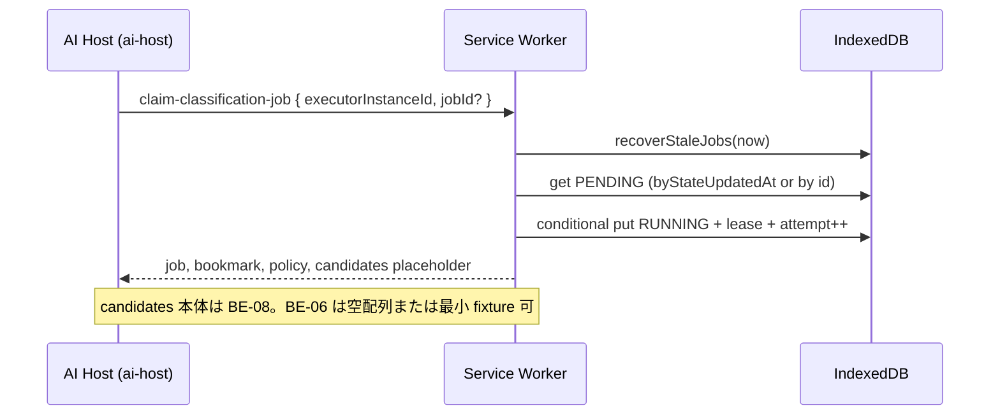

# AI 分類 Job が Service Worker 停止後も失われず、再試行できる

- 状態: 置換済み
- 作成日: 2026-08-22
- 最終更新: 2026-08-23 JST
- 担当: 未定
- 関連: [要件](../REQUIREMENTS.md) / [設計](../DESIGN.md) / [BACKEND](../BACKEND.md) / [DB-SCHEMA](../DB-SCHEMA.md) / [BACKEND_TASKS](../../BACKEND_TASKS.md) §BE-06 / [TASK-003 Plan](2026-08-22-task-003-local-data-layer.md) / BE-07（Prompt API スパイク）/ BE-08（結果適用）

> 履歴注記（2026-08-23）: この完了済みPlanはpolicy version 1でBE-06の永続Job基盤を実装した時点の記録である。本文中の `maxNewTags`、単一の `attempt`、3回でFAILED、NEEDS_REVIEWの同一Job再開は現行の分類policyとして使用しない。version 2の正本は [AI_GUIDE.md](../AI_GUIDE.md)、[BACKEND.md](../BACKEND.md)、[DB-SCHEMA.md](../DB-SCHEMA.md) とし、モデル試行と実行再試行を分離し、stale／NEEDS_REVIEW後は新しいJobを作る。この履歴本文は当時の実装証拠を保つため書き換えない。

## 目的と利用者への価値

Bookmark 保存後、AI によるカテゴリ／タグ分類は **トップレベル拡張ページ（AI Host）** で実行する。Manifest V3 の Service Worker はいつでも停止し得るため、分類の進捗と再送制御は **IndexedDB 上の永続 Job** で管理する。

本 Plan 完了後、利用者は次を得る（BE-07/08 接続前でも Repository / message 契約で検証可能）。

1. ページを保存すると `classification_jobs` に `PENDING` Job が残り、拡張機能を再読込しても失われない。
2. AI Host が `claim-classification-job` で Job を取得すると、lease 付き `RUNNING` へ遷移し、Host 異常終了後も lease 期限経過で `PENDING` に戻って再試行できる。
3. 同じ入力 fingerprint で既に `SUCCEEDED` した Job がある場合、結果の二重適用を防げる。
4. Dashboard（将来 UI）が Job 状態の照会・手動再試行・取消の message 契約を使える。

**利用者が確認できる画面（本 Plan 単体）**: 開発者向けに DevTools → Application → IndexedDB `bookmation.classificationJobs` で状態遷移を確認。message 契約テストと fake-indexeddb テストで再送・lease 回収を証明する。AI Host UI と分類結果の Tag 反映は BE-07/08。

## 現在地

### 存在する

| パス | 役割 |
| --- | --- |
| `src/adapters/indexeddb/persisted-types.ts` | `PersistedClassificationJobRecord`（DB-SCHEMA 準拠: lease, attempt, inputFingerprint, policy snapshot 等） |
| `src/adapters/indexeddb/local-data-layer.ts` | `saveBookmarkWithJob` / `deleteCategoryCascade` で `PENDING` Job を同一 transaction 作成 |
| `src/adapters/indexeddb/stores.ts` | `classificationJobs` と index（`byStateUpdatedAt`, `byFingerprint`, `byRequestId` 等） |
| `src/domain/classification-job.ts` | policy 5 種検証、状態遷移表、`policyFromGranularity`（**簡略 Domain 型**） |
| `src/extension/messages.ts` | `claim-classification-job` / `apply-classification-result` action 定義（`ai-host` 送信元のみ） |
| `src/extension/message-router.ts` | Chrome 境界ルータ（handler 未接続） |
| `src/application/library-application.ts` | BE-04/05 message。claim/apply は `ACTION_NOT_AVAILABLE` |
| `docs/BACKEND.md` §AI Host | claim → RUNNING → apply のライフサイクル記述 |
| `docs/DB-SCHEMA.md` §classification_jobs / §分類適用 | 永続フィールドと apply transaction 手順 |

### 存在しない

| パス | 備考 |
| --- | --- |
| `claimClassificationJob` / `recoverStaleJobs` / `applyClassificationResult` | Repository / Application 未実装 |
| `get-classification-job` / `retry-classification-job` / `cancel-classification-job` | message action 未定義 |
| Clock Port（テスト用 fake） | 未実装 |
| SW 起動時の stale `RUNNING` スキャン | `background.ts` に未接続 |
| Domain `ClassificationJobRecord` と Persisted 型の整合 | フィールド名・意味が不一致（技術的負債） |

### 確認済み制約

- Job は Service Worker 内で AI を実行しない（[BACKEND.md](../BACKEND.md)）。
- `granularity` / `maxNewTags` は discriminated union の 5 種のみ（`0→0` … `4→6`）。claim 後の policy 変更不可。
- 保存時 Job 作成は `policyFromGranularity(2)` 固定（`local-settings` 未接続）。BE-06 では Job 操作に集中し、設定読取は BE-08 と合流可能。
- `creationRequestId = jobId:proposalKey` は **BE-08 の Tag 作成冪等**用。BE-06 では helper 定義と契約文書化のみ（実 Tag 作成は BE-08）。
- BE-05 完了（PR #63 マージ済み）。BE-06 は BE-05 に非依存。BE-07 と並行可。BE-08 の前提。

## 対象範囲

- 対象:
  - `PENDING` / `RUNNING` / `SUCCEEDED` / `FAILED` / `NEEDS_REVIEW` / `CANCELED` の永続化と遷移
  - 条件付き claim（PENDING → RUNNING）、lease・executorInstanceId・bookmarkRevision 記録
  - lease 期限切れ `RUNNING` → `PENDING` 回収（attempt 上限内）
  - input fingerprint による `SUCCEEDED` 再適用防止
  - `apply-classification-result` の **受け口**（lease / revision 検証、終端状態更新、冪等）
  - UI / AI Host 向け Job 照会・再試行・取消 message 契約
  - SW 起動時 stale Job 回収
  - Clock Port と決定的テスト
  - Domain 型と Persisted 型の mapper（Job 操作境界）
- 対象外:
  - Prompt API 実行、AI Host ページ UI（BE-07）
  - 分類結果の Tag / Category edge 適用、候補集合生成、JSON schema 検証本体（BE-08）
  - `SUCCEEDED` 時の Bookmark revision 更新と `bookmarkRevisions` 追加（BE-08 の apply transaction）
  - Dashboard の分類状態表示 UI（TASK-005 以降）
  - P1 Store、Drive 同期、SearchDocument の分類由来更新（BE-08/09）
  - `local-settings` からの granularity 読取（任意後続。現状は保存時 snapshot 固定で可）

## 前提・用語

- **Classification Job**: Bookmark 1 件に対する AI 分類要求の永続レコード。正本は `classificationJobs` Store。
- **lease**: AI Host が Job を独占実行する期限。`leaseExpiresAt` が過去なら回収対象。
- **executorInstanceId**: AI Host ページ生成時の UUID。claim と apply で一致必須。
- **inputFingerprint**: 保存時に `fingerprintFromObject({ bookmarkId, normalizedUrl, policy })` で生成済み。同一 fingerprint の `SUCCEEDED` があれば再適用しない。
- **attempt**: claim のたびに +1。上限超過で `FAILED`（`errorCode=MAX_ATTEMPTS_EXCEEDED`）へ遷移し、自動回収しない。
- **requestId（Job）**: Job 作成冪等キー（保存時 `creationRequestId`、cascade 時 `category-delete:…:bookmarkId`）。
- **apply message requestId**: 拡張 message の `requestId`。同一 Job・同一結果 payload の再送は同じ応答へ収束（Job レコード上の `finishedAt` / 終端 state で判定。専用 receipt Store は作らない）。
- **テスト環境**: Vitest + `fake-indexeddb`（確認日: 2026-08-22、`pnpm test:idb`）。

### 定数（本 Plan で採用。変更時は判断ログへ）

| 定数 | 値 | 根拠 |
| --- | --- | --- |
| `CLASSIFICATION_JOB_LEASE_MS` | `300_000`（5 分） | 文書に数値未記載。Host 手動検証に十分な暫定値 |
| `CLASSIFICATION_JOB_MAX_ATTEMPTS` | `3` | DB-SCHEMA「attempt 上限内」の具体化。実測後に調整可 |
| `CLASSIFICATION_JOB_CLAIM_BATCH` | `1` | MVP は 1 件 claim。将来バッチ化可 |

## 実装方針

### レイヤー配置

```text
src/
  ports/
    clock.ts                          # now(): number（テスト注入）
  domain/
    classification-job.ts             # 遷移検証（既存）+ persisted 向け helper 追加
    classification-job-contract.ts      # claim/apply payload 型、proposalKey helper（新規）
  adapters/indexeddb/
    classification-job-ops.ts         # claim / recover / apply shell（LocalDataLayer から呼ぶ）
    mappers/classification-job.ts     # Persisted ↔ Domain 表示用（新規）
  application/
    classification-job-application.ts # message 向け use case（新規）
  extension/
    messages.ts                       # 新 action 3 件 + payload 型
    library-application.ts または background 合成 # handler 接続
  background.ts                       # 起動時 recoverStaleJobs
```

- UI / AI Host は Repository を直接 import しない。Application 経由のみ。
- IndexedDB の条件付き更新は **read → 検証 → write を 1 readwrite transaction** に閉じる。claim 競合は `CLASSIFICATION_JOB_CLAIM_CONFLICT` で拒否。

### データフロー（claim）



### データフロー（apply — BE-06 範囲）

1. `apply-classification-result` を `ai-host` のみ受理。
2. Job が `RUNNING`、lease 有効、`executorInstanceId` 一致、`bookmarkRevision` 一致を検証。
3. 同一 `inputFingerprint` の別 Job が `SUCCEEDED` なら **no-op 成功**（再適用防止）。
4. outcome に応じて Job のみ更新（単一 transaction）:
   - `FAILED` / `NEEDS_REVIEW` / `CANCELED`: `errorCode`、終端 state、Bookmark の `classificationState` を同期。
   - `SUCCEEDED`: **BE-06 では Tag 未適用**。Job を `SUCCEEDED` にし Bookmark `classificationState` を `SUCCEEDED` に更新する **最小経路**のみ実装（Tag 0 件のテスト用）。payload に Tag 指定がある場合は `ACTION_NOT_AVAILABLE` または Domain エラーで BE-08 へ委譲。
5. 古い revision / 無効 lease は `CLASSIFICATION_JOB_APPLY_REJECTED` で拒否し、Bookmark を変更しない。

### Domain 型の整合

現行 `ClassificationJobRecord`（`triggeredBy`, `retryCount`, `revision`）は BE-01 簡略型で、Persisted と不一致。

**方針**: Job の読み書きは `PersistedClassificationJobRecord` を正とし、Domain 層には **操作専用の不変条件関数**（遷移・policy・fingerprint 検証）だけ置く。UI 向け DTO は Application が Persisted から組み立てる。簡略 `ClassificationJobRecord` は deprecated コメントを付け、BE-08 で統合または削除。

### Message actions

#### 既存（実装する）

| action | source | 概要 |
| --- | --- | --- |
| `claim-classification-job` | `ai-host` | stale 回収後、PENDING を RUNNING へ |
| `apply-classification-result` | `ai-host` | 終端状態の受け口（Tag 適用は BE-08） |

**claim payload（案）**

```ts
{
  executorInstanceId: string  // UUID, 1〜128 文字
  jobId?: string              // 省略時は最古 PENDING を 1 件
}
```

**claim 応答 data（案）**

```ts
{
  job: { id, state, bookmarkId, bookmarkRevision, policy, inputFingerprint, leaseExpiresAt, attempt, ... }
  bookmark: { id, title, normalizedUrl, revision, classificationState }
  // candidates: BE-08 で拡張。BE-06 は labels: [] を返してよい
}
```

#### 新規（UI 契約）

| action | source | 概要 |
| --- | --- | --- |
| `get-classification-job` | `dashboard` | `jobId` または `bookmarkId` で最新 Job を返す |
| `retry-classification-job` | `dashboard` | `FAILED` / `NEEDS_REVIEW` → `PENDING`（新 fingerprint は BE-08。BE-06 は state のみ） |
| `cancel-classification-job` | `dashboard` | `PENDING` / `RUNNING` → `CANCELED`（RUNNING は lease 無効化） |

### Repository / LocalDataLayer 追加メソッド

```ts
recoverStaleClassificationJobs(now: number): Promise<number>  // 回収件数
claimClassificationJob(input: {
  executorInstanceId: string
  jobId?: string
  now: number
}): Promise<ClaimResult | null>  // 対象なしは null

getClassificationJob(jobId: string): Promise<PersistedClassificationJobRecord | undefined>
getLatestClassificationJobForBookmark(bookmarkId: string): Promise<PersistedClassificationJobRecord | undefined>

cancelClassificationJob(jobId: string, now: number): Promise<void>
retryClassificationJob(jobId: string, now: number): Promise<void>

applyClassificationResultShell(input: {
  jobId: string
  executorInstanceId: string
  bookmarkRevision: number
  outcome: "FAILED" | "NEEDS_REVIEW" | "CANCELED" | "SUCCEEDED"
  errorCode?: string | null
  now: number
}): Promise<ApplyResult>
```

- `recoverStaleClassificationJobs`: `byStateUpdatedAt` で `RUNNING` を走査。`leaseExpiresAt < now` かつ `attempt < MAX` なら `PENDING`（lease / executor クリア）。`attempt >= MAX` なら `FAILED`。
- claim 前に常に recover を呼ぶ（SW 起動時・claim message の両方）。

### `creationRequestId = jobId:proposalKey`

BE-08 向けに Domain helper を追加:

```ts
export function proposalCreationRequestId(jobId: string, proposalKey: string): string {
  return `${jobId}:${proposalKey}`
}
```

BE-06 のテストで形式だけ検証。Tag 作成はしない。

### エラーコード（Domain 追加案）

| code | 意味 |
| --- | --- |
| `CLASSIFICATION_JOB_NOT_FOUND` | jobId 不存在 |
| `CLASSIFICATION_JOB_CLAIM_CONFLICT` | PENDING 以外を claim |
| `CLASSIFICATION_JOB_LEASE_INVALID` | apply 時 lease 不一致 |
| `CLASSIFICATION_JOB_APPLY_REJECTED` | revision / executor / state 不一致 |
| `CLASSIFICATION_JOB_ALREADY_SUCCEEDED` | fingerprint 重複（応答は no-op 成功でも可） |
| `MAX_ATTEMPTS_EXCEEDED` | attempt 上限（`errorCode` フィールドにも記録） |

## マイルストーン

### M0: Clock Port と Domain helper

- 成果: テストで時刻を固定でき、`proposalCreationRequestId` と遷移検証が Persisted state 文字列で動く。
- 変更箇所: `src/ports/clock.ts`, `src/domain/classification-job-contract.ts`, `classification-job.test.ts` 拡張。
- 実行: `pnpm typecheck && pnpm test src/domain/classification-job.test.ts`
- 期待結果: 全テスト成功。
- 手動確認: 不要。

### M1: Repository — claim / recover / cancel / retry

- 成果: fake-indexeddb で PENDING 作成 → claim → lease 期限切れ → PENDING 回収 → 上限で FAILED。cancel / retry の遷移。
- 変更箇所: `classification-job-ops.ts`, `local-data-layer.ts`, `local-data-layer.test.ts` または専用 `classification-job-ops.test.ts`。
- 実行: `pnpm test:idb`
- 期待結果: 新規テスト ≥ 12 件追加、既存 regression なし。
- 手動確認: DevTools で `classificationJobs` の `state` / `leaseExpiresAt` / `attempt` が期待どおり。
- 失敗時: transaction 内で state 不整合があれば commit せず DomainError。

### M2: apply shell と fingerprint 冪等

- 成果: RUNNING Job へ FAILED / NEEDS_REVIEW / CANCELED / 空 SUCCEEDED を apply。同一 fingerprint の既存 SUCCEEDED で二重適用しない。
- 変更箇所: `applyClassificationResultShell`, Domain エラー、テスト fixture。
- 実行: `pnpm test:idb`
- 期待結果: 古い revision apply で Bookmark 不変、二重 SUCCEEDED で Tag／edge 増えない。
- 手動確認: 不要。

### M3: message 契約と SW 起動回収

- 成果: `claim-classification-job` / `apply-classification-result` / `get` / `retry` / `cancel` が `message-router` 経由で動作。`background.ts` 起動時に recover。
- 変更箇所: `messages.ts`, `classification-job-application.ts`, `library-application.ts` 合成, `background.ts`, `message-router.test.ts`。
- 実行: `pnpm typecheck && pnpm test && pnpm build`
- 期待結果: message テストで unauthorized sender / invalid payload 拒否。build 成功。
- 手動確認: `pnpm dev` ビルドを拡張機能に読み込み、保存後に Service Worker の console で起動時 recover ログ（開発時のみ）を確認。
- 失敗時: `ai-host` 以外から claim は `UNAUTHORIZED_SENDER` または routing 前拒否。

## 進捗

- [x] 2026-08-22 — Plan レビュー（本書）
- [x] M0 Clock Port + Domain helper
- [x] M1 Repository claim / recover
- [x] M2 apply shell + fingerprint
- [x] M3 message + SW startup

## 発見事項

- 2026-08-22 — 発見: `src/domain/classification-job.ts` の `ClassificationJobRecord` は `PersistedClassificationJobRecord` とフィールドが一致しない。
  - 証拠: Domain は `triggeredBy` / `retryCount`、Persisted は `reason` / `attempt` / `leaseExpiresAt`。
  - 影響: BE-06 では Persisted を正本とし、mapper で境界を閉じる。BE-08 で Domain 型統合を検討。

- 2026-08-22 — 発見: lease 秒数・attempt 上限が設計文書に数値未記載。
  - 証拠: `docs/DB-SCHEMA.md` §classification_jobs は「上限内」のみ。
  - 影響: 本 Plan の定数表を暫定採用。実機 BE-07 で調整可能。

## 判断ログ

- 2026-08-22 — 判断: `SUCCEEDED` の Tag 適用は BE-08 に委譲し、BE-06 は apply **受け口と Job 状態更新**までとする。
  - 理由: BACKEND_TASKS の BE-06/08 分割。BE-07 スパイクと並行可能にする。
  - 検討した代替案: BE-06 で空 Tag の SUCCEEDED だけ完結させる → 採用（テスト用最小経路）。
  - 再検討条件: BE-08 着手時に apply を 1 transaction に統合。

- 2026-08-22 — 判断: Job apply の冪等は専用 receipt Store を作らず、Job 終端 state + message `requestId` の再送で収束する。
  - 理由: Tag mutation の `tagMutationReceipts` ほど複雑な fan-out がない。YAGNI。
  - 検討した代替案: `classificationResultReceipts` Store → BE-08 統合時に再検討。
  - 再検討条件: apply が Bookmark / Label 多 table にまたがった時点で BE-08 Plan へ移す。

- 2026-08-22 — 判断: lease 5 分 / attempt 3 回を暫定採用。
  - 理由: 文書未確定。テスト可能な既定値が必要。
  - 再検討条件: BE-07 実機で Host 起動〜model 準備時間を計測後。

## 検証と受け入れ条件

- [ ] 自動検証: `pnpm typecheck` が成功する。
- [ ] 自動検証: `pnpm test` が成功する（IDB 含む）。
- [ ] 自動検証: `pnpm build` が成功する。
- [ ] Webプレビュー: 本 Plan は分類 UI 未変更のため対象外。理由: Job は SW/IDB 層のみ。
- [ ] AIエージェントE2E: BE-07 前は skip 可。理由: AI Host 未実装。未実証範囲を WORKLOG に記録。
- [ ] 手動検証: Bookmark 保存後、IndexedDB に `PENDING` Job が存在する。
- [ ] 手動検証: claim 後 `RUNNING` + `leaseExpiresAt` が未来時刻になる。
- [ ] 手動検証: lease 過去に recover 後 `PENDING` に戻る（テスト時 Clock fake、手動は DevTools で時刻上書きまたは短い lease 定数で開発ビルドのみ）。
- [ ] 状態fixture: worker 再起動後も Job 残存、Host 終了相当の lease 切れ、lease 競合、結果二重送信、古い bookmarkRevision で Bookmark 不変、attempt 上限で `FAILED`、fingerprint 重複で再適用なし、cancel / retry 遷移。
- [ ] エラー経路: apply 拒否時も保存済み Bookmark を失わず、Job は `FAILED` または `NEEDS_REVIEW` に留まれる。
- [ ] 文書: 本 Plan と `BACKEND_TASKS.md` BE-06 完了条件が一致する。

## 再実行・復旧

- 各マイルストーンは前段のテストが通った状態から独立して再実行可能。
- IndexedDB は開発中 `chrome://extensions` から拡張機能を削除すると消える。検証データは fake-indexeddb テストを正とする。
- recover / claim が途中失敗した場合、次回 SW 起動または次回 claim で `recoverStaleClassificationJobs` が再実行される。手動で Job を編集しない。
- 本番データ破壊操作は行わない。migration は不要（schemaVersion 1 のまま）。

## 結果と残課題

- 達成した成果: claim / recover / cancel / retry / apply shell、message 契約 5 action、SW 起動時 stale 回収
- 検証結果: `pnpm typecheck` / `pnpm test`（244 件）/ `pnpm build` 成功
- 対象外として残した事項: BE-08 Tag 適用、候補集合、granularity 設定読取、Dashboard UI
- 技術的負債: Domain `ClassificationJobRecord` 簡略型の統合
