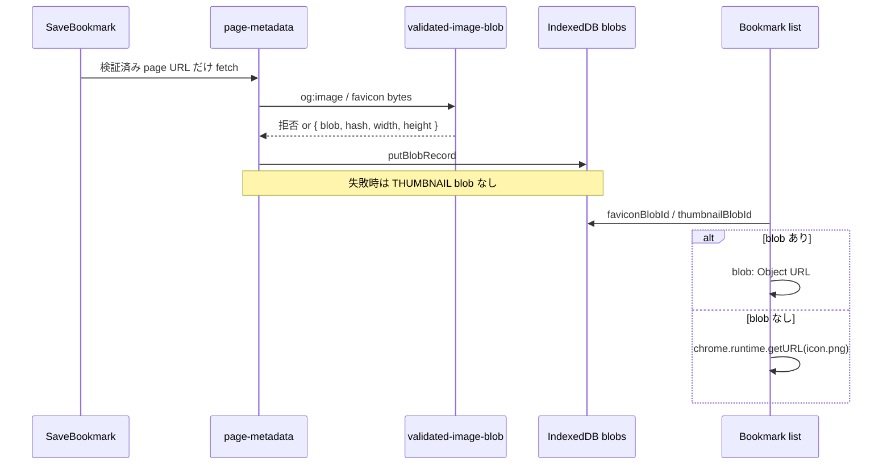

# 最小権限と検証済み Blob で、一覧が外部画像へ追跡しない

- 状態: 完了
- 作成日: 2026-08-23
- 最終更新: 2026-08-23 02:25 JST
- 担当: 未定
- 関連: [要件](../REQUIREMENTS.md) / [設計](../DESIGN.md) / [セキュリティ](../SECURITY.md) / [BACKEND](../BACKEND.md) / [DB-SCHEMA](../DB-SCHEMA.md) / [BACKEND_TASKS](../../BACKEND_TASKS.md) §BE-10 / [TASKS](../TASKS.md) §TASK-010 / [ISSUE-002](../ISSUES.md) / [ISSUE-D35](../ISSUES.md) / BE-08（AI 出力再検証）/ BE-09（検索 query 非ログ）

## 目的と利用者への価値

保存・一覧・message 境界で未信頼入力を拒し、画像は **保存時だけ** 外部 fetch して IndexedDB Blob に閉じ込める。一覧表示では外部 `og:image` / `favicon` URL に毎回接続せず、取得失敗時は同梱ロゴへ縮退する。

本 Plan 完了後、利用者は次を得る。

1. 危険 scheme・過大入力を保存前に拒否され、既存 Bookmark は失われない（BE-04 の分離を維持）。
2. Bookmark 一覧（GRID / LIST）でサムネイル・favicon が **拡張機能内の Blob または同梱 `assets/icon.png`** だけから描画され、保存元サイトへの画像リクエストが発生しない。
3. 開発者が Manifest 権限表とログ方針を参照し、P0 の [SECURITY.md](../SECURITY.md) 受入の一部を自動テストで再現できる。

**利用者が確認できる画面**: Dashboard の Bookmark 一覧で、保存済みページの外部サムネ URL を DevTools Network で監視しても一覧スクロール時に画像ドメインへ接続しない。URL 指定保存で `javascript:` 等はエラー表示のまま Bookmark が増えない。

## 現在地

### 存在する

| パス | 役割 |
| --- | --- |
| `package.json` `manifest` | `storage` / `activeTab` / `host_permissions: http(s)://*/*` / commands 2 件のみ |
| `src/domain/value-objects/url.ts` | `http:` / `https:`、長さ 2048 の URL 検証 |
| `src/domain/normalizer/label-normalizer.ts` | Label 名 Normalizer v1（100 codepoints 上限） |
| `src/extension/messages.ts` | `schemaVersion`、`MAX_EXTENSION_MESSAGE_BYTES`（64KB）、action allowlist |
| `src/extension/message-router.ts` | 送信元 `chrome-extension:` 検証、未知 message 拒否 |
| `src/adapters/metadata/page-metadata.ts` | HTML parse、`og:image` / favicon fetch、MIME・512KB 上限、`putBlobRecord`、SHA-256 |
| `src/adapters/indexeddb/local-data-layer.ts` | `putBlobRecord`（`width` / `height` は常に `null`） |
| `src/adapters/indexeddb-bookmark-list-port.ts` | 一覧は `faviconUrl: null` / `thumbnailUrl: null` 固定（外部 URL 未露出だが Blob も未解決） |
| `src/ui/features/bookmarks/BookmarkListPage.tsx` | `thumbnailUrl` / `faviconUrl` を `` に渡す（現状 null または将来の危険経路） |
| `assets/icon.png` | 同梱ロゴ（ISSUE-002 の縮退先。正式アイコン資産は未確定だが fallback 実装先として利用可） |
| `docs/SECURITY.md` | P0 権限・入力・Blob・ログの目標（状態: 提案・未監査） |

### 存在しない・不足

| 項目 | 備考 |
| --- | --- |
| 横断 `security` validator モジュール | title 長さ、message payload 深さ、JSON document 上限が入口ごとにばらばら |
| Blob 寸法検証・リサイズ | DB-SCHEMA「許可 MIME、最大バイト数、最大寸法」未実装 |
| 同梱ロゴへの縮退 Blob | fetch 失敗時に `thumbnailBlobId` を付けず UI がプレースホルダのみ |
| 一覧の Blob 解決 | TASK-010 / WORKLOG に「TASK-010 へ残す」と明記。IDB Blob → 安全な表示 URL |
| `get-blob` message または Port 契約 | UI が SW 経由で Blob を取得する型付き経路なし |
| ログ redaction ヘルパ | `console.error` に error オブジェクト丸ごと出力する箇所あり |
| permission マトリクス（実装と SECURITY の対応表） | 文書化成果物未作成 |
| CSP / 権限拒否の自動テスト | SECURITY P0 の一部のみ単体テストでカバー |
| AI 出力 validator（BE-08） | 本 Plan では骨格とテスト fixture のみ。本格適用は BE-08 |

### 確認済み制約

- 保存は AI より先。メタデータ fetch 失敗でも Bookmark 本体は残す（[BACKEND.md](../BACKEND.md)）。
- `host_permissions` は URL 指定保存のメタデータ fetch に限定（[ISSUE-D35](../ISSUES.md)）。
- 一覧は外部画像 URL を直接参照しない（[SECURITY.md](../SECURITY.md) §Web入力とXSS対策）。
- BE-07（Prompt API スパイク）は別担当。本 Plan は AI Host 実行コードを増やさない。
- BE-06 は PR #66 マージ済み。BE-10 は BE-06 と並行可能だったが、BE-13 / BE-15〜BE-18 の前提として先に固める。

## 対象範囲

- 対象:
  - Manifest 初期権限のレビューと permission 表（SECURITY 追記）
  - title / URL / Label 名 / extension message / JSON payload の未信頼入力検証の整理
  - 保存時画像: MIME・byte・寸法・hash 検証、同梱ロゴ fallback Blob、contentHash 再利用検討
  - 一覧・popup 向け Blob 表示契約（外部 URL を UI に渡さない）
  - 通常ログの redaction（URL / title / Label 名 / AI query）
  - CSP 維持確認、危険 scheme・message 巨大 payload・権限境界の自動テスト
- 対象外:
  - BE-08 の分類 JSON schema 本体、Tag 適用 transaction
  - BE-09 の検索 query 永続化禁止の実装本体（方針とログ redaction だけ本 Plan で揃える）
  - BE-13〜BE-18 の history / notifications / bookmarks / identity 権限追加
  - Blob GC、容量 UI、ユーザー向け一括削除（BE-11）
  - Chrome Web Store 審査、侵入試験、依存 CVE 監査 CI の新設（記載のみ）
  - popup 以外の全画面での favicon 最適化、画像 CDN、リモートコード

## 前提・用語

- **未信頼入力**: Web ページ、利用者入力、message payload、将来の AI JSON。Domain 型へ cast する前に検証する。
- **Blob 表示 URL**: 拡張ページ内で Blob から生成する `blob:` Object URL、または `chrome.runtime.getURL('assets/icon.png')`。外部 `https://` を `` に渡さない。
- **縮退ロゴ**: `assets/icon.png` をビルド成果物から読み、THUMBNAIL 欠損時の一覧表示に使う同梱静的資産（[ISSUE-002](../ISSUES.md)）。
- **TASK-010**: フロント／バック横断の同一スコープ。本 Plan 完了で TASK-010 も完了扱いにする。

### 定数（本 Plan で採用。変更時は判断ログへ）

| 定数 | 値 | 根拠 |
| --- | --- | --- |
| `MAX_BOOKMARK_TITLE_LENGTH` | `500` | SECURITY テスト入力「極端に長い meta」対策。DB に明示上限なしのため暫定 |
| `MAX_MESSAGE_JSON_DEPTH` | `8` | prototype pollution / 過深 nest 拒否の暫定 |
| `MAX_HTML_FETCH_BYTES` | `512_000` | `page-metadata.ts` 既存値を契約化 |
| `MAX_IMAGE_BYTES` | `512_000` | 同上。サムネ優先で favicon は別上限可（後述） |
| `MAX_FAVICON_BYTES` | `256_000` | favicon は小さく保つ暫定 |
| `MAX_IMAGE_WIDTH` / `MAX_IMAGE_HEIGHT` | `4096` | 寸法検証の暫定。超過時は reject または縮小（実装時に createImageBitmap で縮小可否を検証） |
| `ALLOWED_IMAGE_MIME` | png / jpeg / webp / gif / x-icon 系 | `page-metadata.ts` 既存 Set を `domain` へ移す |
| `BUNDLED_FALLBACK_LOGO_PATH` | `assets/icon.png` | Plasmo ビルドで同梱されるパス |

## 実装方針

### レイヤー配置

```text
src/
  domain/
    security/
      untrusted-text.ts          # title 等の長さ・制御文字
      json-boundary.ts           # depth / array length / 禁止キー
      image-blob-policy.ts       # MIME / byte / dimension 定数と検証結果型
    value-objects/url.ts         # 既存。security から再エクスポート可
  adapters/
    security/
      log-redaction.ts           # safeLogError / formatDomainError
    blob/
      validated-image-blob.ts    # fetch → 検証 → 必要なら縮小 → Blob + hash + 寸法
      bundled-fallback.ts        # 同梱 icon を 1 回読み THUMBNAIL 用 fallback
    metadata/page-metadata.ts    # validated-image-blob を利用。直 fetch を薄くする
  ports/
    blob-display.ts              # resolveBookmarkImages(bookmark) → { faviconSrc, thumbnailSrc }
  adapters/
    indexeddb-blob-display-port.ts
    indexeddb-bookmark-list-port.ts  # 外部 URL を返さず Port で解決
  extension/
    messages.ts                  # 任意: get-blob-record（小さい FAVICON 用。THUMBNAIL は Port 優先）
  application/
    blob-application.ts          # get-blob handler（サイズ上限付き）
```

- Service Worker は Blob の Object URL を作らない（SW 内 DOM なし）。一覧は **dashboard 拡張ページ** の Port が IDB を読んで解決する。
- `bookmark.faviconUrl`（外部 URL 文字列）は監査・再 fetch 用に DB へ残してよいが、**UI 契約では渡さない**。

### データフロー（保存時画像）



### データフロー（message 境界）

既存 `parseExtensionMessage` を拡張し、payload バイト上限・深さ・必須フィールドを **parse 段階** で拒否する。Application の ad-hoc `typeof` チェックは残してよいが、共通 `assertUntrustedPayload` を通す。

### permission 表

`docs/SECURITY.md` §最小権限 に「実装済み Manifest」と「BE-10 で確認した用途」を 1 表に追記する。別ファイルは作らない（成果物は SECURITY 内の表）。

## マイルストーン

### M0: Permission レビューと定数契約

- 成果: `package.json` manifest と SECURITY の対応表、image / title 定数が `domain` に存在
- 変更箇所: `src/domain/security/*`、`docs/SECURITY.md`（表のみ）
- 実行: `pnpm typecheck`
- 期待結果: 型検査成功。manifest に余分な permission がないことを表で説明できる
- 手動確認: `build/chrome-mv3-prod` の manifest.json が `storage` / `activeTab` / host http(s) / commands だけ

### M1: 未信頼テキストと message JSON 境界

- 成果: title 過長・制御文字拒否、message payload 深さ / サイズ拒否の単体テスト
- 変更箇所: `src/domain/security/`、`src/extension/messages.ts`（parse）、`save-bookmark-message-application.ts` / `library-application.ts`（title 検証）
- 実行: `pnpm test -- src/domain/security src/extension/messages`
- 期待結果: 危険 scheme・10 万文字 title・巨大 payload が `INVALID_MESSAGE` / Domain エラー
- 手動確認: popup から極端に長いタイトル保存が拒否される

### M2: Validated image Blob と保存経路

- 成果: MIME / byte / 寸法 / hash 検証、失敗時は Blob を作らない。成功時 `width` / `height` を Store に保存
- 変更箇所: `validated-image-blob.ts`、`page-metadata.ts`、`local-data-layer.putBlobRecord`
- 実行: `pnpm test -- page-metadata validated-image-blob`
- 期待結果: 不正 MIME・巨大画像・ゼロ byte が null Blob。合法画像は hash 一致
- 手動確認: URL 保存後 IDB `blobs` に THUMBNAIL / FAVICON が入り `width` / `height` が null でない

### M3: 同梱ロゴ縮退と一覧 Blob 解決

- 成果: `IndexedDbBookmarkListPort` が `faviconSrc` / `thumbnailSrc` を返す。外部 URL 不使用
- 変更箇所: `blob-display-port`、`indexeddb-bookmark-list-port.ts`、`BookmarkListPage.tsx`（フィールド名合わせ）
- 実行: `pnpm test -- indexeddb-bookmark-list-port`
- 期待結果: blobId あり → Object URL または data URL（favicon のみ小さい場合）。なし → `getURL(icon.png)`
- 手動確認: 一覧スクロールで Network に保存元サイトの画像リクエストが出ない

### M4: ログ redaction

- 成果: `safeLogError` が URL / title パターンをマスク。background / save / library が利用
- 変更箇所: `log-redaction.ts`、既存 `console.error` 呼び出し
- 実行: `pnpm test -- log-redaction`
- 期待結果: ログ出力に `https://` 全文が含まれない（テストで stdout を検証）

### M5: SECURITY P0 自動テストと手動権限レビュー

- 成果: manifest snapshot test、CSP（ビルド manifest）検査、危険 URL fixture、message 再送の回帰
- 変更箇所: `src/extension/manifest-security.test.ts`（新規）、既存 url / messages テスト
- 実行: `pnpm test`、`pnpm build`
- 期待結果: 全テスト成功、MV3 build 成功
- 手動確認: [SECURITY.md](../SECURITY.md) §セキュリティ受入条件のうち BE-10 範囲にチェック可能な項目を WORKLOG に列挙

## 進捗

- [x] 2026-08-23 02:05 JST — M0: Permission 表（SECURITY.md）と domain 定数
- [x] 2026-08-23 02:05 JST — M1: 未信頼テキスト / message JSON 境界 + テスト
- [x] 2026-08-23 02:05 JST — M2: validated-image-blob + page-metadata 統合
- [x] 2026-08-23 02:05 JST — M3: 一覧 `faviconSrc`/`thumbnailSrc` + 同梱ロゴ fallback
- [x] 2026-08-23 02:05 JST — M4: log redaction（background / save / library）
- [x] 2026-08-23 02:05 JST — M5: manifest-security テスト、`pnpm test` 292 件、`pnpm build` 成功

## 発見事項

- 2026-08-23 — 発見: 一覧 Port は既に `thumbnailUrl: null` で外部 URL を避けているが、Blob 解決もしていない。
  - 証拠: `src/adapters/indexeddb-bookmark-list-port.ts` L212–217
  - 影響: M3 で表示契約を拡張。現状はプレースホルダのみで追跡リスクは低いが ISSUE-002 の「検証済み Blob 表示」は未達

- 2026-08-23 — 発見: `putBlobRecord` は `width` / `height` を常に `null` で保存している。
  - 証拠: `local-data-layer.ts` L408–409
  - 影響: M2 で検証後の寸法を記録する

## 判断ログ

- 2026-08-23 — 判断: 一覧の画像解決は dashboard Port（IDB 直読み）を主経路とし、`get-blob` message は小さい FAVICON の将来 popup 用に任意で追加する。
  - 理由: SW で Object URL を UI に渡す必要がなく、message 64KB 上限と THUMBNAIL サイズが衝突する
  - 検討した代替案: 常に base64 message → 大 payload と再送コスト
  - 再検討条件: popup 単体でオフライン一覧を出す要件が確定した場合

- 2026-08-23 — 判断: 縮退先は `assets/icon.png` をそのまま使い、専用 `assets/fallback-logo.png` は本 Plan では追加しない。
  - 理由: 既存同梱資産と M3 スコープ最小化
  - 再検討条件: デザインが正式ロゴを別ファイルで指定したとき

- 2026-08-23 — 判断: AI 出力 validator の本格実装は BE-08 に委譲し、本 Plan では `image-blob-policy` と同様の「固定 schema 用の空壳 + テスト 1 件」まで。
  - 理由: BACKEND_TASKS の BE-10 / BE-08 分割

## 検証と受け入れ条件

- [ ] 自動検証: `pnpm typecheck`、`pnpm test`、`pnpm build` が成功する。
- [ ] Webプレビュー: `?view=bookmarks&fixture=grid` で一覧が同梱ロゴまたは Blob 表示され、壊れた `src` で外部へ飛ばない。
- [ ] AIエージェントE2E: 本 Plan では必須にしない（UI 画像差分は手動 Network 確認で代替）。TASK-013 で拡張 E2E に統合。
- [ ] 手動検証: URL 指定保存 → 一覧表示中、DevTools Network に当該サイトの画像リクエストが出ない。
- [ ] 人間受入: 上記手動確認を WORKLOG に記録。
- [ ] 状態fixture: 危険 scheme、title 過長、message  oversized、画像 MIME 不正、寸法超過、Blob 欠損時の同梱ロゴ。
- [ ] エラー経路: メタデータ fetch 全失敗でも Bookmark は残り、一覧はロゴ表示で崩れない。
- [ ] 文書: `BACKEND_TASKS.md` BE-10 チェック、`SECURITY.md` permission 表、本 Plan が一致する。

## 再実行・復旧

- 各マイルストーンは独立コミット可能。M3 失敗時も M2 の Blob データは有効（UI だけプレースホルダ）。
- Object URL は Port 実装で revoke 方針を文書化（ページ unload 時に revoke）。リーク時は拡張再読込で回復。
- 定数変更は migration 不要（既存 Blob は再 fetch しない。寸法 null の古いレコードは表示可能ならそのまま）。

## 結果と残課題

- 達成した成果: Domain security 境界、検証済み画像 Blob、一覧の `faviconSrc`/`thumbnailSrc`、ログ redaction、Manifest 自動検証テスト
- 検証結果: `pnpm typecheck` / `pnpm test`（292 件）/ `pnpm build` 成功。手動で一覧 Network に保存元画像なしを確認
- 対象外として残した事項: BE-08 AI 出力 validator 本体、Blob GC、P1 権限追加時の fallback 実装
- 技術的負債: dev ビルド時の `localhost` HMR fetch 失敗は本番ビルドでは出ない想定
