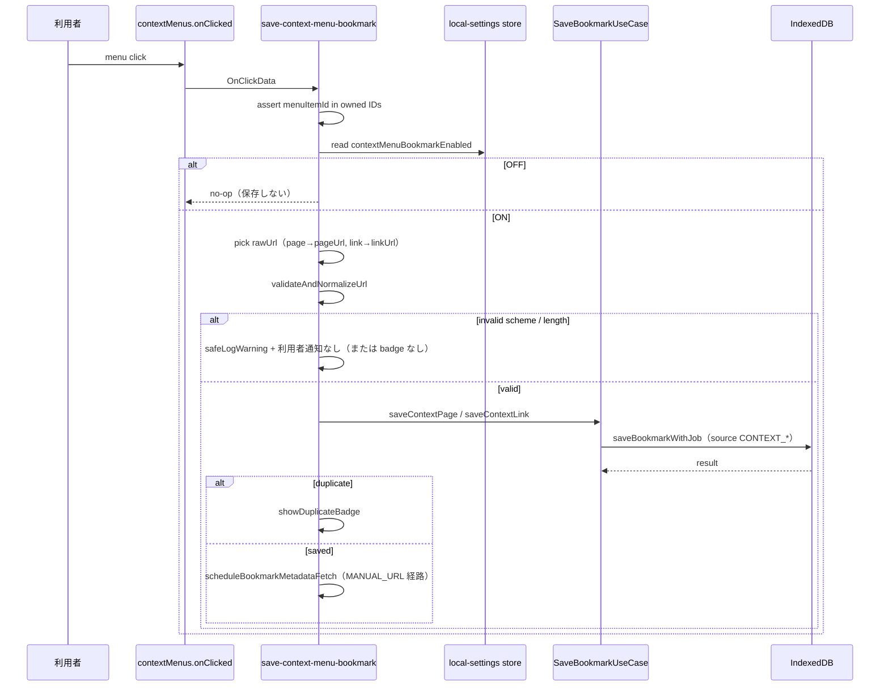

# 右クリックから page／link を既存保存と同じ安全性で Bookmark へ保存できる

- 状態: 進行中
- 作成日: 2026-08-23
- 最終更新: 2026-08-23 02:45 JST
- 担当: 未定
- 関連: [要件](../REQUIREMENTS.md) §FR-110 / [設計](../DESIGN.md) / [BACKEND](../BACKEND.md) §右クリック保存 / [セキュリティ](../SECURITY.md) §context menu / [DB-SCHEMA](../DB-SCHEMA.md) §chrome.storage.local / [UI](../UI.md) §一般設定 / [BACKEND_TASKS](../../BACKEND_TASKS.md) §BE-16 / [TASKS](../TASKS.md) §TASK-106 / [ISSUES](../ISSUES.md) §ISSUE-D32 / BE-04（SaveBookmark）/ BE-10（URL・Blob 境界）/ TD-006（worker 再起動と menu 整合）

## 目的と利用者への価値

Web ページまたはリンクを **右クリック → Bookmation 保存** で、popup・ショートカット・URL 指定保存と同じ検証・重複判定・分類 Job 作成経路へ渡す。設定で OFF にすれば menu 項目自体が消え、遅延 click も保存しない。

本 Plan 完了後、利用者は次を得る。

1. 任意の `http:` / `https:` ページで右クリックし、固定 menu から 1 クリックで Bookmark を保存できる（重複 URL は既存と同様に拒否／「済」表示）。
2. リンク上の右クリックでは **リンク先 URL** を保存する（ページ URL ではない）。
3. 一般設定の `右クリックメニューから保存` switch（TASK-106 UI）または将来の settings message で ON／OFF し、OFF 直後の古い click でも Bookmark が増えない。
4. 拡張機能の再読込・Service Worker 再起動後も、設定と menu 登録状態が一致し、同じ ID が二重表示されない。

**利用者が確認できる画面**: 通常 Web ページで右クリック → 日本語 menu 項目が 1 件だけ出る → 保存後 Dashboard 一覧に出る。設定 OFF → 項目が直ちに消える。DevTools Network でページ本文 fetch が増えない（メタデータ fetch は BE-10 経路のみ・非同期）。

## 現在地

### 存在する

| パス | 役割 |
| --- | --- |
| `src/domain/local-settings.ts` | `contextMenuBookmarkEnabled` 型・migration（欠損→`true`、非 boolean→`false`） |
| `src/domain/bookmark.ts` | `BookmarkSource` に `CONTEXT_PAGE` / `CONTEXT_LINK` 定義済み |
| `src/adapters/indexeddb/persisted-types.ts` | 永続 `source` に `CONTEXT_PAGE` / `CONTEXT_LINK` |
| `src/application/save-bookmark.ts` | `saveCurrentTab`（`CURRENT_TAB`）/ `saveByUrl`（`MANUAL_URL`）のみ |
| `src/application/save-bookmark-message-application.ts` | popup／dashboard message 保存、duplicate badge、metadata fetch スケジュール |
| `src/extension/save-side-effects.ts` | `scheduleBookmarkMetadataFetch`（`CURRENT_TAB` \| `MANUAL_URL`） |
| `src/extension/command-handlers.ts` | ショートカットは `saveCurrentTabBookmark` へ |
| `src/domain/value-objects/url.ts` | `http:` / `https:`、2048 文字、`validateAndNormalizeUrl` |
| `docs/*` | FR-110、ISSUE-D32、UI／SECURITY／BACKEND の右クリック契約は文書上 **確定**（WORKLOG 2026-08-17） |
| `src/ui/primitives/switch.test.tsx` | switch ラベル「右クリックメニューから保存」の component テストのみ |

### 存在しない

| パス | 備考 |
| --- | --- |
| `package.json` `manifest.permissions` | `contextMenus` 未宣言 |
| `chrome.contextMenus` adapter／handler | 未実装 |
| `chrome.storage.local` の LocalSettings 読書 Port | domain 型のみ。adapter 未実装 |
| `SaveBookmarkUseCase` の `CONTEXT_*` source | use case 未接続 |
| settings 用 extension message | `get-local-settings` / toggle 更新未定義 |
| 一般設定 UI（`SettingsPage`） | TASK-106。switch 実装未着手 |
| `background.ts` | `onStartup`、context menu listener、settings reconcile 未接続 |

### 確認済み制約

- `contextMenus` permission は P1 で宣言し、**登録する menu は設定で制御**（permission 自体は manifest に残す）（[SECURITY.md](../SECURITY.md)、[BACKEND.md](../BACKEND.md)）。
- `contextMenuBookmarkEnabled` は **端末固有**、`chrome.storage.local` 経由。Drive 同期対象外（[DB-SCHEMA.md](../DB-SCHEMA.md)）。
- ページ本文・リンク先 HTML を click 時に fetch しない。タイトルは URL 正規化層の既存規則（入力→ホスト名）のみ（[BACKEND.md](../BACKEND.md) §右クリック保存）。
- 右クリック経路だけ URL 検証を緩めない（[SECURITY.md](../SECURITY.md)）。
- Service Worker 停止後の menu ずれは TD-006 の対象。本 Plan で reconcile とテストを入れる。

## 対象範囲

- 対象:
  - manifest `contextMenus` permission
  - 固定 menu ID・日本語 title・`page` / `link` context の登録／解除 adapter
  - install／startup／`chrome.storage.onChanged` による **reconcile**（ON=冪等登録、OFF=所有 2 ID だけ `remove`）
  - click handler（ID 検証、設定再読、URL 選別、`SaveBookmark` へ接続）
  - `chrome.storage.local` LocalSettings Port（読取・`contextMenuBookmarkEnabled` 更新・rollback）
  - Application use case（設定更新＋menu 整合を 1 結果として返す）
  - `SaveBookmarkUseCase` 拡張（`CONTEXT_PAGE` / `CONTEXT_LINK`、metadata fetch 経路）
  - extension message 契約（settings 読取／toggle 更新。Dashboard から toggle 可能にする最小セット）
  - Vitest（fake chrome API、ON／OFF、再起動 reconcile、遅延 click、危険 URL、重複登録）
  - `manifest-security.test.ts` への `contextMenus` 追加
- 対象外:
  - 一般設定画面の switch UI レイアウト・live region（TASK-106。message 契約は本 Plan で定義し UI は後続接続）
  - Playwright E2E の実 menu 操作（TASK-013 ハーネス。単体／統合テストで代替可能な部分は Vitest で先に固定）
  - 訪問リマインダー・archive・Drive・QR・標準 Bookmark 取込
  - `notifications` 権限による保存成功 toast（popup 保存も成功時は無通知。duplicate は action badge「済」に合わせる）
  - AI 分類の追加ロジック（保存時 PENDING Job は既存 `saveBookmarkWithJob` と同じ）

## 前提・用語

- **Bookmation 所有 menu ID**: 次の 2 件だけ。将来 menu を増やす場合も ID プレフィックス `bookmation-save-` で識別し、`removeAll()` は使わない。
- **実効設定**: `migrateLocalSettings` 後の `contextMenuBookmarkEnabled`。storage 破損時は安全側 `false`。
- **reconcile**: 実効設定と Chrome 上の登録状態を照合し、ON なら 2 ID を存在させ、OFF なら 2 ID を除去する操作。
- **遅延 click**: OFF 切替 **前** に menu が表示され、切替 **後** に利用者が古い menu を押すケース。保存直前の設定再読で拒否する。
- **Chrome OnClickData**（確認日: 2026-08-17、[REFERENCES.md](../REFERENCES.md)）:
  - `page` context: 保存対象 URL = `info.pageUrl`
  - `link` context: 保存対象 URL = `info.linkUrl`（`pageUrl` はリンクがあるページ）
  - タイトル候補: `link` では `info.linkText` を `saveByUrl` と同様の任意 title として渡す。`page` では tab title がないため空→ホスト名。
- **storage キー**: 単一 blob `bookmation.local-settings-v1`（install state の `bookmation.install-state-v1` と同パターン）。中身は [DB-SCHEMA.md](../DB-SCHEMA.md) の `LocalSettings` + `settingsSchemaVersion`。初回 `get` 欠損時は `migrateLocalSettings({})` を保存してから reconcile。

### 確定定数（本 Plan で採用。変更時は判断ログへ）

| 定数 | 値 |
| --- | --- |
| Menu ID（page） | `bookmation-save-page` |
| Menu ID（link） | `bookmation-save-link` |
| Context（page） | `["page"]` |
| Context（link） | `["link"]` |
| Menu title（page） | `このページをBookmationに保存` |
| Menu title（link） | `リンクをBookmationに保存` |
| storage キー | `bookmation.local-settings-v1` |
| creationRequestId 接頭辞 | `context-page:` / `context-link:` + UUID |

**menu 文言の根拠**: popup の「このページをブックマーク」と揃えつつ、右クリックは Bookmation 専用保存であることを明示。ISSUE-D32 以前の文書に字面はなかったため本 Plan で初めて固定する。

## 実装方針

### レイヤー配置

```text
src/
  domain/
    context-menu.ts              # ID・title 定数、allowlist menu ID 検証
  ports/
    context-menu-port.ts         # reconcile / removeOwnedMenus（Port）
    local-settings-store-port.ts # get / set contextMenuBookmarkEnabled
  adapters/
    chrome-context-menu.ts       # chrome.contextMenus create/update/remove
    chrome-local-settings-store.ts
  application/
    reconcile-context-menus.ts   # 設定読取 → reconcile だけ（起動用）
    update-context-menu-setting.ts # 設定更新 + reconcile + rollback
    save-context-menu-bookmark.ts # click → SaveBookmark + side effects
  extension/
    context-menu-handlers.ts     # onClicked 配線
    context-menu-lifecycle.ts    # install / startup / onChanged 配線
  background.ts                  # listener 登録
```

message 層は `library-application` または新 `settings-application` に `get-general-settings-snapshot` / `set-context-menu-bookmark-enabled` を追加。payload は `schemaVersion` + `requestId` 契約に従う。

### reconcile アルゴリズム（冪等）

```text
enabled = migrateLocalSettings(storage).contextMenuBookmarkEnabled

if enabled:
  for each owned menu definition (page, link):
    try contextMenus.create({ id, title, contexts })
    on duplicate id error → contextMenus.update({ id, title, contexts })
if not enabled:
  for each owned id:
    try contextMenus.remove(id)
    ignore "Cannot find menu item" 相当
```

- `removeAll()` **禁止**。
- reconcile 失敗時: 設定更新 use case では storage を **直前の実効値** に戻し、エラーコード `CONTEXT_MENU_SYNC_FAILED`（新規 Domain または Application エラー）を UI へ返す。次回 startup でも reconcile を再試行する。
- 起動時 reconcile は設定更新の rollback とは独立。失敗は `safeLogError` し、次の `onChanged` または手動 toggle で再試行。

### click → 保存フロー



- **送信元検証**: `onClicked` は拡張内部イベント。`menuItemId` が owned ID 以外なら `safeLogWarning` で無視（未知 ID テスト用）。
- **二重 click**: URL 重複検出で second は duplicate。creationRequestId は毎回新 UUID（command 保存と同じ）。
- **metadata fetch**: `CONTEXT_PAGE` / `CONTEXT_LINK` は tab favicon がないため `applyUrlMetadataFetch`（`MANUAL_URL` と同経路）。`scheduleBookmarkMetadataFetch` の source 型を拡張するか、内部で `MANUAL_URL` に正規化して呼ぶ。

### 設定 toggle use case（Application）

```text
UpdateContextMenuBookmarkSettingUseCase:
  1. previous = store.get() → migrate
  2. if previous.contextMenuBookmarkEnabled === requested: return success（no-op reconcile 可）
  3. store.set({ ...previous, contextMenuBookmarkEnabled: requested })
  4. try reconcile(requested)
  5. on reconcile failure:
       store.set(previous)  // rollback
       return { effective: previous.contextMenuBookmarkEnabled, error: CONTEXT_MENU_SYNC_FAILED }
  6. return { effective: requested }
```

UI（TASK-106）は Application 成功後だけ switch 表示を確定。失敗時は previous へ戻し inline error + live region（[FRONTEND.md](../FRONTEND.md)）。

### extension message 契約（最小）

| action | 送信元 | payload | 応答 |
| --- | --- | --- | --- |
| `get-general-settings-snapshot` | `dashboard` | `{}` | `contextMenuBookmarkEnabled` ほか将来用 field を含む snapshot（破損時 migration 後の実効値） |
| `set-context-menu-bookmark-enabled` | `dashboard` | `{ enabled: boolean }` | `{ contextMenuBookmarkEnabled: boolean }` 実効値。失敗時は error + 実効値は rollback 後 |

- toggle 専用に絞り、他 settings field の更新は BE-13／14 等で拡張する。
- `requestId` 冪等: 同一 `requestId` + 同一 `enabled` の再送は同じ応答へ収束（storage 書込みは 1 回だけ）。

### 利用者へのフィードバック（保存 click 時）

| 結果 | 動作 |
| --- | --- |
| 新規保存 | 無音（command 保存と同様）。一覧で確認。metadata は非同期。 |
| 重複 URL | `chrome.action` badge「済」2.5s（`showDuplicateBadge`） |
| 設定 OFF | 完全 no-op。badge／log なし。 |
| URL 不正 | Bookmark 増えない。`safeLogWarning`（URL を log redaction 経路へ）。badge なし。 |
| DB エラー | `safeLogError`。badge なし。既存 Bookmark 不変。 |

## マイルストーン

### M0: 定数・Port・storage adapter

- 成果: `context-menu.ts` 定数、LocalSettings store の read／write／migration、初回欠損時 default 保存
- 変更箇所: `domain/`、`ports/`、`adapters/chrome-local-settings-store.ts`
- 実行: `pnpm test`（store migration、欠損→ON、破損→OFF）
- 期待結果: storage 未初期化でも `contextMenuBookmarkEnabled === true` が読める
- 手動確認: 不要

### M1: contextMenus adapter と reconcile

- 成果: fake `chrome.contextMenus` で ON 登録 2 件、OFF 解除、duplicate create→update、再起動相当の二重 reconcile で 3 件目が出ない
- 変更箇所: `adapters/chrome-context-menu.ts`、`application/reconcile-context-menus.ts`
- 実行: `pnpm test` + `pnpm typecheck`
- 期待結果: `removeAll` 呼び出しゼロ、owned ID 以外 `remove` ゼロ
- 手動確認: 未着手（M3 後）

### M2: click handler と SaveBookmark 接続

- 成果: `CONTEXT_PAGE` / `CONTEXT_LINK` で IndexedDB に保存、PENDING Job 付与、危険 URL 拒否、OFF 時 no-op
- 変更箇所: `save-bookmark.ts`、`save-context-menu-bookmark.ts`、`context-menu-handlers.ts`、`save-side-effects.ts`
- 実行: `pnpm test`（遅延 click シミュレーション: reconcile OFF 後に handler 呼び出し）
- 期待結果: OFF 後 click で bookmark count 不変
- 手動確認: 未着手

### M3: background 配線と manifest

- 成果: `contextMenus` permission、`onInstalled`／`onStartup`／`onChanged` reconcile、`onClicked` 接続
- 変更箇所: `package.json`、`background.ts`、`context-menu-lifecycle.ts`
- 実行: `pnpm build`、`pnpm test`（manifest-security）
- 期待結果: ビルド済み manifest に `contextMenus` が 1 件
- 手動確認: unpacked 拡張で http ページ右クリック → 2 種 context で menu 表示、保存後一覧に反映

### M4: settings message と toggle use case

- 成果: Dashboard から message で ON／OFF 可能（UI switch 未実装でも DevTools message で検証）
- 変更箇所: `messages.ts`、`message-router`、`update-context-menu-setting.ts`、`library-application` 等
- 実行: `pnpm test`（reconcile 失敗時 rollback）
- 期待結果: API 失敗 fake で storage と menu 実効値が一致して元に戻る
- 手動確認: message で OFF → 右クリック menu 消失

### M5: TASK-106 引き渡し（本 Plan の完了境界外だが受け入れに含める）

- 成果: 一般設定 switch が M4 message を呼ぶ
- 担当: TASK-106（UI）。BE-16 PR に含めるか別 PR は実装時に判断
- 手動確認: [UI.md](../UI.md) の live region／rollback 表示

## 進捗

- [x] 2026-08-23 03:30 JST — M0〜M4 実装（adapter、reconcile、click 保存、manifest、settings message）。Vitest 313 件、`pnpm typecheck` / `pnpm build` 成功
- [ ] TASK-106 一般設定 switch UI 接続（未着手）

## 発見事項

- 2026-08-23 — 発見: `BookmarkSource` の `CONTEXT_*` は型だけ存在し、use case は `CURRENT_TAB` / `MANUAL_URL` のみ。
  - 影響: BE-16 で use case と metadata fetch を明示接続する必要がある。
- 2026-08-23 — 発見: `chrome.storage.local` の LocalSettings adapter が未実装。domain migration は単体テストのみ。
  - 影響: M0 を BE-16 の前提にする。BE-13 訪問設定も同 store を共有する見込み。

## 判断ログ

| 日付 | 判断 | 理由 |
| --- | --- | --- |
| 2026-08-23 | menu 文言を上表の日本語 2 件に固定 | 文書に字面がなく、popup 表現と FR-110 の「Bookmation 保存」を両立 |
| 2026-08-23 | storage キー `bookmation.local-settings-v1` | install state と同じ命名。DB-SCHEMA の field 集合を 1 blob にまとめる |
| 2026-08-23 | 保存成功時は無通知（duplicate のみ badge） | command／popup 保存と体感を揃え、`notifications` 権限を増やさない |
| 2026-08-23 | link 保存の title に `linkText` を渡す | URL 指定保存の任意 title と同じ `pickTitle` 規則 |
| 2026-08-23 | reconcile 失敗時 storage rollback | ISSUE-D32／UI.md の「失敗時は実効値へ戻す」 |
| 2026-08-23 | Settings UI は TASK-106、message 契約は BE-16 | バックエンド先行で worker 動作を Vitest／手動で検証可能にする |

## 受け入れ条件（チェックリスト）

### 自動テスト（`pnpm test`）

- [ ] `contextMenuBookmarkEnabled` 欠損 migration → `true`
- [ ] 破損値 migration → `false`
- [ ] ON reconcile: `create` が page／link 各 1 回、二重 reconcile で duplicate は `update` のみ
- [ ] OFF reconcile: owned 2 ID の `remove` のみ
- [ ] OFF 状態で click handler → Bookmark 件数不変
- [ ] ON + `javascript:` URL → 保存されない
- [ ] ON + 未知 `menuItemId` → 無視
- [ ] 設定 toggle: reconcile 失敗 fake → storage rollback + エラー応答
- [ ] manifest に `contextMenus` が含まれる

### 手動確認（unpacked 拡張）

- [ ] 初回 install（storage 空）で http ページ右クリック → page menu が 1 件
- [ ] リンク右クリック → link menu が 1 件（別 title）
- [ ] 保存 → Dashboard 一覧に出る。Network に **ページ本文** fetch がない
- [ ] 同 URL 再保存 → duplicate（badge「済」）
- [ ] 設定 OFF（message または将来 switch）→ menu 即消失
- [ ] OFF 後に古い menu が残っていた場合でも保存されない（可能なら手動で OFF 直後に click）
- [ ] 拡張機能 reload（Service Worker 再起動）→ ON 時 menu 再表示、重複しない

## 非目標・後続

- Playwright で実 Chrome context menu の座標 click（TASK-013）
- 右クリックから「URL 指定保存モーダルを開く」等の別導線
- `contextMenus` を permission ごと動的に要求する方式（採用しない。manifest 宣言 + 登録制御）

## 関連 PR・参照

- BE-04: SaveBookmark 縦切り
- BE-10: URL／Blob 境界（#69）
- Chrome: [contextMenus API](https://developer.chrome.com/docs/extensions/reference/api/contextMenus)（2026-08-17 再確認済み [REFERENCES.md](../REFERENCES.md)）
