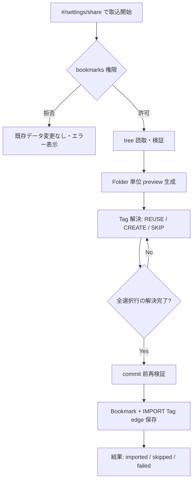

# TASK-105: Chrome 標準 Bookmark 取込 — 要件

- 日付: 2026-08-23
- 関連: [GitHub #33](https://github.com/anti-fact/Bookmation/issues/33) / FR-109 / TASK-105 / BE-15 / ISSUE-D16 / ISSUE-016
- 正本: [REQUIREMENTS.md](../REQUIREMENTS.md) FR-109、[UI.md](../UI.md) §標準Bookmark取込、[DB-SCHEMA.md](../DB-SCHEMA.md) §importJobs、[SECURITY.md](../SECURITY.md)

## 目的

利用者の **明示操作** と `bookmarks` 権限許可後に、Chrome 標準 Bookmark tree を **読み取り専用** で取得し、preview を経て Bookmation へ **コピー** する。元の Chrome Bookmark／Folder tree は **一切変更・削除しない**。

各 Bookmark には **直上 Folder 名から解決した Tag を 1 件だけ** 付与する。祖先 Folder、full path、AI 分類は取り込まない。

## ISSUE-016 決定（確定済み）

| 項目 | 決定 |
|------|------|
| Tag 化対象 | 各 URL node の `parentId` が指す **直上 Folder 1 件だけ**（例: `A/B/ページ` → Tag `B` のみ） |
| 祖先 / full path | Category／Tag へ **変換しない**（UI で出典確認用に表示してよいが保存対象に含めない） |
| AI 分類 | 取込 **と同時に Classification Job を作らない** |
| 同名 active Tag | ID・revision・親 Category を再検証して **REUSE** |
| 新規 Tag | preview で active な **親 Category を選択** または **同一導線の Category side view で作成** してから `origin=IMPORT` で CREATE |
| Category 暗黙作成 | **Folder 名から Category を作らない** |
| 同名 leaf Folder | 正規化名が同じなら **global unique な同一 Tag 解決**へ収束 |
| 空／不正 Folder 名 | 自動 rename／placeholder **なし** → **SKIP** |
| tombstone 同名 | 自動復元 **なし** → **SKIP** または全体 **cancel** |
| 元 tree | **非破壊**（`chrome.bookmarks` の create/update/remove を **呼ばない**） |

## 具体例（Chrome エクスポート HTML）

Chrome ブックマークマネージャーからエクスポートした NETSCAPE 形式 HTML（例: `bookmarks_2026_08_23.html`）は、`chrome.bookmarks.getTree()` と **同じ tree 意味** を持つ。v1 の取込元は API 読取だが、preview／Tag 解決の期待値はこの HTML で固定する。

```
Bookmarks（ルート）
└─ ブックマーク バー  [PERSONAL_TOOLBAR_FOLDER]
   ├─ cobalt
   ├─ YouTube …
   └─ …（直下に URL のみ、子 Folder なし）
└─ gamebanana …  ← ルート直下（Folder なし）
```

| 対象 | 直上 Folder | 付与 Tag | 備考 |
|------|-------------|----------|------|
| バー直下 71 件 | `ブックマーク バー` | **`ブックマーク バー` の 1 件のみ** | preview は Folder group が **1 行**（約 71 URL） |
| ルート直下 1 件 | （なし） | — | `FOLDER_NAME_INVALID` → **SKIP**（自動でバー Tag を付けない） |

**利用者が言う「全部 `ブックマーク バー` タグで import」** = バー直下 URL について ISSUE-016 をそのまま適用した結果。子 Folder が無いので Tag group も 1 つだけ。

preview での操作:

1. Folder group `ブックマーク バー` を表示（約 71 件）
2. Tag `ブックマーク バー` が active なら **REUSE**、なければ親 Category を選んで **CREATE**
3. 確定後、各 Bookmark に `source=CHROME_IMPORT` + IMPORT Tag edge **1 件**

**ネストがある場合**（本例には無い）: `ブックマーク バー/開発/cobalt` なら Tag は **`開発` のみ**（祖先 `ブックマーク バー` は付けない）。

**HTML ファイル取込**: v1 非スコープ（下記）。エクスポート HTML は **テスト fixture・手動検証用** として扱う。

## 利用者フロー（v1）



1. **開始**: `#/settings/share`（共有設定）から「Chrome 標準ブックマークを取り込む」等の明示操作
2. **権限**: 用途説明のうえ `bookmarks` を **optional permission** として request（拒否時は no-op）
3. **Preview**: 直上 Folder 別件数、各行（ページ名／URL／Folder 名／付与予定 Tag／親 Category／解決状態）
4. **Tag 解決**: Folder group ごとに REUSE または CREATE（親 Category 必須）または SKIP
5. **確定**: 全選択項目の解決が終わるまで commit 不可
6. **Commit**: fingerprint・revision・URL・重複を再検証し、Bookmark を `source=CHROME_IMPORT` で保存
7. **結果**: imported / skipped / failed 件数と理由を表示

## スコープ（本実装）

### UI（`ChromeBookmarkImportPanel`）

配置: `#/settings/share`（[UI.md](../UI.md) §標準Bookmark取込）。TASK-103（QR／CSV）と同画面でもよいが、**本タスクは取込のみ**。

- 権限説明と取込開始ボタン
- 直上 Folder 単位の group 表示（tree 全体の階層選択 UI は **作らない**）
- 各行: ページ名、URL、直上 Folder 名、付与予定 Tag、親 Category、解決状態（REUSE / CREATE / SKIP）
- 新規 Tag group: 既存の `ParentCategoryCombobox` + Category 作成 side view（Bookmark 追加／編集と **同一導線**）を再利用
- 空／不正 Folder・tombstone 競合行は skip 理由を表示
- 解決未完了時は「取り込む」disabled
- 進捗（中断再開対応時）と結果サマリー
- 取込直後の Tag は **1 件だけ** 表示し、AI 分類 pending UI は **出さない**

### バックエンド（BE-15）

#### Chrome 読取 Port

- `chrome.bookmarks.getTree()` 等の **read-only** adapter
- URL node の `parentId` → 直上 Folder node を解決
- `http:` / `https:` 以外、危険 URL、title／URL 長さは既存 Normalizer／SaveBookmark と同系統で検証

#### Folder → Tag 解決

| mode | 条件 | commit 時 |
|------|------|-----------|
| `REUSE` | 正規化名一致の **active Tag** が存在 | `expectedTagRevision`・親 Category を再検証 |
| `CREATE` | active Tag なし・tombstone なし・Folder 名 valid | 利用者選択の `parentCategoryId` + `expectedParentCategoryRevision` + 安定 `tagCreationRequestId` |
| `SKIP` | Folder 名 invalid または tombstone 同名 | 当該 Folder 配下 Bookmark は import 対象外 |

- 複数 branch に同名 leaf Folder（例: `A/B/x` と `C/B/y`）→ **同じ Tag 解決**へ収束
- `sourceFolderId`（Chrome 側 ID）は preview／Job 再開用のみ。Bookmation の正本 ID に転用しない

#### Import Job（IndexedDB `importJobs` — **DB v3**）

[DB-SCHEMA.md](../DB-SCHEMA.md) §importJobs に準拠:

- `state`: `PREVIEW` → `RUNNING` → `SUCCEEDED` | `PARTIAL` | `FAILED` | `CANCELED`
- `selectionFingerprint`: commit 時に選択集合を再検証
- `folderTagResolutions`: Folder 単位の REUSE / CREATE / SKIP 固定
- `cursor`: 大量 tree の **中断再開**用（v1 では chunk サイズを決めて実装）

#### Commit トランザクション（Bookmark 単位）

各 import 対象 URL について:

1. normalized URL 重複 → **skip**（既存 active Bookmark がある場合）または方針に従い failed 理由を記録
2. 新規 Bookmark 作成（`source=CHROME_IMPORT`）
3. 解決済み Tag edge を **1 件だけ** `assignedBy=IMPORT` で付与
4. Category edge は Tag 親 Category から **closure 規則で導出**（手動 Category 指定なし）
5. **Classification Job は作らない**（Bookmark は `UNCLASSIFIED` または active Tag 有無に応じた既存規則）

#### Extension messages（案）

| action | 用途 |
|--------|------|
| `preview-chrome-bookmarks-import` | tree 読取 → preview + Import Job（PREVIEW）作成 |
| `update-chrome-bookmarks-import-resolutions` | Folder ごとの Tag 解決（CREATE の親 Category 等）を Job へ保存 |
| `commit-chrome-bookmarks-import` | fingerprint 再検証 → 一括／chunk commit |
| `get-chrome-bookmarks-import-status` | 進捗・結果取得（再開用） |

Dashboard UI は Port 経由で上記 message のみ使用（Repository 直接 import 禁止）。

#### 権限（manifest）

- `bookmarks` は **optional_permissions** に追加（利用時だけ request）
- 契約テスト: adapter が `chrome.bookmarks.create/update/remove` を **呼べない** こと

### テスト

- ドメイン／Application: `A/B/ページ` → Tag `B` のみ、祖先なし
- 同名 leaf Folder の Tag 収束
- REUSE / CREATE / SKIP / tombstone / 空 Folder 名
- normalized URL 重複
- commit 時 revision 競合 → 該当行 failed、他は継続可能なら `PARTIAL`
- Import Job 再送・`tagCreationRequestId` 冪等
- 権限拒否 → データ無変更
- fixture tree（深い tree、同名 Folder、0 件、危険 URL）

## 非スコープ（v1）

- QR／CSV export・QR 読取（TASK-103）
- CSV import
- **NETSCAPE HTML ファイルの直接 import**（Chrome マネージャー export 含む。tree 検証 fixture としては利用可）
- 祖先 Folder を Category 化、full path Tag 化
- Folder 名からの Category 自動作成
- 取込と同時の AI 分類 Job
- Chrome 側 Bookmark の更新・削除・並べ替え
- 取込後の Undo（論理削除は通常 UI から可能）
- フォルダ単位の取込 ON/OFF（v1 は preview 上の行選択で十分なら最小限）

## 依存・前提

| 依存 | 内容 |
|------|------|
| TASK-003 | LocalDataLayer、Tag／Category edge、revision、tombstone |
| TASK-010 | URL 正規化、危険 URL、Bookmark `source` |
| ISSUE-016 | 上表のとおり **Decided** |
| 既存 UI | Category 作成 side view、Tag 親 Category 選択（BookmarkDialog 系） |

**未実装**: `importJobs` store（現在 `DB_VERSION=2` → **v3 migration が必要**）

## 受け入れ（チェックリスト）

### コア契約

- [ ] `A/B/ページ` 取込で Tag は **`B` の 1 件のみ**（祖先 `A` なし）
- [ ] 同名 active Tag は REUSE 表示・再利用
- [ ] 新規 Tag は preview で親 Category 選択または side view 作成 **必須**
- [ ] Folder 名から Category を **暗黙作成しない**
- [ ] 空／不正 Folder 名・tombstone 同名は skip／cancel（自動 rename なし）
- [ ] commit 前に preview で対象・重複・Tag 解決を確認できる
- [ ] commit 時に selection fingerprint・revision・危険 URL を再検証
- [ ] 各 Bookmark に IMPORT Tag edge **1 件**、Category は導出
- [ ] AI Classification Job **未作成**
- [ ] 取込後も Chrome 標準 Bookmark tree **不変**

### 運用

- [ ] `bookmarks` 権限は取込開始時のみ要求（optional）
- [ ] 権限拒否時は Bookmation データ **無変更**
- [ ] 中断・再送後も Bookmark／Tag／edge **重複登録なし**
- [ ] `pnpm test` / `pnpm build` 成功

### 手動（拡張機能読込後）

- [ ] 共有設定から取込開始 → 権限プロンプト → preview 表示
- [ ] 新規 Tag 行で Category 選択しないと commit 不可
- [ ] 取込成功後、一覧に `CHROME_IMPORT` 由来 Bookmark が Tag 1 件付きで表示
- [ ] Chrome ブックマークマネージャ上の元データが変わっていない

## 実装フェーズ案（参考）

1. **Phase A**: Chrome read port + preview use case + message（PREVIEW のみ、UI 一覧）
2. **Phase B**: Tag 解決 UI + Job 永続化 + resolution update
3. **Phase C**: commit + 進捗／結果 + DB v3 `importJobs`
4. **Phase D**: 中断再開・PARTIAL・契約テスト・fixture

## 参照

- Issue: https://github.com/anti-fact/Bookmation/issues/33
- WORKLOG 2026-08-18「標準Bookmark取込を直上FolderのTagだけに限定」
